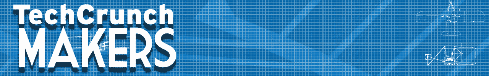

# TC 制造商:漫步弹球名人堂 TechCrunch

> 原文：<https://web.archive.org/web/https://techcrunch.com/2014/01/10/tc-makers-a-walk-through-the-pinball-hall-of-fame/>

在吃豆人之前，在乒乓之前，在太空入侵者之前有弹球。感觉很好。

当我们本周在拉斯维加斯参加 [CES 2014](https://web.archive.org/web/20221207065653/https://beta.techcrunch.com/tag/ces-2014) 时，我们非常高兴地在[弹球名人堂](https://web.archive.org/web/20221207065653/http://www.pinballmuseum.org/)停留，这是一个展示所有机电产品的令人惊叹的空间。我和 Tim Arnold 谈过，他是 Things And Stuff(或者，Stuff And Things)的主管，他把维持一些惊人的娱乐活动作为自己的人生使命。

阿诺德有多年积累的收藏品。他过去是——现在仍然是——一名训练有素的 Bally 弹球技术员，他有数百台机器，这些机器是他在弹球热潮末期的大甩卖中收集的。他从零开始重建了许多机器，用坏机器的好零件制造了一个超级机器，任何人都可以在他的不伦不类的博物馆里玩。

阿诺德拥有一切:戈特利布，巴利斯，中路，等等。他也有单人街机游戏，包括令人惊叹的机电游戏，如 [Bally Road Runner](https://web.archive.org/web/20221207065653/https://www.youtube.com/watch?v=5qTTy0FFnb4) ，这是首批使用晶体管控制电子设备的街机游戏之一。他在后面还有一个小型车间，在那里他修理旧机器，即使在它们从工厂车间滚下来 60 年后，也能让它们保持工作状态。

弹球名人堂有很多历史和乐趣。阿诺德是一个修补匠，也是一个专注的制造者。他建议年轻的创客们学会制造东西，而不仅仅是把东西混在一起。他说，通过灵巧的双手，你可以确保你的工作和技能总是有需求的。

参观像弹球名人堂这样的地方，会让你感受到从最初的弹球游戏室的第一个铃铛和齿轮到今天的超现实游戏机的漫长历史。想想我们在不到 20 年的时间里从弹球机——本质上是一个美化了的气泵——发展到街机和家用游戏机，真是令人难以置信。另外，游戏真的非常非常有趣。

*[TechCrunch Makers](https://web.archive.org/web/20221207065653/https://beta.techcrunch.com/tag/makers/) 是一个视频系列，以制作酷东西的人为特色。如果您想成为我们的特色，[请给我们发电子邮件！](https://web.archive.org/web/20221207065653/mailto:john+makers@beta.techcrunch.com)。* 

[gallery ids="939389，939391，939393，939394，939395，939396，939397，939398，939399，939401，939404，939405，939406，939407，939408，939410，939411，939

