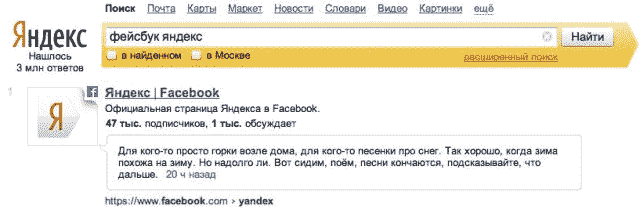

# Yandex 将脸书帖子和大数据添加到其在俄罗斯和其他国内市场的搜索结果中

> 原文：<https://web.archive.org/web/https://techcrunch.com/2014/01/13/yandex-facebook/>

去年，Yandex 和[脸书](https://web.archive.org/web/20221208062212/http://www.facebook.com/)发生了一场引人注目的冲突，当时俄罗斯搜索巨头的一组开发人员开发了一款名为 [Wonder](https://web.archive.org/web/20221208062212/https://beta.techcrunch.com/2013/01/24/yandex-launches-social-search-app-wonder-as-a-u-s-experiment-gets-legal-advice-on-why-it-shouldnt-bother-facebook/) 的社交搜索应用，脸书[立即屏蔽了](https://web.archive.org/web/20221208062212/https://beta.techcrunch.com/2013/01/24/facebook-blocks-yandex-wonder/)，导致 [it 关闭](https://web.archive.org/web/20221208062212/https://beta.techcrunch.com/2013/01/30/wonder-no-more-yandex-says-facebook-has-given-a-final-no-on-graph-api-usage-will-pull-its-social-app/)。但事实上，双方自 2010 年以来一直在合作，今天是合作的最新篇章。Yandex 正在推出一项社交搜索功能，将为 Yandex 访问者提供来自脸书的实时公共帖子以及其他搜索结果。Yandex 的搜索量约占俄罗斯总搜索量的 60%,它也将使用脸书消防软管的数据来帮助提供更相关的结果。

据我们所知，这是一项非商业交易，免费使用消防水管。Yandex 不愿评论它最终是否会加入商业元素——比如围绕搜索广告。

另外唯一一个在搜索结果中使用脸书的搜索引擎是美国的 Bing。

此举意义重大，原因如下:

——在人们转向 Twitter 和脸书等社交网络以及谷歌作为主要搜索来源的时候，这是 Yandex 提供更具社会可信度(有些人可能认为准确)的信息的一种方式。绕过 Yandex 这样的搜索引擎最终会打击其基本的广告业务。

——这是脸书继续提升其在俄罗斯消费者中的形象，并注册新用户的一种方式，以更好地与当地最受欢迎的 Vkontakte 竞争。“Yandex 索引了许多博客托管服务、微博和社交网络，”一位发言人告诉我。“现在，在获得对脸书公共数据的完全访问权后，这个社交网络将在 Yandex 的搜索结果中得到更好的体现。”

—从更广的层面来看，这是一个迹象，表明脸书正采取措施，通过与当地企业合作来拓展国际市场。今日:Yandex。明天:百度？(也许不会这么快。)

和 Bing 协议一样，Yandex 使用脸书的“消防水管”覆盖所有实时数据。对 Yandex 而言，它仅限于俄罗斯、乌克兰、白俄罗斯、哈萨克斯坦和土耳其的脸书用户的公开帖子。据 Yandex 发言人称，这涵盖了“数千万”用户。

Yandex 的关系是逐渐开始的。首先，脸书的帖子只会出现在 Yandex 博客搜索页面的搜索结果中。

“下一步是在主搜索页面(yandex.ru 或 yandex.com.tr)使用脸书更新，”一位发言人告诉我。在主搜索页面上，脸书将被用作一种社交雷达，列出当前任何热门话题的搜索结果，以及与最新新闻相关的帖子。

该发言人表示，在“不久的将来”，用户不仅会在搜索结果中看到公开的帖子，还会看到对这些帖子的评论(这是 Bing 在 2013 年 5 月推出的功能)。他补充说，脸书用户标记为“私人”的个人资料和帖子将不会被编入索引，也不会被搜索到。

交易的另一方是大数据游戏:Yandex 将把来自脸书公共消防水管的数据整合到自己的搜索算法中，以增强搜索结果。

这意味着更多的文章和视频链接会在脸书上被分享，同时也会改变整体搜索结果。这位发言人说:“在搜索结果中对网页进行排名时，脸书资料的受欢迎程度将被考虑在内。”。

Yandex 和脸书的合作可以追溯到 2010 年，当时 Yandex 开始利用脸书页面的更新，提供对公众人物和组织的更详细的搜索结果(类似于谷歌在其搜索结果中对维基百科数据的处理)。

