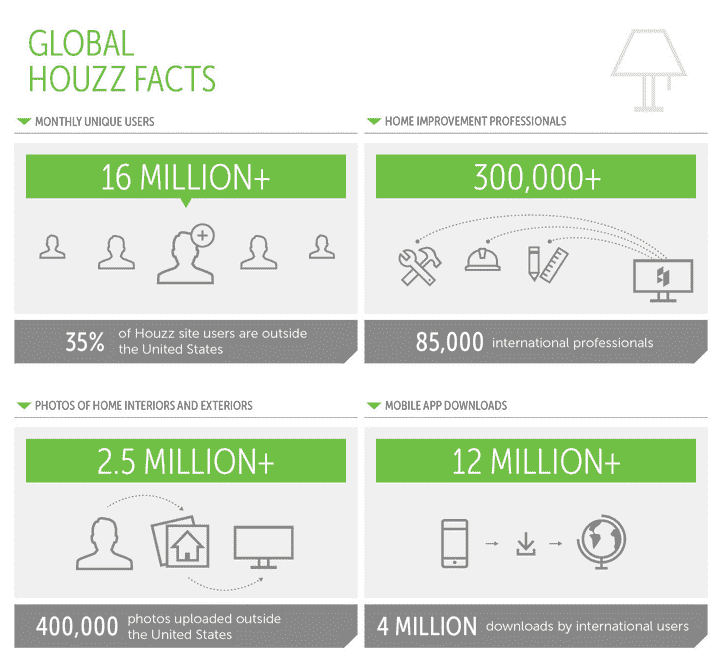

# Houzz 走向国际，在伦敦、柏林和悉尼开设办事处

> 原文：<https://web.archive.org/web/https://techcrunch.com/2014/01/15/houzz-goes-international-opens-offices-in-london-berlin-and-sydney/>

快速发展的网站和移动应用程序 Houzz 今天宣布，它已经在伦敦、柏林和悉尼开设了办事处。这标志着该公司首次正式进行国际扩张，但正如其联合创始人兼首席执行官阿迪·塔塔尔科本周早些时候告诉我的那样，Houzz 35%的流量已经来自美国以外

公司雇佣了当地的经理来管理这些办公室。此外，它还聘请了 Oliver Jung 来监督其国际业务。Jung 之前发起并领导了 Airbnb 的国际扩张。

正如 Tatarko 在我与她交谈时强调的那样，该公司计划以其在美国发展业务的方式来应对其国际扩张。这意味着它将专注于发展其社区，并在必要时将其内容国际化。然而，它不会专注于市场营销。鞑靼科认为，随着社区的发展，这将自动跟进。

“销售从来都不是我们的第一要务，”塔塔尔科告诉我。“我们首先是一家社区和技术公司。这就是我们在美国建立 Houzz 的方式，也是我们计划在国际上发展的方式。”

即使在今天，没有任何具体的营销或当地代表，Houzz 已经看到国际家居改造专家，建筑师和其他人与世界各地的用户联系。正因为如此，Houzz 的名录中已经有 85，000 名来自美国以外的专业人士。就像 Houzz 设法成为美国重塑业务的颠覆者一样，它也希望能够扰乱一些国际市场，在这些市场中，大部分业务仍然以传统方式进行，基本的口碑营销仍然是这些专业人士与潜在客户联系的主要方式。

Tatarko 认为，这种国际扩张对 Houzz 的美国用户也有好处。这将让他们接触到更多的想法和趋势，让每个人都接触到不同的做事方式。

作为这一声明的一部分，Houzz 还发布了其最新的用户数量。这项服务现在每月有来自 184 个国家的 1600 万独立用户。专业人员现在已经向网站上传了超过 250 万张图片，包括 2013 年上传的 100 万张视网膜质量的图片。它的应用程序去年被下载了 600 多万次，总共下载了 1200 万次。

公司本身现在已经发展到 170 名员工，但正如 Tatarko 强调的那样，管理结构仍然非常扁平。没有中层管理，创始人仍然亲自面试每一位准员工。尽管新的国际办公室将有本地经理，但我们的想法是在这些前哨机构中也复制同样的结构。