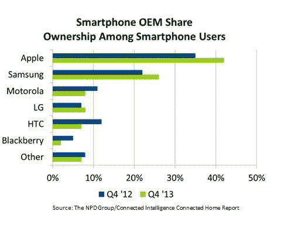
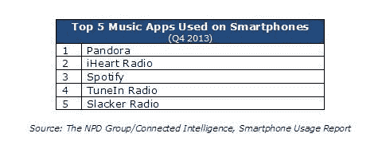

# 苹果在美国扩大与三星的智能手机差距，现在拥有 42%的份额:NPD TechCrunch

> 原文：<https://web.archive.org/web/https://techcrunch.com/2014/01/16/apple-widens-smartphone-gap-over-samsung-in-u-s-now-has-42-ownership-npd/>

# 苹果在美国扩大与三星的智能手机差距，现在拥有 42%的所有权:NPD

虽然三星和安卓继续在全球范围内增加市场份额，但美国仍然是苹果和 iPhone 主导的故事。今天来自[的互联家庭报告](https://web.archive.org/web/20221006120624/http://www.connected-intelligence.com/our-research/own/connected-home-report)和来自[的 NPD 集团](https://web.archive.org/web/20221006120624/http://www.npd.com/)的 2013 年第四季度数据显示，iPhone 现在已经拥有美国所有智能手机用户的 42%，而三星现在拥有 26%。

相比之下，在一年前的同一个季度，苹果的所有权份额为 35%，三星为 22%:换句话说，在两家公司的关键市场上，差距略有扩大。

这个消息对三星来说不是一个好兆头，特别是当 Kantar Worldpanel Comtech 的早期迹象表明，12 月份，三星在中国的销量已经将第一大供应商的位置让给了当地最受欢迎的小米。该分析公司对此的完整报告将于本月底发布。

NPD 进一步指出，美国更广泛的情况是智能手机在美国的渗透率继续上升。现在，约 60%的手机用户使用智能手机，而一年前这一比例为 52%。这表明，尽管一些理论认为，随着早期用户向中期/后期用户的转移，成熟市场的低成本销售将超过高端设备，但这种情况在美国似乎并没有发生太多——或者说，运营商、经销商和苹果已经为较便宜和较旧的 iPhone 型号及其更新、更昂贵的版本找到了市场。

在其他领先的手机制造商中，唯一一家市场份额增长的原始设备制造商是 LG，而摩托罗拉、HTC 和黑莓都出现了下滑。诺基亚及其 Windows Phone 操作系统本身没有足够大的份额来获得单独的排名，因此它被归入“其他”一类，这一类也出现了下降，这是围绕最大平台和品牌的整合日益加强的又一个迹象。

智能手机拥有量的增长也对数据使用量的上升产生了直接影响。在美国，现在每月 6.6 GB，而一年前是 5.5 GB。NPD 表示，其中一个“关键驱动因素”是流媒体音乐服务。约 52%的智能手机用户现在使用 leader Pandora 和排名第二的 iHeart Radio 等应用。有趣的是，尽管 Spotify 得到了大量的媒体报道，但就使用量而言，它排在第三位。

NPD 表示，报告中的应用使用数据来自其覆盖 4500 名智能手机用户的设备上的“智能电表”，而大约 5000 名 18 岁以上的美国消费者接受了联网家庭研究的调查。