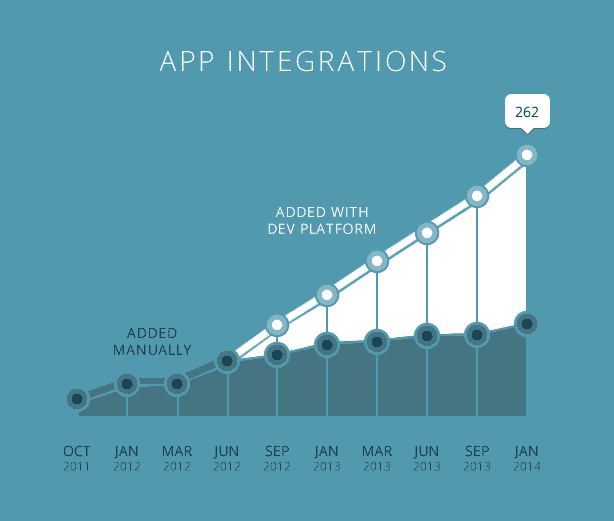

# Zapier 开放了其开发者平台，为普通人提供了连接 APIs | TechCrunch 的方法

> 原文：<https://web.archive.org/web/https://techcrunch.com/2014/01/17/zapier-opens-its-developer-platform-gives-the-everyday-joe-a-way-to-connect-apis/>

Zapier 是一个连接应用程序以实现任务自动化的平台，它在一定程度上受到了集成第三方服务的限制。随着 Zapier 公司本周宣布其开发者平台的[更新，这种情况已经改变。](https://web.archive.org/web/20230328164135/https://zapier.com/blog/connect-any-service-zapier-new-and-improved-developer-platform/)

这一变化值得注意的是，如果没有其他原因的话，它如何开放系统，以便应用程序可以相互交谈和交换数据，使人们能够更容易地完成工作。连接应用程序还有助于分解根深蒂固的本地技术。数据可以被提取出来并以以前不可能的方式使用。

[Zapier](https://web.archive.org/web/20230328164135/http://zapier.com/) 是一种将触发事件转化为行动的服务。例如，您可以使用 Zapier 在网页更新时获得通知。发送到社交网络的照片也可以通过这项服务发送到 Dropbox 账户。

现在，任何带有 API 的服务都可以添加到 Zapier 中。此外，Zapier 现在还可以为每个触发器或动作执行多个 API 调用。这为企业使用该服务连接来自销售和财务等多个部门的信息提供了可能性。

Zapier 目前有 262 个可以连接的服务。Gmail、MailChimp、Dropbox 和 Salesforce 是它提供的一些服务。去年 8 月，Zapier 推出了其开发者平台。此后，又增加了 141 项服务。在过去的六个月里，Zapier 团队用 [Backbone.js](https://web.archive.org/web/20230328164135/http://backbonejs.org/) 重建了开发者平台，让人们使用起来更快。

Zapier 的联合创始人 Wade Foster 在本周的一次电话采访中说，这个新平台有两个主要的新功能。到目前为止，只有具有特定身份验证功能的服务可以添加到 Zapier 中。这些是复杂的应用程序，如 Google Docs 和 Twilio，具有细粒度的身份验证功能。

Zapier 现在已经设计了新的平台，允许最常见的 API 认证方法开箱即用。这开启了一个巨大的应用前景，这些应用有 API，但不一定有集成到 Zapier 平台所需的认证要求。这意味着开发人员甚至非编码人员可以添加任何有 API 的服务。这些可以公开提供，也可以在内部用于连接不同的内部环境，如 CRM 和 ERP 系统。

在本例中，Etsy 被添加到 Zapier 平台:

【YouTube = http://www . YouTube . com/watch？v=H2gb58ImS4c&w=640&h=360]

Foster 说，位于 API 前面用于连接服务的脚本引擎也是可用的。这允许开发人员从多个来源提取数据。这与只连接两点的传统 API 相反。有了这个新功能，一个服务可以调用多个应用程序，并返回来自不同服务或数据源的信息。

例如，发票数据和客户销售联系信息可能位于两个独立的仓库中。有了这些新特性，来自 Zapier 的开发人员可以通过一个 API 访问这两个特性。

长期以来，它一直是一个数据孤岛的迷宫。在 BMC Software 首席技术官办公室工作的克里斯·丹西(Chris Dancy)说，有了 Zapier，它现在有了新的能力。这意味着有人可以连接 SAP 和 Oracle 数据，开启各种可能性。“影子 IT”已经取得了很大成就，它帮助了 SaaS 的崛起，让任何人都能够通过现成的服务完成工作。

“盗梦空间(

[like the movie](https://web.archive.org/web/20230328164135/http://www.imdb.com/title/tt1375666/)

“这是当助手，工厂工人和日常 Joes 用户 API 包装改变组织的结构，”丹西在一次电子邮件采访中说。它给了助手、工厂工人和日常工作人员 API 包装来改变组织的结构。"

需要更多的方法来连接不同形式的信息，以便人们可以用新的方式联系。Zapier 的开发者平台是一个例子，表明我们已经接近拥有连接数据源的方法，而在以前，这需要一个工程师团队来进行定制集成，这不仅会花费数百万美元，而且很可能几乎毫无用处。

我们现在正在见证一种新结构的出现，它由通过 API 连接的数据网络组成。下一步是易用性，这意味着更好的 API 设计和进行即时数据分析的能力，使日常生活中的普通人能够创建自己的推荐引擎和连接网络，这在传统上是开发人员的领域。欢迎来到盗梦空间时代。

(专题图片[通过](https://web.archive.org/web/20230328164135/http://www.flickr.com/photos/mafeili/5376252058/in/photolist-9c5Gr1-ahouhh-cmezPu-cffb9j-cXd9vA-a5kHYn-e2NEDx-dCzVrc-fKuHZV-fKuPyT-cU5NgJ-9z3YNF-eaAE8x-anp1Bc-ebYc7v-hwQZum-a4RkW2-bJB3yK-hQCc9u-eaquhv-dZTwpH-9b96Sf-hvckZD-dFdR2U-gUtNgf-a7AjC1-bAsJY2-dBrqKU-j1BSF8-d3GLYu-awrDRk-iXf6Rj-anoNbr-dAYdWv-9qR9Wg-fdxPam-dM5qyy-dUPHJ4-fKRoBu-dvJnT7-c3Mp1L-hemrqZ-fKv3JX-fKMFQL-c7ketG-f83oVS-j828Kp-bzZDum-aBXtDU-ifx8ky-dp9Vsx/) Flickr)

**免责声明**:我和克里斯·丹西以及《连线》杂志作家兼 TechCrunch 撰稿人[克林·芬利](https://web.archive.org/web/20230328164135/http://klintfinley.com/)一起做了一个[播客](https://web.archive.org/web/20230328164135/http://mindfulcyborgs.com/shows/)。我们谈论电子人和 API。