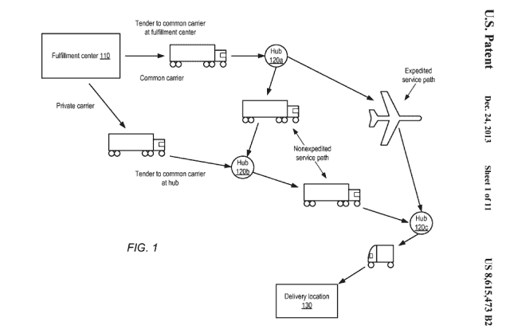

# 亚马逊专利“预期”运送——在你购买之前就开始发送

> 原文：<https://web.archive.org/web/https://techcrunch.com/2014/01/18/amazon-pre-ships/>

亚马逊的[自主飞行送货无人机](https://web.archive.org/web/20230319165123/https://techcrunch.com/2013/12/01/amazon-is-experimenting-with-autonomous-flying-delivery-drones/)的计划去年就是如此。据称，这家电子商务巨头正致力于更为反乌托邦的东西:预装运。

亚马逊已经为一种运输系统申请了[专利](https://web.archive.org/web/20230319165123/http://pdfpiw.uspto.gov/.piw?Docid=08615473&homeurl=http%3A%2F%2Fpatft.uspto.gov%2Fnetacgi%2Fnph-Parser%3FSect1%3DPTO2%2526Sect2%3DHITOFF%2526p%3D1%2526u%3D%25252Fnetahtml%25252FPTO%25252Fsearch-bool.html%2526r%3D1%2526f%3DG%2526l%3D50%2526co1%3DAND%2526d%3DPTXT%2526s1%3D%252522anticipatory%252Bpackage%252522%2526OS%3D%252522anticipatory%252Bpackage%252522%2526RS%3D%252522anticipatory%252Bpackage%252522&PageNum=&Rtype=&SectionNum=&idkey=NONE&Input=View+first+page)，这种运输系统旨在通过在买家购买之前预测他们将要购买的东西来缩短送货时间——并在销售点击量下降之前将产品运送到他们的大致方向，甚至直接送到他们的门口。

这实际上是朝着从电子商务的迂回路线中完全排除人力代理的又一步。为什么不让机器自主地从其他机器购买东西，并让第三组自主机器人递送东西——而颤抖的肉接收者打开门，温顺地接受他们收到的任何包裹，希望更多的机器不会决定今天是[收获他们器官的日子](https://web.archive.org/web/20230319165123/https://techcrunch.com/2014/01/17/today-in-dystopian-war-robots-that-will-harvest-us-for-our-organs-11/)。

正在这时，门铃响了。是一个送货员，带着——你猜对了——给我的一个亚马逊包裹。这种互动应该是完全正常的，但有一个明显的不祥之兆，即使我 99.9%确定盒子里的东西是我上周订购的东西，而不是亚马逊认为我下周想要订购的东西。或者我几分钟前点的东西。但这可能正是亚马逊的目标。]

该专利于 2012 年 8 月提交，于去年 12 月 24 日获得批准，描述了亚马逊所谓的“预期运输”方法——其中一个预运输场景(详细描述的众多场景)如下:

> …一种方法可以包括将一件或多件物品包装成包裹以最终运送到递送地址，选择要将包裹运送到的目的地地理区域，将包裹运送到目的地地理区域而不在运送时完全指定递送地址，以及当包裹在运输途中时，完全指定包裹的递送地址。

根据这项专利，包裹的预期位置可以通过分析各种“商业变量”来确定。可以被分析以确定客户对特定预装运包裹的需求以帮助决定在地理上将其发送到哪里的数据可以包括历史购买模式、通过调查/问卷明确表达的偏好、人口统计数据、浏览习惯、愿望清单等等。

该专利还详细讨论了将包裹“投机性运输”到目的地的各种场景，以及如何根据与潜在客户的接近程度重新安排物品的路线——甚至是包裹如何在卡车上保持近乎连续的运输，直到客户购买。

有时，专利的语言听起来好像亚马逊正在考虑实物商品的交付，就像公共事业公司可能向家庭供应水或电一样——通过预测需求高峰和低谷，并相应地调整其管道，但最重要的是通过保持货物流动(因此，让卡车不断装满包裹，持续不断地运动)。

这样一个系统可能需要对其现有的电子商务库存和时间管理系统进行彻底检查(假设亚马逊尚未开始部署该设备来支持预期发货)，以使它们更具动态性和响应性。但正如该专利指出的那样，这反过来可能有助于更好的库存管理

> …包裹的投机性运输可以实现更复杂和及时的库存项目管理，例如通过允许包裹在实际订单之前开始流向潜在客户。

在需求预测算法失败的情况下，这也是必然的，专利建议亚马逊无论如何都可以交付包裹——作为一份礼物送给那些还没有真正点击购买它的人，但数据分析表明，他们可能会非常喜欢它——也就是说，如果退货/改变路线的成本超过了突然拜访预客户的成本。

这可能是一个巨大的惊喜，也可能是非常不合适的——这取决于甲骨文亚马逊的算法有多好。不合适，比如说，送一个 DIY 包给一个已经去世的人。或者孩子的玩具给失去亲人的父母。如果预期算法不想在门铃上叮当作响，它们将不得不穿越大量的人类陷阱。

在美国，亚马逊早在 1999 年就通过申请[一键购买](https://web.archive.org/web/20230319165123/http://worldwide.espacenet.com/publicationDetails/biblio?CC=US&NR=5960411&KC=&FT=E&locale=en_EP)的专利，为从电子商务这块蛋糕上切下一大块铺平了道路。该专利多年来一直保持着良好的地位，如果其他电子商务玩家想要类似的快速结账过程，就需要许可这种方法。

预发货有可能让亚马逊再次做到这一点，将在线购买过程提升到众所周知的“下一个层次”——等等。点击购买并在几小时或几分钟后拿到你的东西将是巨大的。尽管如此，未来很可能会出现这样的情况:亚马逊用户，小心你想要的东西。

(通过[华尔街日报](https://web.archive.org/web/20230319165123/http://blogs.wsj.com/digits/2014/01/17/amazon-wants-to-ship-your-package-before-you-buy-it/)