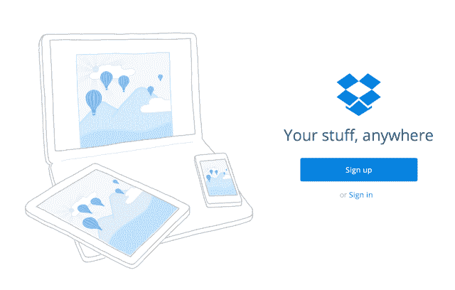
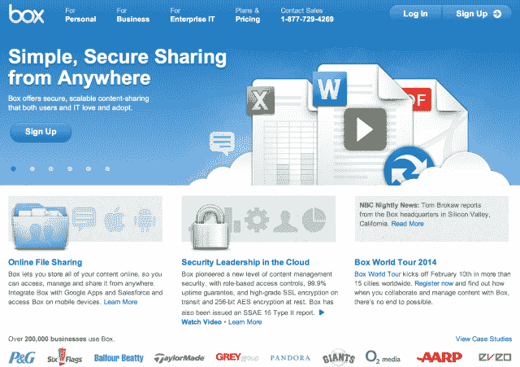
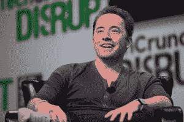

# 投资者在 Dropbox 上投入大量资金，这样它就能打败 Box | TechCrunch

> 原文：<https://web.archive.org/web/http://techcrunch.com/2014/01/18/dropbox-grows-up/?utm_source=dlvr.it&utm_medium=twitter>

根据[华尔街日报](https://web.archive.org/web/20230326060530/http://online.wsj.com/news/article_email/SB10001424052702303465004579327001976757542-lMyQjAxMTA0MDEwNzExNDcyWj)和 [Re / code](https://web.archive.org/web/20230326060530/http://recode.net/2014/01/17/dropbox-fundraising-could-) 的报道，Dropbox 正在以 100 亿美元的估值筹集 2.5 亿至 4 亿美元。为什么？因为 Dropbox 花了去年的时间来重建其产品，使其为企业服务，现在是时候销售该产品了。怎么会？因为一位消息人士称，Dropbox 一直做得很好，并认为它背后有充分的理由利用这个简单的融资市场。

这笔钱还可以资助从其他科技巨头挖走顶尖人才和大型收购。但随着竞争比以往任何时候都更加激烈，Dropbox 需要在潜在客户使用 box、Google Drive、微软 SkyDrive 或亚马逊 WorkSpaces 之前进行大企业销售推广。

## Dropbox 长大了

Dropbox 以轻松的消费产品而闻名。“你的文件无处不在”是它的座右铭，可爱的铅笔画是它的风格，它的吉祥物？一只挥舞着 AK-47 的恐龙…骑着鲨鱼…背上还有一只秃鹰。该公司甚至在旧金山办公室的门厅里放了一尊霸王龙的雕像。请注意，在这个品牌中，没有任何东西可以让企业确信 Dropbox 是安全的、可扩展的，并且非常适合复杂的团队。

然而，就成为一个家喻户晓的技术品牌而言，它的病毒战略奏效了。为注册好友提供千兆字节的免费存储空间让它快速增长。截至 2012 年 11 月，它已经拥有 1 亿用户。一年后，它的规模翻了一番，达到 2 亿。此外，有趣的文化帮助它挖走了一些名人，如谷歌的 Guido Van Rossum——Python 之父；脸书资深设计师 Soleio Cuervo 和 Rasmus Andersson。

但 Dropbox 无法摆脱其业余爱好者的名声。一年前，我听到企业说 Dropbox 没有所需的权限和安全功能，无法确保员工只能访问正确的文件，也无法查看谁在下载什么。

Dropbox 显然也听到了这些批评。它看到了在企业中可以赚大钱。对于个人使用，大多数人免费获得足够的千兆字节空间来满足他们的需求。如果他们想要更多免费的，他们可以招募朋友并获得存储奖励。很少有外行人需要每月 9.99 美元的 100 多千兆字节空间的专业计划。但 Dropbox 每位企业用户每年的费用约为 175 美元，这可能会让它的利润迅速增长。

因此，一年多前，Dropbox 开始雄心勃勃地寻求重建其产品架构。目标是让用户能够从同一个帐户同时访问他们的个人文件以及其企业服务的大修版本。

2013 年 11 月，联合创始人兼首席执行官德鲁·休斯顿发布了新的 Dropbox For Business 。他强调了同一个账户的个人和专业文件的双重使用，强大的权限控制，详细记录每个员工访问内容的共享审计日志，防止未经授权共享的块，以及将员工文件转移给新员工或在他们离开公司时从他们所有设备上删除这些文件的选项。

增强后的企业产品 Dropbox 将于今年年初推出。它的病毒式消费者战略让 Dropbox 迈出了第一步，世界各地公司的员工都在使用它。但是，获得每年数百或数千个 175 美元座位的大型企业安装仍然是靠销售大军赢得的战争，这需要资金来雇佣士兵和将军。

## 在泡沫市场中筹资

【Dropbox 的幸运，[眼下的好消息](https://web.archive.org/web/20230326060530/https://techcrunch.com/2013/11/08/get-money-while-the-gettings-good/)。在对 Pinterest 、[优步](https://web.archive.org/web/20230326060530/https://techcrunch.com/2013/08/23/uber-confirms-258m-raise/)及其企业竞争对手 [Box](https://web.archive.org/web/20230326060530/http://online.wsj.com/news/article_email/SB10001424052702303497804579240453655952012-lMyQjAxMTAzMDAwNDEwNDQyWj) 的数亿美元大规模融资的刺激下，一位接近该公司的消息人士告诉我，Dropbox 想趁热打铁。脸书股价的回升和推特的首次公开募股也助长了市场的泡沫，在这里很容易以低价以高估值筹集大笔资金。人们的想法是，这个窗口最终可能会关闭，没有一家快速增长的公司希望在这种情况下钱包变薄。

消息人士告诉我，Dropbox 的强劲势头使得新的 2.5 亿至 4 亿美元的融资变得容易得多。用户同比增长 2 倍；高调人才挖墙脚；和对其企业潜力的兴趣都可能是炒作的原因。

据华尔街日报的 Douglas MacMillan 称，Dropbox 已经完成了由贝莱德牵头的 2.5 亿美元投资，并有之前的投资者参与。 [Re / code 的 Liz Gannes 说](https://web.archive.org/web/20230326060530/http://recode.net/2014/01/17/dropbox-fundraising-could-actually-be-as-much-as-400-million/) Dropbox 可能会从大型共同基金 Fidelity 和 T. Rowe Price 再吸引 1 亿到 1.5 亿美元。这笔资金建立在 2011 年从高盛、Sequioa Capital、Index Ventures 和 Accel Partners 筹集的 2.5 亿美元的 Dropbox 基础上。

新的融资将使 Dropbox 的总融资额达到[5.07 亿美元至 6.57 亿美元之间。](https://web.archive.org/web/20230326060530/http://www.crunchbase.com/company/dropbox)

## 花钱赚钱

既然 Dropbox 有充足的现金和适合企业的产品，它可以认真对待销售了。

首先，这意味着配备经验证的销售主管。2012 年末，它挖走了过去 10 年来建立并领导 Salesforce 销售团队的 Kevin Egan。最近，Dropbox 一直在[加强其业务开发团队](https://web.archive.org/web/20230326060530/http://recode.net/2014/01/14/dropbox-steps-up-biz-dev-with-hires-from-facebook-google-and-spotify/)，这可能有助于它与其他流行的企业软件产品和移动设备制造商建立合作伙伴关系和整合。它刚刚挖走了脸书移动合作伙伴主管亨利·莫伊西纳克(Henri Moissinac)和帮助 Spotify 与多家公司合作的汤姆·谢(Tom Hsieh)。

这笔资金可以帮助 Dropbox 支付这类关键员工的薪酬，这往往需要提供高额薪酬，才能让高管离开轻松的科技巨头工作。它也可以用销售步兵来充实他们的团队。[2013 年，Dropbox 的员工从 200 人增加到了 500 人](https://web.archive.org/web/20230326060530/https://blog.dropbox.com/2014/01/happy-new-year-from-dropbox/)，因此它不怕增加员工数量。

凭借更深厚的销售基础，Dropbox 可以专注于招募新的企业客户。该公司表示，超过 400 万家企业使用 Dropbox，但不清楚使用程度。Dropbox 的[客户页面](https://web.archive.org/web/20230326060530/https://www.dropbox.com/business/customers)上的大多数公司规模较小。真正的摇钱树是《财富》500 强公司中拥有数百个用户的大型公司级设备。

为了赢得这些客户，Dropbox 必须击败 box 和其魅力领袖 Aaron Levie。Box 仅引用了 200，000 个商业客户，但尽管李维对 punky 红色匡威运动鞋情有独钟，他的公司在企业想要的安全性和许可功能方面享有盛誉。这就是为什么 [Box 签下了像宝洁、国家保险、LinkedIn 和 MTV 这样的大牌公司。快速浏览一下 Dropbox(上图)和 box(下图)的主页，就能了解到他们迄今为止的关注点。](https://web.archive.org/web/20230326060530/https://www.box.com/customers/)

Dropbox 还必须抵御 Google Drive，它受益于与谷歌其他企业产品的集成，SkyDrive 适合使用微软 Office 套件的企业，以及亚马逊 WorkSpaces 与亚马逊网络服务的从属关系。与 Dropbox 的独立平台相比，这些公司的每一个帝国都赋予了它们优势。

休斯顿和他的首席技术官阿拉什·菲尔多西将不得不通过敏捷的产品开发和精明的营销来弥补这一差距。他们还必须尽量减少 Dropbox 上周遭遇的那种吓跑企业的中断。

Dropbox 首席执行官德鲁·休斯顿

随着越来越多的公司进入大数据时代，以及媒体文件的持续增长，企业对企业云存储、共享和同步越来越感兴趣。Dropbox 现代的自下而上的分销方式让它占据了滩头阵地，但它仍需要资金来资助传统的首席信息官酒宴。

额外的几亿美元还可以帮助 Dropbox 购买更多成熟的产品，如其[收购邮箱](https://web.archive.org/web/20230326060530/https://techcrunch.com/2013/03/15/dropbox-buys-mailbox-all-13-employees-joining-and-app-will-remain-separate/)，以及[较小的](https://web.archive.org/web/20230326060530/https://techcrunch.com/2013/07/20/dropbox-acquires-mobile-coupon-startup-endorse-a-month-after-shutdown/)团队，如[代言](https://web.archive.org/web/20230326060530/https://techcrunch.com/2013/07/20/dropbox-acquires-mobile-coupon-startup-endorse-a-month-after-shutdown/)、 [Snapjoy](https://web.archive.org/web/20230326060530/https://techcrunch.com/2012/12/19/dropbox-acquires-snapjoy-and-puts-photos-into-its-focus/) 和[出售的](https://web.archive.org/web/20230326060530/https://techcrunch.com/2013/11/04/dropbox-snatches-up-sold-the-service-that-simplifies-selling-online-to-help-it-build-a-new-mystery-ecommerce-product/)，这些产品可以为其员工带来特殊功能或专业知识。如果 Dropbox 能够发现其企业产品中的漏洞(目前最大的漏洞是同步协作)，并通过收购来填补这些漏洞，它可能会对潜在客户更具吸引力。

去年，人们普遍猜测 Dropbox 可能会在 2014 年上市。但是上市是一个漫长而笨拙的过程，谁知道当休斯顿和菲尔多西敲响纽约的钟声时，市场是否还会如此友好。随着大量竞争对手争夺日益强大的企业存储宝座和风险投资，Dropbox 现在充实其战争资金是有意义的。

*【图片: [Ariel Zambelich/Wired](https://web.archive.org/web/20230326060530/http://www.wired.com/business/2013/07/dropbox/) ， [JDLasica](https://web.archive.org/web/20230326060530/http://www.flickr.com/photos/jdlasica/) ，*