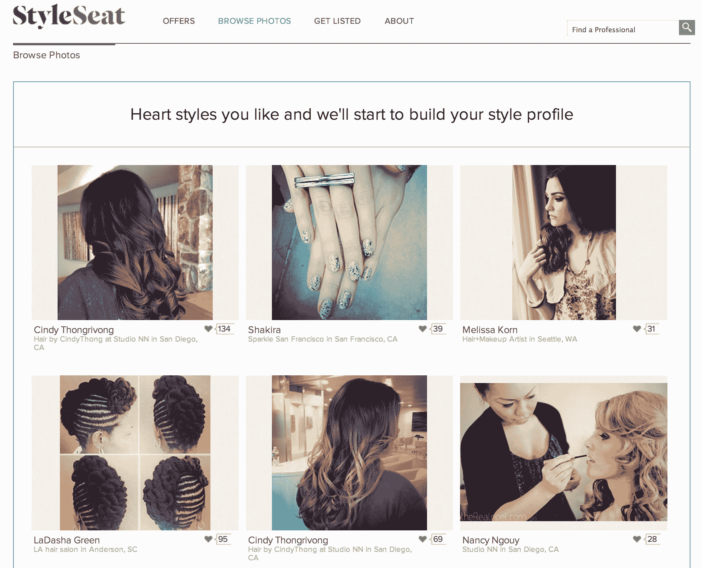

# 面向造型师和美容专家的在线市场 StyleSeat 从 light speed TechCrunch 融资 1020 万美元

> 原文：<https://web.archive.org/web/https://techcrunch.com/2014/01/22/online-marketplace-for-stylists-beauty-pros-styleseat-raises-10-2-million-series-a-from-lightspeed/>

正如[上个月](https://web.archive.org/web/20221207073429/https://beta.techcrunch.com/2013/12/16/salon-booking-platform-styleseat-goes-mobile-ahead-of-upcoming-series-a/)所暗示的，沙龙预订服务 [StyleSeat](https://web.archive.org/web/20221207073429/https://www.styleseat.com/) 现在已经结束了首轮融资。在光速创投的带领下，该公司又筹集了 1020 万美元的外部投资，使其迄今为止的融资总额达到 1400 万美元。这笔资金将用于发展该平台和目前 35 人的 StyleSeat 团队，该团队将在 2014 年翻一番。

现有投资者 Lowercase Capital 也参与了这轮融资，另外还有 Cowboy Ventures 和 Softtech。

StyleSeat 已经聘请了一些值得注意的新员工，包括网飞公司前商业智能总监 Andrew Dempsey，现在是 StyleSeat 的高级数据分析师，以及 One Kings Lane 的前产品副总裁 Yulie Kim，现在是 StyleSeat 的产品副总裁。据 StyleSeat 联合创始人兼首席执行官 Melody McCloskey 称，该公司也在寻求增加其数据科学和工程团队的人员，特别是在移动领域，他们在过去的一个月里已经雇佣了五名工程师。

StyleSeat 于 2011 年首次推出，从 2012 年年中使用其在线预订平台的约 55，000 家沙龙和水疗中心发展到现在的 200，000 多名美容专业人士。StyleSeat 声称，平均而言，这些专业人士在使用该平台的前 15 个月内，收入能够增长 68%。这种增长不仅是因为在线预订的增加，也是因为 StyleSeat 提供的其他营销工具的影响。

基于免费增值的服务对使用专业工具收费，包括电子邮件营销、高级日程安排、提醒等。该公司还一直在测试通过[现场优惠](https://web.archive.org/web/20221207073429/https://beta.techcrunch.com/2012/06/29/salon-booking-service-styleseat-launches-offers-platform-to-pull-stylists-away-from-daily-deal-sites/)(广告)的货币化努力，在那里它将收取预订量的 30%。这两个领域的业务都做得很好，但该公司没有谈到具体的转化率或收入。

如今，使用这项服务的消费者能够搜索和浏览 StyleSeat，找到造型师和其他美容专业人士(如打蜡、美甲、水疗服务等)。)，在这里他们可以查看自己的专业人士的个人资料，查看他们工作的照片，然后在准备好的时候预约。与此同时，造型师能够使用该平台管理预约、客户名单、他们自己的个人资料和照片，现在，由于去年 12 月推出的 [StyleSeat 移动应用程序，他们甚至可以在旅途中给客户发短信或打电话。](https://web.archive.org/web/20221207073429/https://beta.techcrunch.com/2013/12/16/salon-booking-platform-styleseat-goes-mobile-ahead-of-upcoming-series-a/)

自从 iOS 和 Android 移动客户端首次亮相以来，来自移动设备的预订量增长了 16 %,该客户端是为了应对该公司网站上快速增长的移动访客群而创建的。如今，68%的 StyleSeat 使用来自手机。

因为该公司使用 AngularJS 建立在移动基础上，他们能够快速推出消费者需要的其他功能，例如，包括支持预约重新安排和预约历史。

相比之下，截至 2012 年 6 月，该平台已为客户预订了超过 550 万次预约，而此前仅为 80 万次。现在，进入 2014 年，StyleSeat 将开始更加关注业务的消费者方面，计划通过开发移动和“按需”方面，为客户提供更多发现和预订约会的方式。

一项面向消费者的新产品功能正在 Q1 或 Q2 推出，目前仍处于保密状态。但从高层次来看，麦克洛斯基表示，StyleSeat 正在为移动设备做一些事情，“人们可能甚至没有想到，但这些事情已经成为我多年来想要创建的公司的一部分。”(人们只能希望这将包括按需美甲/足疗，对吗？)

有了这笔新资金，该公司还得到了董事会成员、光速公司(Lightspeed)的贾斯汀·卡德贝克(Justin Caldbeck)，显然他是通过全力争取赢得这笔交易的。“投资者对我们很感兴趣，但我礼貌地拒绝了会面，因为我们还没到那个阶段，”麦克洛斯基解释道。然后贾斯汀突然出现在办公室，要求只占用麦克洛斯基一分钟的时间。她听完了他的话，很快就被说服了。

“对我来说，他对我的事业的热情非常明显，”她说。“我和他有过几次偶然的会面，他在不同市场工作过的经历给我留下了深刻的印象。”Caldbeck 投资了 Bloomreach、GrubHub、Sidecar 和 TaskRabbit 等公司。“他对市场动态了如指掌，并真的打算建立一个大企业，”麦克洛斯基补充道。

该公司还希望填补一个独立的董事会席位，该人也将有市场经验，最好是从运营的角度来看。