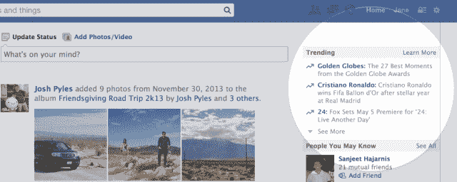
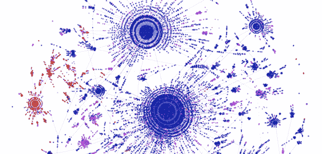

# 脸书愉快地驳斥普林斯顿研究称将失去 80%的用户

> 原文：<https://web.archive.org/web/https://techcrunch.com/2014/01/23/facebook-losing-users-princeton-losing-credibility/>

上周，普林斯顿大学的研究人员发布了一份广泛报道的研究报告，称脸书将在 2015-2017 年间失去 80%的用户。但是现在[脸书的数据科学家](https://web.archive.org/web/20230120143721/https://www.facebook.com/notes/mike-develin/debunking-princeton/10151947421191849)已经将这项研究中追踪谷歌搜索量的愚蠢的“相关性等于因果关系”的方法与它相反，表明普林斯顿将在 2021 年失去所有的学生。

脸书的一位发言人说“普林斯顿发表的报告完全是胡说八道。”的确，它从头到尾都有缺陷。

首先，它做了一个牵强的流行病学类比，将脸书比作一种使用者最终会“康复”的“疾病”。脸书可能会大量消耗我们的注意力，一些人对此感到厌恶，但这并不意味着它实际上像病毒一样运行。然后，研究人员以 Myspace 为例，说明用户如何从社交网络中恢复过来，然后像自然发生的那样放弃它。他们没有提到 Myspace 实际上是如何被脸书杀死的。

但这项未经同行评议的研究中的关键错误是，由于“脸书”的搜索量在 2012 年开始下降，这一定意味着脸书的使用率在持续下降。

是的，不是。回到 2007 年左右脸书的网络全盛时期，许多人确实通过搜索“脸书”或“脸书登录”来浏览社交网络但是后来这个叫做移动的东西出现了，人们开始通过打开一个应用程序来访问脸书，而不是搜索一个网站。因此，考虑到脸书一半以上的流量来自手机，对“脸书”的搜索量下降并不能证明什么。自 2012 年以来，脸书一直保持增长，目前拥有 11.9 亿用户，用户数量从未整体下降。

这并不是说脸书没有一些很大很大的问题。毫无疑问，[不再是“酷”](https://web.archive.org/web/20230120143721/https://techcrunch.com/2014/01/05/facebook-without-the-cool-kids/)，[不管它是否在乎](https://web.archive.org/web/20230120143721/https://techcrunch.com/2013/09/18/facebook-doesnt-want-to-be-cool/)。它承认在美国青少年中的使用略有下降[。它看到了来自移动第一社交应用的日益激烈的竞争，如 Snapchat 和 WhatsApp。它最终需要经受住向可穿戴设备的中期转变。许多早期的超级巨星已经离开。黑客正在动摇分享私人信息的信念。在手机上，你以朋友电话号码的形式拥有自己的社交图谱，这让人们更容易转向另一个社交网络。](https://web.archive.org/web/20230120143721/https://techcrunch.com/2013/10/30/facebook-teens-drop/)

这些因素的任何组合都可能阻止脸书的增长，并最终导致其萎缩。未来几年，携带智能手机的西方人很可能会将注意力分散到更多不属于脸书的应用上。但是，到 2017 年，完全失去 9.52 亿每月用户将需要灾难性的灾难。

即使这种情况发生，也很可能是因为搜索“脸书”的人越来越少，或者它类似于一种“疾病”，因为地球将在 2060 年耗尽空气——这正是脸书的数据科学家使用普林斯顿的方法证明会发生的情况。正如我们的一位[读者在推特上写道](https://web.archive.org/web/20230120143721/https://twitter.com/keepfischin/status/426527760744337408)“也许普林斯顿应该少担心谁在谷歌脸书，而应该多关心谁在谷歌 Coursera  

阅读下面来自脸书的迈克·德韦林、拉达·亚当和肖恩·泰勒的完整[注释](https://web.archive.org/web/20230120143721/https://www.facebook.com/notes/mike-develin/debunking-princeton/10151947421191849)(经许可出版)。里面全是 lols。

—-

脸书数据科学家迈克·德韦林

像你们中的许多人一样，我们对普林斯顿大学研究人员最近发表的一篇预测脸书即将灭亡的文章很感兴趣。特别有趣的是创新性地使用谷歌搜索数据来预测参与趋势，而不是研究[的实际参与趋势](https://web.archive.org/web/20230120143721/https://www.facebook.com/photo.php?fbid=10101235005815241&set=a.766892728661.2325161.4599&type=1&theater)。使用与论文中相同的强大方法，我们试图找到更多关于“普林斯顿大学”的信息——你不会相信我们的发现！

根据“相关性等于因果性”的科学原理，我们的研究明确表明，普林斯顿可能有完全消失的危险。看看脸书上的页面点赞，我们发现了以下令人担忧的趋势:

现在，脸书并不是人类知识的唯一宝库。对谷歌学术进行搜索，发现有大量学术论文，结果如下，显示了按年份匹配查询“Princeton”的文章的百分比:

这一趋势同样令人担忧:自 2009 年以来，期刊中“普林斯顿”论文的比例大幅下降。

当然，普林斯顿大学主要是一所高等学府——所以只要有学生，就没问题。不幸的是，在调查中，我们发现一个机构的本科生招生和它的谷歌趋势指数之间有很强的相关性:

不幸的是，这对普林斯顿大学来说是个坏消息，它的谷歌趋势搜索分数在过去几年里一直在下降:

这一趋势表明，到 2018 年，普林斯顿大学的招生规模将仅为目前的一半，到 2021 年，将完全没有学生，这与之前的学术水平图一致。基于我们稳健的科学分析，后代将只能想象这个曾经在地球上行走的废墟机构。

虽然我们担心普林斯顿大学，但我们更担心地球的命运——谷歌“空气”趋势也在稳步下降，我们的预测显示，到 2060 年，空气将不复存在:

正如之前的研究人员[J. Sparks，2008]在过去所表达的，这将对全人类的命运产生严重后果，而不仅仅是我们新泽西州的学术同事。

尽管本研究尚未经过同行评议，但本文的每一个“喜欢”都被视为同行评议。开始复习！

另外，我们并不认为普林斯顿或世界的空气供应会很快有所改善。我们爱普林斯顿(和空气)。作为数据科学家，我们想给大家一个有趣的提醒:并非所有的研究都是生来平等的——一些分析方法会得出非常疯狂的结论。

*Mike develon，Lada Adamic，Sean Taylor 研究。*

—-

## 更多大脸书新闻:

[脸书发布热门话题](https://web.archive.org/web/20230120143721/https://techcrunch.com/2014/01/16/facebook-trending/)

[扎克伯格称 Snapchat 为“隐私现象”](https://web.archive.org/web/20230120143721/https://techcrunch.com/2014/01/14/snapchat-privacy-zuckerberg/)

[脸书数据科学家证明模因像 DNA 一样变异和适应](https://web.archive.org/web/20230120143721/https://techcrunch.com/2014/01/08/facebook-memes/)

*【TechCrunch 图片致谢:[egophiliac via DeviantArt](https://web.archive.org/web/20230120143721/http://egophiliac.deviantart.com/art/SCIENCE-280611118)】*