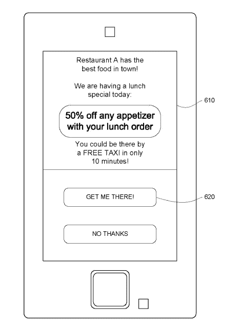
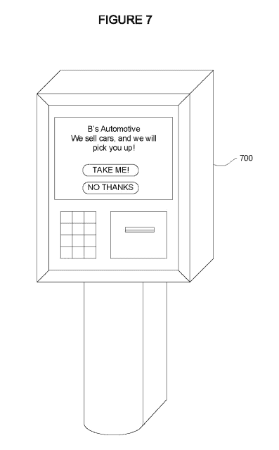

# 谷歌授予免费搭乘广告商位置的专利 TechCrunch

> 原文：<https://web.archive.org/web/https://techcrunch.com/2014/01/23/google-awarded-patent-for-free-rides-to-advertisers-locations/>

谷歌可能很快会推出一项新服务，将广告业务与其对当地交通工具、出租车以及(从长远来看)自动驾驶汽车的了解结合起来。美国专利商标局上周授予谷歌[一项专利](https://web.archive.org/web/20230120143722/https://www.google.com/patents/US8630897)，用于安排免费(或高度折扣)运输到广告客户的商业地点。

它是这样工作的。假设一家拉斯维加斯赌场真的想要你的生意。它不仅可以为你提供一些免费硬币，而且如果它认为这笔费用值得(当然是使用谷歌的自动算法)，它可以为你提供免费出租车或派一辆自动驾驶汽车来接你。

谷歌目前已获专利的算法将考虑用户的当前位置、前往广告商业务的路线和潜在交通方式(火车、私家车、出租车、租车或共享汽车)，以及用户的日常日程和“竞争广告商愿意为客户支付的替代位置价格”

正如谷歌所指出的，对于一个实体企业来说，最困难的部分往往是让人们到你的位置。谷歌表示，它的发明将使商店更容易吸引潜在客户，否则商店将不得不投资于靠近高流量地区的更昂贵的位置。

至少在谷歌的一个例子中，这涉及到使用自动驾驶汽车，尽管向人们提供公共交通优惠券等低技术选项也是专利的一部分。谷歌将利用客户的偏好，以及广告商愿意支付的价格，来确定给用户的最佳报价。

当然，广告客户可以使用许多因素来确定他们想要的目标客户。专利指出，主题公园可以选择只对“用户做广告，表明他们有一个或多个孩子陪伴，以增加收入。”

就像谷歌的其他广告选择一样，这项专利设想了一个竞价系统，不同的广告商可以在这个系统中争夺客户。谷歌说，这些出价可能基于客户的购买历史和其他因素。“例如，”该专利的作者写道，“与那些看起来旅行但实际上没有购买任何东西的人相比，广告商可能会出价更高，以吸引持续使用交通服务进行购买的客户。”

当他们的车到达时，用户可能还需要证明自己的身份，广告商也可能会出价让一辆车来接客户，将他们带回他们的家或最初的接车地点。

该专利于 2011 年提交，发明者([路易斯·里卡多·普拉达·戈麦斯](https://web.archive.org/web/20230120143722/https://www.google.com/search?tbo=p&tbm=pts&hl=en&q=ininventor:%22Luis+Ricardo+Prada+Gomez%22)、[安德鲁·蒂莫西·希巴尔斯基](https://web.archive.org/web/20230120143722/https://www.google.com/search?tbo=p&tbm=pts&hl=en&q=ininventor:%22Andrew+Timothy+Szybalski%22)、[巴斯蒂安·特龙](https://web.archive.org/web/20230120143722/https://www.google.com/search?tbo=p&tbm=pts&hl=en&q=ininventor:%22Sebastian+Thrun%22)、[菲利普·内梅克](https://web.archive.org/web/20230120143722/https://www.google.com/search?tbo=p&tbm=pts&hl=en&q=ininventor:%22Philip+Nemec%22)和[克里斯托弗·保罗·厄姆森](https://web.archive.org/web/20230120143722/https://www.google.com/search?tbo=p&tbm=pts&hl=en&q=ininventor:%22Christopher+Paul+Urmson%22))也负责谷歌的许多无人驾驶汽车专利。

(via: [斜线圆点](https://web.archive.org/web/20230120143722/http://news.slashdot.org/story/14/01/23/230212/should-self-driving-cars-chauffeur-shopping-whales-for-free))