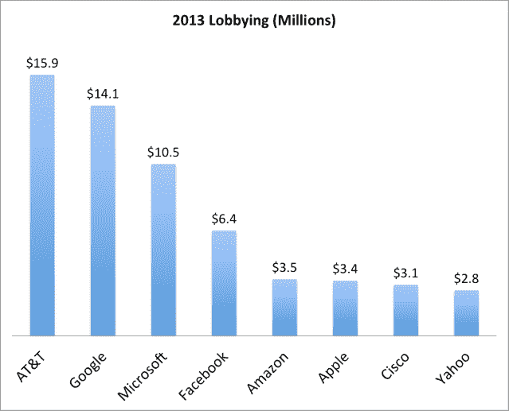

# 谷歌和其他科技公司在华盛顿游说者身上花了多少钱

> 原文：<https://web.archive.org/web/http://techcrunch.com/2014/01/23/how-much-google-and-other-tech-companies-spent-on-d-c-lobbyists-in-one-chart/>

# 在一张图表中，谷歌和其他科技公司在华盛顿游说者身上花了多少钱

2013 年，科技公司花费了超过 6100 万美元来影响美国的政治领导人，其中谷歌以 1400 万美元的可观收入领先。从高技能移民改革到监管，科技公司越来越多地被迫先发制人应对政策制定者施加的限制。

下图基于消费者监督机构从众议院职员披露数据库中收集的[数据。](https://web.archive.org/web/20230129230510/http://www.consumerwatchdog.org/newsrelease/google-leads-pack-10-tech-firms-pump-6115-million-2013-lobbying-efforts)

在某些情况下，游说比事后处理罚款和法律要便宜得多，也更成功。谷歌通过在美国首都 T4 结交朋友，避免了美国联邦贸易委员会的巨额反垄断罚款。

在其他情况下，谷歌的钱本可以更有成效地花在羽衣甘蓝芯片上，给那些吃饱喝足的员工。尽管数年来耗资数百万美元，众星云集，但整个科技行业仍未通过针对高技能移民的立法。

到目前为止，这笔钱在保护个别公司不突出的问题上做得很好。但是，技术部门是否能够影响一个全国性的问题还有待观察，就像全国步枪协会阻止枪支管制一样。根据 OpenSecrets.org 的说法，全国步枪协会及其附属机构花费了不到 300 万美元，所以金钱本身并不是决定一个人能否成功的因素。

随着 2014 年的到来，预计在网络中立、监控改革和移民方面的游说将会加强。