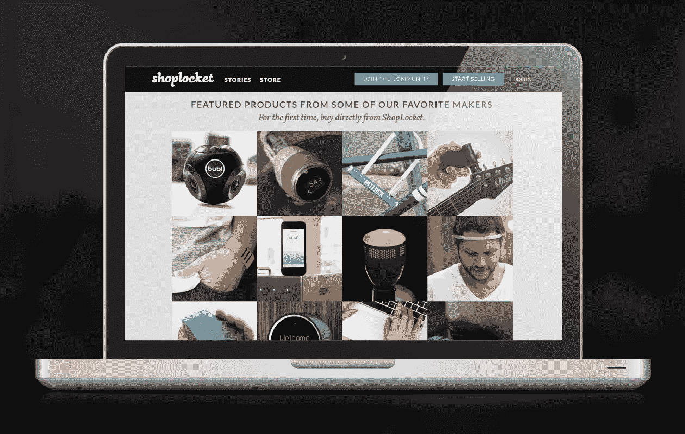

# PCH 国际收购 shock let 为硬件初创公司“关闭循环”| TechCrunch

> 原文：<https://web.archive.org/web/https://techcrunch.com/2014/01/23/pch-acquires-shoplocket/>

总部位于多伦多的初创公司[shopping locket](https://web.archive.org/web/20230328023155/https://www.shoplocket.com/)，一个电子商务平台，最初旨在让任何人通过他们现有的网络存在快速轻松地销售从单一商品到一系列商品的任何东西，但现在被一个不寻常的追求者收购了:T2 PCH 国际，该公司由爱尔兰企业家利亚姆·凯西(Liam Casey)创立，其名字是主要电子品牌与其亚洲供应伙伴和制造商之间的中间人。

交易的具体条款尚未披露，根据该条款，ShopLocket 将继续作为子品牌运营。“这是一笔好交易，”凯西说。“每个人都很开心。”

起初，这种匹配似乎很奇怪，但鉴于两家公司最近的发展，这种匹配是有道理的:由 TC Hardware warehouse 法官凯瑟琳·黑格(Katherine Hague)经营的[shopping locket](https://web.archive.org/web/20230328023155/https://techcrunch.com/tag/ShopLocket)最近推出了自己的预订单销售平台，以帮助硬件初创公司在达到能够销售航运产品的阶段之前，利用众筹活动产生的惯性。毕竟，成功的 Kickstarter 活动会引发很多兴趣，但通常这种兴趣不会消失，因为初创公司很少有办法在众筹活动结束后继续收集订单。也许更重要的是，如果一家初创公司有兴趣单干，ShopLocket 也提供了 Kickstarter 或 Indiegogo 托管的众筹活动的成熟替代品。凯西说，公司“结束了”从他的硬件加速器[高速公路](https://web.archive.org/web/20230328023155/http://highway1.io/)开始的循环，为初创公司提供了一个完整的产品创造、开发和销售解决方案。

“我选择他们是因为他们对自己工作的热情，”凯西说。“他们对企业家的旅程充满热情，有能力与社区建立真正的关系。”

凯西告诉我们，公司通常对构建自己的硬件 Kickstarter 项目感兴趣，但他们缺乏持续提供关于产品在开发周期中所处位置的准确和真实更新的能力，这对这些初创公司来说是一个巨大的挑战。PCH 和 ShopLocket 可以利用他们的专业知识在这方面提供帮助，这将有望为实际购买产品的人带来更强大、更令人满意的众筹体验。

PCH 国际公司最近也在其他方面凸显了其对硬件创业公司的兴趣。该公司将于下周在旧金山的演示日展示其新的早期硬件创业加速器的第一批产品，名为 [Highway1](https://web.archive.org/web/20230328023155/https://techcrunch.com/2013/06/25/highway1/) 。Highway1 为大约 10 家初创公司提供 2 万美元的种子资金，以及工程和设计建议，换取 3%至 6%的股权，以及 PCH 与中国主要供应商建立的关系。它还通过现有的 PCH 加速器计划为后期公司提供支持。

Casey 概述了收购 ShopLocket 可能带来的一些成果，比如为人们创造独家产品的能力，以及提供基于会员资格的早期访问其创业合作伙伴创造的特定产品的机会。由于已经有工厂“排队”以获得与其合作的机会，PCH 在供应方面对那些寻求众筹硬件项目的人也有很大优势。

该团队加入 ShopLocket 提供了 PCH 可以为新兴硬件公司的新目标市场提供的另一个优势，对于那些评估其加速器帮助价值的初创公司来说，这可能是一个相当大的价值激励。因此，虽然这仍然是一项表面上看起来有点超出左场的收购，但这仍然是一项相当于精明的战略收购的清晰逻辑。PCH 过去一直是科技硬件公司的低调朋友，但现在它可能即将成为过去几年一直在增长的电子产品创业运动的主要贡献者。