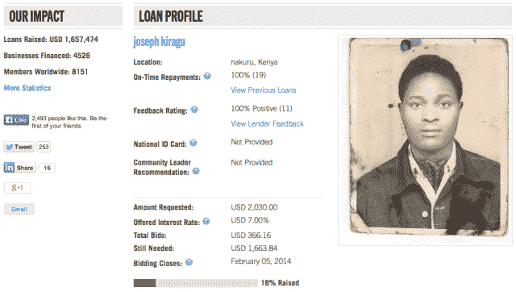

# Zidisha 为发展中国家的低收入企业家推出 Kickstarter 式的小额贷款平台 TechCrunch

> 原文：<https://web.archive.org/web/https://techcrunch.com/2014/01/23/zidisha-launches-a-kickstarter-style-micro-lending-platform-for-low-income-entrepreneurs-in-developing-countries/>

谈到借贷，银行长期以来一直处于等式的中心。然而，随着新信息技术、移动设备和传统网络的普及，新的借贷方式正在慢慢颠覆以银行为中心的模式。最好和最有前景的例子是 P2P 贷款，它利用技术直接将需要钱的人与有钱投资的人匹配起来，同时省去中间人。

通过实现资本跨越国际边界和财富划分的有效流动，并通过允许贷款人与借款人联系并直接向借款人汇款，P2P 小额贷款有能力在全球范围内产生巨大影响。然而，Julia Kurnia 表示，尽管有少数组织和机构尝试过这种方式，但跨越国际财富鸿沟的直接 P2P 贷款从未大规模开展过。

所以 Kurnia 决定改变这种情况。2009 年，她创办了一家非营利组织，致力于为发展中国家的低收入企业家提供直接的 P2P 贷款。由于没有太多的路线图可循，Zidisha 花了几年时间规划其路线，通过良好的老式试错法，缓慢地开发出一种可以大规模工作的小额金融模式。

快进四年，小微金融平台终于准备好公开亮相了。在 Y Combinator 对其 P2P 贷款模式进行了最后的润色之后——在那里，它将在 3 月份成为加速器的第二个非营利毕业生(或者第三个，如果你问豁免项目)，Zidisha 今天将推出一个令人兴奋的价值主张。这家初创公司认为自己是第一个真正直接的 P2P 贷款平台，让任何人都可以向发展中国家的初创企业家发放小额贷款。

尽管这个想法可能令人兴奋，但对许多人来说，齐迪沙的模型乍一看可能只是另一个[基瓦](https://web.archive.org/web/20230213151647/http://www.kiva.org/)的克隆。然而，Zidisha 的独特之处在于，与其他小额信贷项目或公司不同，该平台为任何人提供了与低收入企业家互动并直接向他们放贷的能力。

虽然像 [Prosper](https://web.archive.org/web/20230213151647/http://www.prosper.com/) 和 [Lending Club 这样的平台帮助](https://web.archive.org/web/20230213151647/https://techcrunch.com/2012/12/13/with-an-ipo-on-its-radar-lending-club-adds-former-treasury-secretary-larry-summers-to-its-heavyweight-board/)在早期开创了 P2P 贷款并使其成为主流，Kiva 这样的组织已经通过 Zip 这样的[服务成功地在发展中市场采用了这种模式，但 Zidisha 希望更进一步。](https://web.archive.org/web/20230213151647/http://www.fastcoexist.com/1679137/kiva-s-secret-project-to-let-you-give-peer-to-peer-loans)

Kurnia 告诉我们，要做到这一点，并将其方法与其他人区分开来，关键在于它如何对待“直接”这一概念。尽管 P2P 式的小额贷款已经成功地降低了银行在借贷过程中的重要性，但大多数小额金融组织仍然依赖中介来实现借贷过程。例如，Kiva 的优势来自它与当地合作伙伴建立的众多密切关系，这反过来有助于扩大其规模并提供更好的覆盖面。

然而，由于这些关系，Kiva 依靠其实地合作伙伴向企业家发放贷款。另一方面，Zidisha 希望完全消除小额贷款等式中的依赖性。

原因在于，尽管许多小额信贷平台的初衷是好的，但最终，依赖第三方的成本还是落在了创业者身上。这些中介机构(或现场合作伙伴)收取的全球平均利息和费用率为 37 %,在某些市场，可能高达 70%。即使是那些从 Kiva 获得零利率贷款的微型金融机构，也可以收取平均 35%的利息和费用。

此外，小额信贷机构在这些发展中市场发展和维持实体业务的成本并不低。由此带来的高运营成本意味着高费用，最终对当地企业家来说是一笔不公平的交易，因为这使他们无法赚到足够的钱(相对于他们的贷款成本)来对他们的生活质量和家庭生活水平产生真正的影响。

这就是 Kiva Zip 和 Zidisha 的不同之处:尽管 Kiva Zip 允许借款人和贷款人直接沟通(通过手机)，但在较小程度上，它仍然依赖当地合作伙伴帮助审查借款申请人和管理还款。相比之下，Kurnia 表示，Zidisha 不允许任何第三方，特别是当地组织，为借款人发布内容或管理贷款。

因此，为了避免高昂的运营成本并为借款人提供更好的条件，Zidisha 的 50 名员工几乎全部由志愿者组成，他们负责初创公司的运营，无论是审查借款人的申请，发放贷款，登记还款还是回答查询。在这方面，Zidisha 的创始人告诉我们，该公司类似于维基百科。换句话说，这是一个几乎完全由志愿者运营的有社会意识的在线社区。

Zidisha 模式的另一个吸引力在于其条款:Zidisha 贷款的平均利率和费用在 5%至 9%之间，Kurnia 说，其中大部分用于支付转移贷款的成本。例如，为了帮助支付其余的运营成本，该平台为贷款人提供了直接向 Zidisha 捐款的能力，并使贷款时留下小费变得很容易。

借鉴 Watsi 的书——它本身是 Y Combinator 支持的非营利组织——zidi sha 允许贷款人在与企业家互动的同时发布问题和评论，从而帮助促进借贷者之间更直接的关系，而企业家反过来可以分享进度报告和业务增长的更新。这使得企业家可以直接与投资者建立联系，并发展实际的关系，这反过来又为贷款人提供了看到他们的小额投资所带来的影响的机会。

Zidisha 通过确保其贷款人的投资 100%直接支付给借款人的企业，提供了额外的激励。该平台还允许贷款人设定自己的利率，利率按周分期偿还，借款人自己发布贷款申请。

当 Zidisha 与第三方合作时，它将提供技术支持以及网络和移动网络，使该公司能够为当地企业家提供服务。事实上，正是这些服务可以帮助进一步减少借款人和贷款人之间的障碍，方法是提供进行本地信用检查和验证的能力，提供低成本的电子转账和独立跟踪借款人的表现。

但这就是它的范围，创始人说。在此之后，Zidisha 的目标是摆脱用户的方式，让他们开始直接与借款人互动。

如今，这家初创公司正在与来自八个国家的 3100 家贷款机构合作，包括贝宁、布基纳法索、几内亚、印度尼西亚、肯尼亚、马里、尼日尔和塞内加尔，并计划在未来几个月内开始扩大这一名单。迄今为止，已有 160 万美元的贷款通过其平台直接发放给了 3，700 名借款人。与此同时，四年期的平均利率为 4.6%，平均违约率仅为 8%。

最后，当我们谈到直接的 P2P 贷款在全球范围内产生巨大影响的真正潜力时，这位创始人说，重要的是要记住，这些企业家工作的限制性政治和经济条件往往意味着当地银行向小企业主贷款的成本很高。

因此，许多借款人与小额信贷机构合作也就不足为奇了。然而，Kurnia 解释说，由于机构高昂的管理成本，个人业务扩张贷款往往带有令人望而却步的抵押和利息要求。Zidisha 希望消除这些障碍，为借款人提供获得贷款的机会，使他们能够保留更大份额的收入，从而更好地支持他们的家庭。

因此，尽管像 Kiva 这样的组织继续主导着这个市场的大部分份额，但像 Zidisha 这样的初创公司正在努力创建一个论坛，让旧金山的记者可以与来自世界上最偏远和最贫困地区的企业家联系和交朋友。最后，如果这个平台成功了，那将是因为它创造了一种借贷体验，这种体验不仅仅围绕着贷款的收集，而是“传记的收集”，引用该网站一位贷方的话说。

无论是来自饱受战争蹂躏的西非卡萨芒斯地区的[女售货员，她“早上四点起床阅读戴尔·卡耐基的书籍”，卡耐基的创始人说，还是在内罗比贫民窟](https://web.archive.org/web/20230213151647/https://www.zidisha.org/microfinance/loan/Aissatoutraore/20.html)开办[计算机培训学校的企业家，这些故事肯定会让你正确看待自己，并让你感觉到，最终，技术正被用来真正帮助人们——而不仅仅是让分享你的照片变得更加容易。](https://web.archive.org/web/20230213151647/http://p2p-microlending-blog.zidisha.org/2013/06/12/life-will-never-be-the-same/)

像 Watsi 和 Zidisha 这样的网站把“收养孩子”或家庭的日子放在了发展中国家，在那里你收到的只是一张照片或一本小册子，根本不知道你的投资去了哪里，也不知道它实际上被用来做什么。换句话说，他们让捐赠(或借贷)变得更容易，回报也更多。