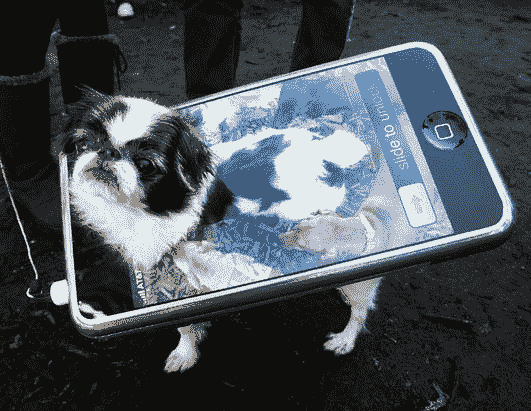

# Gmail 和 Google+在全球范围内关闭，大约 50 分钟后服务恢复

> 原文：<https://web.archive.org/web/https://techcrunch.com/2014/01/24/gmail-goes-down-across-the-world/>

# Gmail 和 Google+在全球范围内关闭，大约 50 分钟后服务恢复

截至 2 点 52 分，Gmail 和 Google+的服务似乎已经恢复，对大多数受影响的人来说是可靠的。

**更新:**用户现在报告称，Gmail 服务至少部分恢复了，尽管也有反复中断和缓慢的报告。在这一阶段，似乎有些服务已经恢复，而其他人仍然完全无法连接。

Gmail 目前正在经历一场似乎是大范围的宕机，来自欧洲、美国、加拿大、印度等地的报道称，谷歌的电子邮件服务已经瘫痪。我们仍然在[应用状态面板](https://web.archive.org/web/20230327191409/http://www.google.com/appsstatus#hl=en&v=status&ts=1390590512049)上看到绿灯(更新:现在显示为东部时间 2:20 左右的红色)，但我们正在试图找到更多关于这个问题的信息。

大多数用户目前看到的错误是一个(500)代码问题，这几乎只是表明这是一个暂时的问题，并没有给出原因的线索。然而，从 Twitter 上的反应来看，这个问题目前正在影响大量用户。Google+也宕机了，尽管你没有早点注意到这一点也是情有可原的。

Google+的中断也影响了新系统下的 YouTube 评论，这意味着这些评论根本不会加载到视频以及网络和移动端的视频中。试图通过外部客户端使用 POP 或 IMAP 协议访问 Gmail 的用户也无法访问他们的收件箱。多次致电谷歌新闻热线未能接通，我们也通过电子邮件向他们的新闻账户发送了更多信息，但有一个很好的理由怀疑他们可能没有阅读(见整篇文章)。

作为一个额外的奖励，请注意谷歌的网站可靠性工程团队，它确保谷歌服务保持运行，当这一切发生的时候，他们正在 Reddit 上做 AMA。那会让你们喘口气，伙计们。

根据应用状态面板，谷歌称这是对其 Gmail 服务的“破坏”，并承诺“不久将提供更多信息”大约 20 分钟后，大多数用户的服务短暂恢复，但随后再次关闭。不到一个小时后，对于之前抱怨连接性的用户来说，它似乎再次恢复并稳定了。

## 来自 TechCrunch 的更多重大新闻

[Gmail 故障导致数千封邮件被发送到一名男子的 Hotmail 账户](https://web.archive.org/web/20230327191409/https://techcrunch.com/2014/01/24/gmail-glitch-is-causing-thousands-of-emails-to-be-sent-to-one-mans-hotmail-account/)

[谈论时机:就在 Gmail 爆炸之前，谷歌的可靠性团队坐下来参加了一次 AMA](https://web.archive.org/web/20230327191409/https://techcrunch.com/2014/01/24/talk-about-timing-googles-reliability-team-sat-down-for-an-ama-right-as-gmail-exploded/?ncid=fb)

脸书愉快地驳斥了普林斯顿大学的研究，称其将失去 80%的用户

【T2

[斯诺登回答了我们亟待解决的数据收集问题:最坏的情况会是什么？](https://web.archive.org/web/20230327191409/https://techcrunch.com/2014/01/23/snowden-answers-our-burning-data-collection-question-whats-the-worst-that-could-happen/)

[苹果称正在研发两款更大的 iphone](https://web.archive.org/web/20230327191409/https://techcrunch.com/2014/01/23/apple-is-working-on-two-larger-iphones-per-wsj/)

[谷歌授予广告商免费乘车专利](https://web.archive.org/web/20230327191409/https://techcrunch.com/2014/01/23/google-awarded-patent-for-free-rides-to-advertisers-locations/)

图片修改自[快门架](https://web.archive.org/web/20230327191409/http://shutterstock.com/)