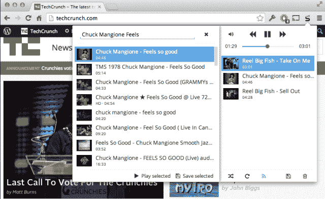

# Streamus 将 Chrome 变成了一个快速、免费、基于 YouTube 的 Spotify 替代品

> 原文：<https://web.archive.org/web/https://techcrunch.com/2014/01/24/streamus-turns-chrome-into-a-fast-free-youtube-powered-spotify-alternative/>

# Streamus 将 Chrome 变成了一个快速、免费、基于 YouTube 的 Spotify 替代品

用 Chrome？整天听很多音乐？看看这个扩展。

以 Rdio 或 Spotify 这样的音乐流媒体服务为例，将其归结为绝对的基础——搜索歌曲，将歌曲添加到播放列表，并播放这些歌曲。用 YouTube 的海量(有时甚至是可疑的合法)音乐库为它提供动力。保持它超级快，超级简单。

那是 [Streamus](https://web.archive.org/web/20230302171343/http://streamus.com/) 。Streamus 是 Chrome 的一个扩展，在过去的几个月里一直在悄悄地开发，但最近才开始攀升。

Streamus 可以让你搜索一首歌曲，并在大约 3 秒钟内开始播放。没有可切换的标签，也没有可打开的应用程序。它看起来是这样的:

你只需在 Chrome 的 Omnibar(阅读:Chrome 的一体化地址栏/搜索框的别称)中键入“Streamus”，点击 tab(或 space)，然后键入你要找的歌曲的名称。Streamus 几乎立即返回一个包含 YouTube 结果的下拉列表——只需点击一个，音频就立即在后台开始播放，这一切都不会让你离开当前页面..

想要一首以上的歌曲？想要建立一个大型的音乐播放列表来帮助你度过一天吗？Streamus 也会这么做的。它在 Chrome 的导航区域添加了一个小按钮，点击它会打开一个下拉菜单，如下所示:

从那里，你可以将歌曲添加到播放列表，保存播放列表供以后收听，或者启用“广播”模式，试图根据你到目前为止选择的艺术家来查找你要挖掘的歌曲。很少有多余的东西，这就是它本来的样子。没有俗气的社交网络元素，没有“流行艺术家”指标。你选歌，它就放歌。

另外，扩展的开发者看起来是个很酷的人。几个月来，他一直在一个小的子 reddit 上记录每个新版本[，允许他的用户就每个版本提出问题——就此而言，允许他提出问题(比如“bug x 影响到你了吗？”)的用户。](//web.archive.org/web/20230302171343/https://www.reddit.com/r/streamus)

当然，由于它是完全免费的，而且仍处于早期测试阶段，它也不是没有缺点。由于这些音乐都来自 YouTube 的音乐收藏(大部分是用户上传的)，因此有相当多的劣质音乐。虽然我发现最热门的结果通常是我正在寻找的歌曲，但情况并非总是如此。有些歌曲被贴错标签了。有些只是质量不确定。有时你会得到一首歌的不稳定的现场版本，有人在他们的手机上录制了这首歌，从质量来看，手机似乎被放在一罐果酱里。但是它很快，而且是免费的，这是一个非常好的方法来快速播放你一整天都想听的那首歌。

如果 YouTube 变得越来越大，看看它如何应对将会很有趣。Streamus 只播放视频中的音频，一旦你安装了扩展，几乎没有迹象表明这些内容是从 YouTube 上获取的——所以很容易想象 YouTube 可能会有点恼火。

你可以[在 Chrome 网上商店找到这个扩展](https://web.archive.org/web/20230302171343/https://chrome.google.com/webstore/detail/streamus-beta/jbnkffmindojffecdhbbmekbmkkfpmjd?hl=en)。