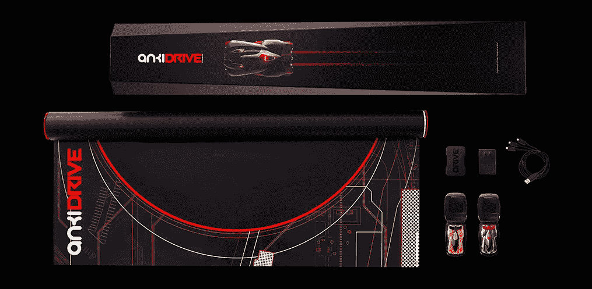

# 免费赠品:20 个 Anki DRIVE 入门套件和免费的脆饼干门票

> 原文：<https://web.archive.org/web/https://techcrunch.com/2014/01/25/techcrunch-giveaway-20-anki-drive-starter-kits-and-free-ticket-to-the-crunchies/>

# TechCrunch 赠品:20 个 Anki DRIVE 入门套件和免费的 Crunchies 门票

Anki 的团队非常兴奋能够入围[“2013 年最佳新创企业”](https://web.archive.org/web/20221007004800/https://beta.techcrunch.com/events/7th-annual-crunchies-awards/vote/)的 Crunchie Award 决赛，他们决定通过传播 Anki 的爱并向 20 名幸运的人赠送 [Anki Drive starter kits](https://web.archive.org/web/20221007004800/http://anki.com/) (每套价值 199.95 美元)来表达对我们读者的感谢。一名非常幸运的人还将获得一张免费的[脆饼干](https://web.archive.org/web/20221007004800/https://beta.techcrunch.com/events/7th-annual-crunchies-awards/)门票(价值 120 美元)。这是你把 Anki Drive 带回家的机会，然后在 2 月 10 日的 Crunchies 上与技术行业最优秀和最聪明的人分享你的赛车经验。

Anki Drive 被形容为“马里奥赛车”,它会在你的客厅地板上栩栩如生。你听到了吗？马里奥赛车！想要亲身体验 Anki Drive，请查看下面的 [Greg 的评论](https://web.archive.org/web/20221007004800/https://beta.techcrunch.com/video/hands-on-with-the-new-anki-drive-2/517973734/)。

要获得赠品，您只需遵循以下步骤。我们将从每一步中选择 10 个，你可以两个都选，这样你的机会会加倍:

**1)在下面发表评论，告诉我们你喜欢驾驶/比赛的哪些方面**

**2)用# Crunchies 标签发这篇文章**

赠品将从现在开始，到 1 月 29 日星期三晚上 7:30 结束。请注意，嘎吱嘎吱的门票只有一张，不包括机票和酒店。此外，投票将于明天太平洋时间晚上 11:59 结束。别忘了在这里为你最喜欢的[松脆饼干决赛选手投票](https://web.archive.org/web/20221007004800/https://beta.techcrunch.com/events/7th-annual-crunchies-awards/vote/)。

祝你好运！

*我们的赞助商帮助制作松脆饼干。如果您有兴趣了解更多关于赞助机会的信息，请联系我们的赞助团队:[sponsors@beta.techcrunch.com](sponsors@beta.techcrunch.com)。*

**更新:这一赠品现在已经结束。一旦我们有了获胜者，我们将更新这个帖子。**

 ****以下是您的获奖者:**

@ themayorpete
@ professor Josh
@ linear Peter
@ ImTiffanyYu
@ David Parker 9
@ nivo 0o 0
@ Ed
@ MarkMiscavage
@ acameronma
@ djkillpixcie

泰勒·霍尔特
桑迪·霍奇
尼玛·斯雷特
埃里克·赫克特
阿米特·普拉丹
安贾利·梅农
克里斯·瑟瑞斯
大卫·维索尔
克里斯多夫·乔
布兰登·奥弗迈尔**