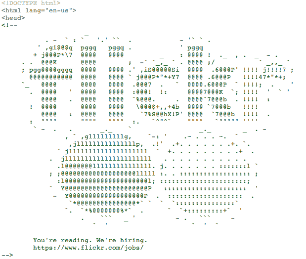

# Flickr 上下颠倒的“关于”页面实际上是一个聪明的招聘广告

> 原文：<https://web.archive.org/web/https://techcrunch.com/2014/01/27/flickrs-upside-down-about-page-was-actually-a-clever-job-ad/>

# Flickr 上下颠倒的“关于”页面实际上是一个巧妙的招聘广告

一些 Flickr 用户注意到该公司的“关于”页面昨天颠倒了。是的，完全颠倒了。是的，我们检查过，[不仅仅是我们](https://web.archive.org/web/20221207170602/https://plus.google.com/102166846250265670042/posts/B2jerSUDfW6)。事实证明，是的，Flickr 的颠倒是故意的。雅虎今天向我们证实，这个“错误”实际上是一个复活节彩蛋，意在庆祝澳大利亚日(1 月 26 日)。

一位公司发言人指出:“我们改变了澳大利亚日的‘关于’页面(因此颠倒了)，用澳大利亚的所有东西取代了团队照片——例如袋鼠的照片。”。

但是这个页面还有另一个很酷的花招——它也是一个招聘广告。雅虎表示，爱管闲事的开发人员在检查源代码时看到了一个特殊的“我们正在招聘”代码:

信息很简单:“你在阅读。我们在招人”，然后是 Flickr 招聘页面的链接。

一位读者在[黑客新闻](https://web.archive.org/web/20221207170602/https://news.ycombinator.com/item?id=7127686)上调侃这个广告:

> “更深奥的东西会更有趣..也许右下角有一个小而突出的 Pi，点击后会应用 3D CSS 变换，让网页看起来像是打开了一个求职网站的大门。”

有人回复说，“有人桑德拉·布洛克的电影看多了。”(也许这个[一个](https://web.archive.org/web/20221207170602/http://www.imdb.com/title/tt0113957/)？)

我们问雅虎在推荐方面的表现如何，但该公司拒绝透露。根据 Twitter 的说法，[似乎只有少数用户](https://web.archive.org/web/20221207170602/https://twitter.com/search?q=flickr%20upside%20down&src=typd&f=realtime)注意到了这一变化——这可能更广泛地说明了 Flickr 目前的“酷”因素，而不是该公司可能喜欢分享的。

*图片致谢: [Craig Tumblison](https://web.archive.org/web/20221207170602/https://plus.google.com/102166846250265670042/posts/B2jerSUDfW6) ，Google+；雅虎*