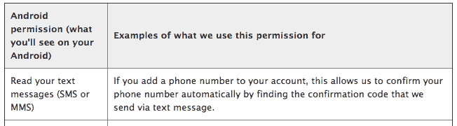

# 脸书偷看安卓用户的短信？好吧，等一下 TechCrunch

> 原文：<https://web.archive.org/web/https://techcrunch.com/2014/01/28/facebook-reading-android-users-texts-well-hold-on/>

# 脸书偷看安卓用户的短信？好吧，等一下

昨天，互联网上有消息称，脸书已经“偷偷”给其安卓应用程序添加了一项新的许可，允许该程序读取用户的短信。

[Reddit 对应用程序请求的讨论](https://web.archive.org/web/20221206130238/http://www.reddit.com/r/technology/comments/1wc19y/facebook_sneaked_a_new_permission_into_todays/)浮出水面 [Android 论坛 12 月](https://web.archive.org/web/20221206130238/http://forums.androidcentral.com/android-applications/346155-facebook-app-update-new-permissions.html)的帖子强调了这一变化，因此看起来更新和必要的权限更改正在以滚动方式执行。事实上，点燃 Reddit 的截图的[海报在听到其他用户的反馈后也这么说。](https://web.archive.org/web/20221206130238/http://tony.calileo.com/fb/)

所以，脸书可能还没有请求允许阅读你的短信，但如果你是安卓用户，很快就会了。

管它呢，你可能会想。嗯，脸书已经预料到你脖子后面的汗毛会竖起来，并给出了一个简单的解释,说明它为什么想要阅读你的短信。从其网站:

这里的基本情况是，脸书要求访问您的文本，以使其双因素身份验证更加友好。它不会让你翻遍你的短信去找一个代码，它会自动搜索并为你抓取字符串。

这是一个很小的理由，要求什么感觉像一个非常大的访问点，你的个人信息。

我们可以简单地框定这一点:你介意脸书针对你的短信内容投放广告吗？也就是说，如果你的短信成为脸书可以用来帮助广告商更好地定位广告的另一个数据集，你会不高兴吗？你可能不介意。脸书已经允许广告商使用教育水平和年龄等选择因素来锁定你，为什么不再增加一个呢？

你可能想到的 Gmail 类比并不是一个精确的比较。无论好坏，通过 Gmail 发送的内容现在都是谷歌数据存储的一部分。然后，在一些限制条件下，谷歌会自动扫描你的邮件，并根据你的邮件内容投放广告，将其电子邮件服务货币化。微软喜欢制造噪音说这太过分了，尽管它也扫描你的电子邮件，尽管是为了防病毒，而不是为了更好地商业化其 Outlook.com 产品。

为什么脸书短信的情况不同？因为你的短信根本不是脸书世界的一部分。因此，脸书想要访问你的短信是该公司采取了更多的帐篷。

这并不是说脸书现在、将来甚至想要根据你的短信内容来定向投放广告。它可能只是希望能够更好地确认新手机的合法性。但是如果你给一只老鼠一片巧克力，它通常会想要整个饼干。

如果你以前对脸书和它对你数据的处理很满意，我怀疑你现在仍然如此。然而，如果你已经在围栏上，这可能是一个爬下来的理由。