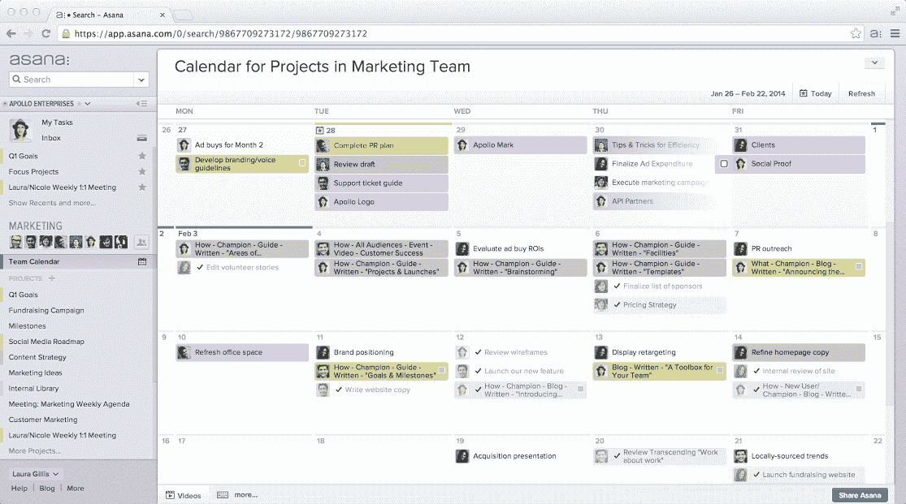

# Asana 在其协作服务| TechCrunch 中增加了日历功能

> 原文：<https://web.archive.org/web/https://techcrunch.com/2014/01/29/asana-adds-calendar-function-to-its-collaboration-service/>

Asana 是一家软件公司，致力于帮助公司搁置电子邮件，提高工作的凝聚力，该公司为其服务带来了一个关键的新功能，将动态日历添加到其任务、项目和团队的组合中。

作为一种服务，体式围绕任务和任务分配给谁来运作。一个人被指定为任务的执行人，而不是让许多人参与到一个有截止日期的任务中。该公司的观点是，太多的厨师意味着没有人喝汤，因此它迫使公司精确地关注谁是任何特定任务的关键人物。

如果你以前没有玩过 Asana，它的界面是围绕团队和他们当前的一组任务建立的。更新之类的东西被收集在一个收件箱里，该系统围绕着这样一个理念:电子邮件本质上是基于任务的分配和团队合作的垃圾。鉴于我个人反对电子邮件的立场，我喜欢 Asana 的弯曲。

虽然 Asana 是一个帮助团队分配工作和协作完成任务的简洁工具，但它缺乏一种可视化的方式来绘制——甚至绘制——团队的任务。因此，该公司在其产品中内置了日历功能。

日历不是新的。也不是很有趣。(我相信，你的谷歌日历与其说是放松，不如说是压力的来源。)但是 Asana 创造了一个动态的、可排序的日历功能。这意味着你可以绘制整个团队的任务或部分任务。因此，我可以映射一个团队中两个成员的任务，以此类推。

日历还会自动更新到其他地方输入的新信息，以您选择的方式不断更新数据，显示在无限滚动的用户界面上。

Asana 向我介绍了产品，虽然我不像他们的产品那样在基于团队的环境中工作，但它看起来非常流畅。

以上比我通常的想法更积极——我道歉——但坦白地说，我喜欢 Asana 的观点:更少的邮件，更多的合作，没有隐藏。

Asana 产品的本质是责任——用户以一种非常公开的方式对一组特定的任务负责。而且，考虑到最后期限也是公开的，我怀疑在购买 Asana 所卖东西的团队中推卸责任的现象会减少。

总之，Asana 今天显著改进了它的产品。如果这有助于对抗电子邮件，我同意。

*Top Image Credit:[Flickr](https://web.archive.org/web/20230406162011/http://www.flickr.com/photos/g4ll4is/)*