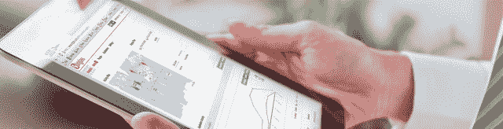
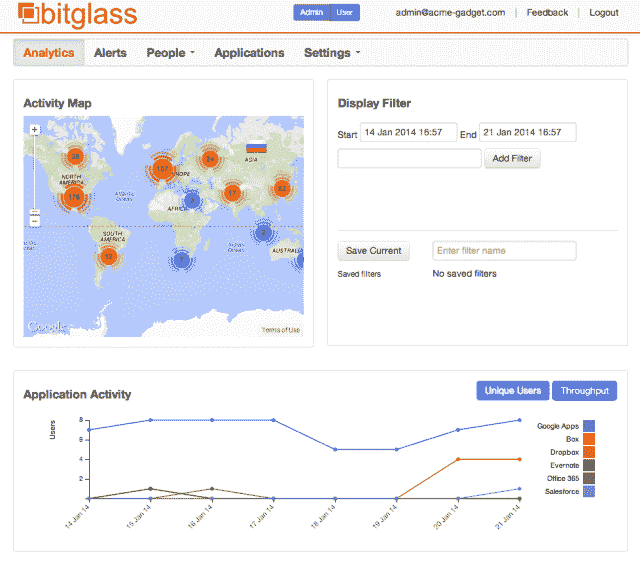
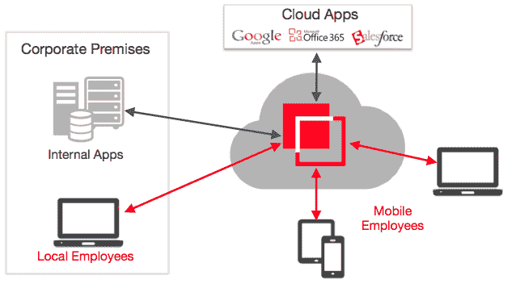
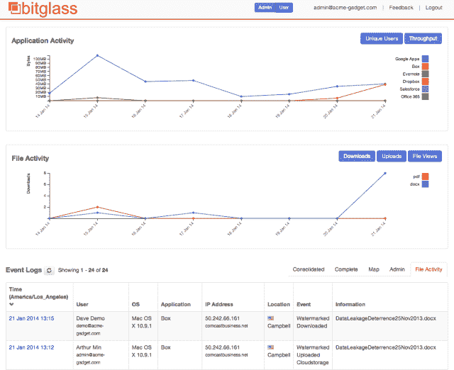

# 在 1000 万美元的支持下，隐秘的初创公司 Bitglass 展示了其面向移动和云的企业安全解决方案 TechCrunch

> 原文：<https://web.archive.org/web/https://techcrunch.com/2014/01/29/backed-by-10m-stealthy-startup-bitglass-reveals-its-enterprise-security-solution-for-mobile-cloud/>

Bitglass 是一家隐秘的创业公司，去年在一轮超额认购中从 NEA 和 Norwest Venture Partners 获得了 1000 万美元的首轮融资，今天它打开了大门。该公司正专注于一个急需的领域，即数据安全，这是企业从内部解决方案转向云服务的一个方面，如 Google Apps、Salesforce、Box、Dropbox 等。

借助 Bitglass，公司能够保护和跟踪敏感的公司数据，而无需首先在员工的笔记本电脑或移动设备上安装客户端软件，这对于当今企业环境中的工作方式来说是一个显著的飞跃。

Bitglass 的前身是帕洛阿尔托，但现在位于加州坎贝尔以南一点的地方，由 Nat Kausik(首席执行官)创建，他之前在惠普工作了八年，后来又创建了其他公司，包括 Arcot 和 FineGround，分别被 Computer Associates 和 Cisco 收购。与此同时，Bitglass 的联合创始人兼首席技术官 Anurag Kahol 曾是 Juniper Networks 的工程总监，并在思科工作了 11 年，这是两位创始人第一次相遇的地方。

在硅谷的生态系统中，年轻人有时被高估了，考西克笑着形容自己是“一个老古董”。但是，在这种情况下，这并不是一件坏事。“可以说，这是我的第五次创业，”他说。“我试过退休……但是很无聊。我能告诉你什么？我喜欢建立公司。”

Kausik 说，Kahol 去年带着一个安全解决方案的想法来找他，这个方案可以保护存储在云服务中的数据。在 Juniper Networks，他一直致力于企业网络的安全解决方案，他意识到这与世界上大部分地区的发展方向相反——向云和移动设备发展。

“数据从美国电话电报公司的 Salesforce 或 Google Apps 直接传到某人的手机上，”Kausik 解释说，这是为什么其他解决方案在今天相对“没有意义”的原因。“数据永远不会触及企业网络，”他说。

2013 年 1 月，两人合作创建了 Bitglass，这是一种 SaaS(软件即服务)安全解决方案，专为企业客户设计，其数据存储在云和员工的移动设备上，包括他们通过公司 BYOD 计划从家里带来的个人设备。

这种转变给企业带来的问题是，当数据在异地存储和访问，以及通过不连接到公司内部网络的个人设备存储和访问时，安全性、加密和跟踪都没有那么好。与此同时，目前的解决方案主要是通过强迫员工在手机和电脑上安装和运行客户端软件来处理这个问题，以便访问受保护的文件、公司电子邮件、日历等。

“挑战在于员工想要隐私和移动性，”Kausik 说。他们不希望公司窥探或跟踪他们的个人活动，比如他们正在下载哪些应用程序，他们如何使用手机，他们在哪里，等等。同时，公司需要保护他们的数据。“这是我们正在解决的问题，”他说。

为了实现这一目标，Bitglass 为企业 IT 提供了许多服务，包括云应用安全、移动安全和云访问控制。Bitglass 设置了一个代理，在员工登录公司文件存储时捕捉流量，如谷歌应用程序或 Box 或其他任何东西。它通过单点登录解决方案来实现这一点，例如，如果一家公司过去指导用户通过类似“sso.company.com”的方式登录，他们将改为通过 Bitglass 域(例如“bitglass.net”)登录。

与 Bitglass 合作的大多数企业客户已经有了单点登录解决方案，但如果他们没有，Bitglass 会提供一个。

一旦通过身份验证，Bitglass 就会监视员工在使用云应用程序时采取的每个行动，包括谁、什么、何时、何地以及如何使用公司数据。除了这种日志记录，云文档还可以添加水印(默认情况下，员工会被提醒这一点),以便进行跟踪，而不仅限于员工自己对文件的处理。它可以看到数据在公司外部被共享，或者被复制粘贴到一个新文件中，然后被转移到其他地方或被窃取。

Bitglass 还可以远程擦除移动设备。今天，许多移动设备管理解决方案，如 MobileIron 或 AirWatch，也可以实现这一功能。然而，在 Bitglass 的情况下，该公司没有在设备上安装客户端软件或代理。“圣杯是只能从手机上擦除公司数据，但不能安装软件或跟踪员工的私人生活，”Kausik 解释说。

他说，当客户需要擦除手机数据时，下一次手机与服务器同步时，它会直接从邮箱中吸走所有数据，因此员工无法接触到这些数据。在发布时，移动产品只支持电子邮件、日历和联系人，但计划在本季度晚些时候支持云存储。

这家 30 人的公司自去年 9 月以来一直在与 60 家企业客户测试 Bitglass，其中包括金融和医疗/生物技术领域的客户。其中一部分已经转化为付费用户。考斯克指出，Bitglass 的价格是每个用户每月 10 美元，客户通常会签订年度合同。

NEA 的 Forest Baskett 和 Scott Sandell，以及 Norwest 的 Matthew Howard，作为筹集 1000 万美元资金的结果，加入了董事会。