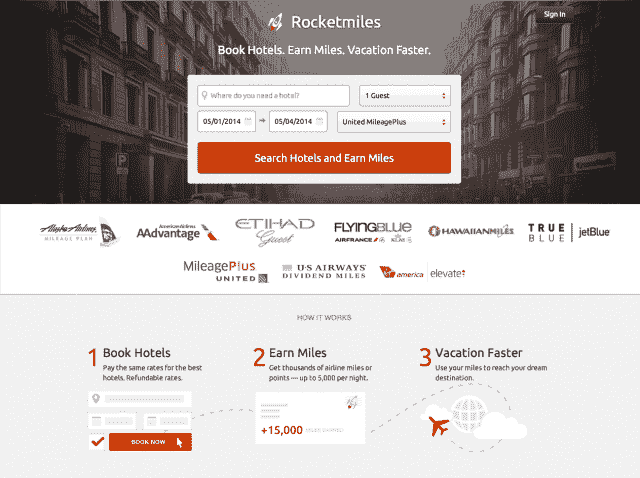

# Rocketmiles 是一项能让你在酒店住宿时获得航空里程的服务，它在 TechCrunch 的首轮融资中筹集了 650 万美元

> 原文：<https://web.archive.org/web/https://techcrunch.com/2014/01/29/rocketmiles-a-service-that-lets-you-earn-airline-miles-for-hotel-stays-raises-6-5m-series-a/>

总部位于芝加哥的 Rocketmiles 公司帮助飞行常客通过使用其网站预订酒店住宿来赚取额外的航空里程，该公司在首轮融资中筹集了 650 万美元。这轮融资由 August Capital 领投，现有投资者 Peterson Ventures、Link Ventures 和 Atlas Venture 以及新投资者 Chicago Ventures 和 Match.com 首席执行官萨姆·亚甘(Sam Walsh)也参与了融资。

该网站于去年春天推出，由前 Groupon 高管[杰伊·霍夫曼](https://web.archive.org/web/20221206171330/http://www.linkedin.com/in/jayhoffmann/)(首席执行官)领导，他曾在联合航空公司 Mileage Plus 经营合作伙伴关系——这一经历让他对这个行业的运作方式有了深入的了解。联合创始人[比约恩·拉森和克里斯·海伦尼克](https://web.archive.org/web/20221206171330/https://www.rocketmiles.com/team)也是旅游业的资深人士。

对于消费者来说，前提很简单:你只需输入你的旅行日期、地点、客人数量和航空公司计划，Rocketmiles 就会返回一个酒店列表，允许你通过 Rocketmiles 服务预订来自动获取里程。

为了让这种业务运作起来，Rocketmiles 以较低的价格购买房间，然后以更高的价格转售，从而获得收入从航空公司购买更多的里程。霍夫曼指出，这个想法是为消费者每次预订提供大量的里程，因此该网站只关注那些至少可以获得 1000 英里的酒店。

在推出时，该公司支持了大约 6 家航空公司，但今天它已将这一数字增加到 9 家，到 2 月底将达到 12 家。

霍夫曼解释说:“形势已经发生了转变——最初我们试图说服航空公司，这对他们来说是一件好事，现在我们有证据表明，他们的客户非常欢迎这一点。”。

Rocketmiles 在全球顶级商务旅行目的地的酒店名册也从最初的约 300 家增加到现在的 5000 家。

霍夫曼拒绝透露迄今为止有多少客户使用了这项服务，但他说有“几十万”，其中 78%是出于商务旅行的目的而预订的。他指出，在过去的四个月里，这项业务也以 30-40%的速度增长。

有了首轮融资，Rocketmiles 将开始专注于扩展其服务，将国际合作伙伴纳入其中。例如，下周该公司将开始支持 Aeroplan，这是一个在加拿大很受欢迎的常旅客计划。

此外，还有一款专为企业设计的产品正在研发中，例如，这款产品可以帮助企业为公司活动或其他员工旅行批量预订房间。

除了产品开发和国际扩张，Rocketmiles 还计划将额外的资金用于客户收购。霍夫曼说:“我们知道这是一项终身价值业务，这意味着一旦客户在 Rocketmiles 上进行交易，他们就会一次又一次地从我们这里购买。”他说，顾客觉得这项服务不同于其他在线旅行社，并看到了价值，这促使他们再次光临。

他补充说，住在 Rocketmiles 大本营芝加哥的普通用户每年在该网站上可以获得大约 8 万英里的里程。

Rocketmiles 也将在不久的将来招聘员工，在六个月内从目前的 20 名员工增加到 30 名。

作为融资的一部分，该公司将八月资本合伙人特里普·琼斯(Tripp Jones)纳入董事会。该公司还聘请了 TripIt 联合创始人、Hotwire 前产品 SVP 斯科特欣茨(Scott Hintz)作为第二位外部顾问。与此同时，Tom Botts 将加入 Rocketmiles 的顾问委员会，加入前 Jetsetter 首席执行官兼 Room77 首席执行官 Drew Patterson 的行列。

图像:[快门](https://web.archive.org/web/20221206171330/http://shutterstock.com/ "Shutterstock")