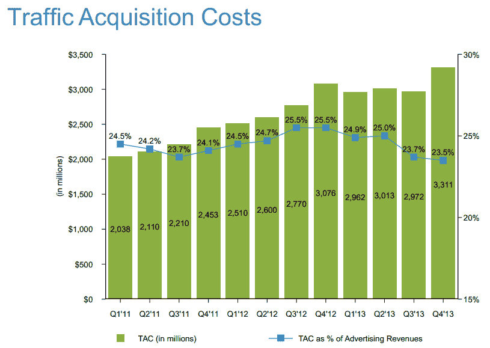
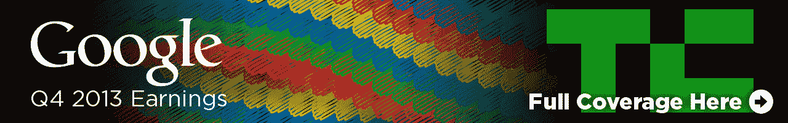

# 谷歌以 168.6 亿美元的收入击败了第四季度的 13 家公司，但由于摩托罗拉的疲软错过了每股 12.01 美元的收益

> 原文：<https://web.archive.org/web/https://techcrunch.com/2014/01/30/google-q4-13-beats-with-16-86b-revenue-misses-with-eps-of-12-01-because-of-motorola-weakness/>

# 谷歌 13 年第 4 季度收入 168.6 亿美元击败谷歌，因摩托罗拉疲软错过每股收益 12.01 美元

谷歌刚刚发布了第四季度盈利报告，结果基本符合华尔街的预期，但由于摩托罗拉的亏损超过预期，谷歌每股盈利有所下降，该公司第四季度的亏损较上年同期翻了一番。

过去三个月，该公司报告收入为 168.6 亿美元，净收入为 33.7 亿美元。非公认会计准则的每股收益为 12.01 美元，而公认会计准则的每股收益为 9.90 美元。

“2013 年底，我们迎来了又一个充满动力和增长的季度。谷歌首席执行官拉里·佩奇(Larry Page)在今天的一份声明中表示:“谷歌的独立收入同比增长 22%，达到 157 亿美元。”。“我们在广泛的产品改进和业务目标方面取得了巨大进展。我也对通过继续努力改善用户体验来改善人们的生活感到非常兴奋。”

在收益发布前，大多数分析师[预计](https://web.archive.org/web/20221209002430/http://www.ibtimes.com/google-goog-earnings-preview-q4-2013-earnings-expected-increase-thanks-climbing-ad-revenue-1550975)由于手机和 YouTube 上更好的广告收入，该公司每股收益将增长 16%左右。分析师[一致认为](https://web.archive.org/web/20221209002430/http://finance.yahoo.com/q/ae?s=GOOG+Analyst+Estimates)谷歌将公布 167.5 亿美元的收入(同比增长 37.8%)，每股收益为 12.26 美元。

上个季度，谷歌公布了 148.9 亿美元的收入和 29.7 亿美元的净收入，每股收益为 107.4 美元。

在过去的连续三个季度里，谷歌击败了华尔街的预期，这在很大程度上要归功于其广告词增强活动的改善结果。不过，总体而言，谷歌衡量广告业绩的关键指标之一——每次点击成本——一直呈下降趋势，第三季度下降 4%，同比下降 8%。另一方面，付费点击在第三季度增长了 8%，同比增长了 26%。本季度，付费点击增加了 31%，每次点击成本仅下降了 2%。

第四季度，交通采购成本从去年第四季度的 308 万美元上升至 33.1 亿美元。这占谷歌收入的 24%，而去年为 25%。

过去几周对谷歌来说尤其有趣。该公司宣布以 32 亿美元[收购](https://web.archive.org/web/20221209002430/https://beta.techcrunch.com/2014/01/13/google-just-bought-connected-device-company-nest-for-3-2b-in-cash/)Nest，就在昨天(肯定是为了抢在今天的收益发布之前)，它说将[把摩托罗拉的大部分股份卖给联想](https://web.archive.org/web/20221209002430/https://beta.techcrunch.com/2014/01/29/lenovo-to-buy-motorola-mobility-from-google/)。

自 2012 年被谷歌收购以来，摩托罗拉一直处于亏损状态。上个季度它公布了 2.48 亿美元的运营亏损，本季度它的收入为 12.4 亿美元，但亏损了 3.84 亿美元。

