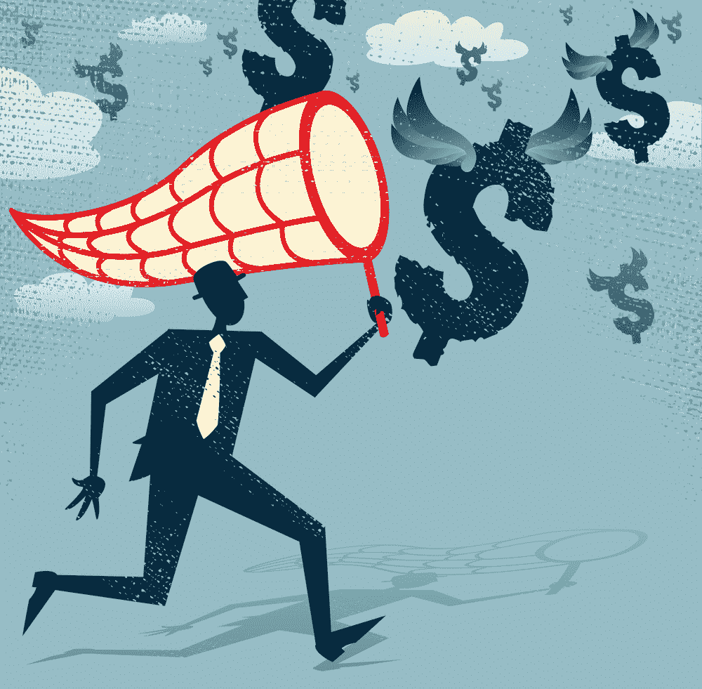

# 判断您的初创公司的完整定量指南技术危机

> 原文：<https://web.archive.org/web/https://techcrunch.com/2014/01/31/the-complete-quantitative-guide-to-judging-your-startup/>

从投资者那里筹集资金通常是一种令人沮丧的经历。虽然在从事高风险项目时，这种挫败感总会有一部分存在，但更严重的是缺乏清晰的路标，让创始人能够评判他们公司的表现。事实是，大多数创始人只听到过风险资本家的“是”或“否”，对影响这一决定的因素没有清晰的理解。

关于筹款过程本身，已经有很多精彩的文章，比如去年发布的《保罗·格拉厄姆指南》。这篇文章不是筹资指南，而是从我作为风险投资者的经历中看到的幕后情况，在判断一家早期初创公司时，我会分析大多数量化指标。

这些指标分为五组:财务、用户、采购、销售和营销。虽然统计数据很重要，但任何一个指标在风投决策中的相关权重都将取决于初创企业的类型，以及风投自己对哪些指标重要、哪些不重要的看法。

如果可能，我会给出如何判断某个特定价值的路标。这些都是我在过去两年里分析和接触数百家初创公司的亲身经历，我所有的个人偏见肯定都存在。与风险企业中的任何指导方针一样，公司总是违反规则和期望。

## 财务指标

财务状况对任何初创公司来说都至关重要，事实上，一些公司之所以得到风险投资家的资助，仅仅是因为它们拥有良好的资产负债表和现金流量表。虽然这篇文章可能是一个关于会计原理的教程，但我想放大几个关键指标。

**月度收入增长**

*取当月收入，减去上月收入，除以上月收入。*

令我惊讶的是，创始人比风险资本家更多地使用这个数字。原因是它显示的是比例而不是数量，数量很重要，因为初创公司的收入是决定增长率的主要因素。如果您上个月赚了 20 美元，您需要将其增加到 30 美元，以获得 50%的增长率。那可能是一个顾客。但是，如果您的每月收入为 1000 万美元，要实现同样的增长就更具挑战性。

虽然风投没有我们将讨论的下一个指标那样频繁地使用这个指标，但一些指导方针仍然很有帮助。每月 40%的增长率非常好。如果您能说服投资者，在销售和营销方面投入额外资本将推动增长率提高，那么低于 40%的增长率可以被视为良好。

**收入运行率**

*取最近一个月确认的收入乘以 12。*

风投们经常谈论当前的收入增长率以及 12 个月后的预期增长率。因此，他们会说“公司目前的运营成本是 200 万美元，但到年底将达到 1000 万美元。”这些数字通常是首选的，因为它们解决了数量问题。

此外，几乎所有处于早期阶段的初创公司都必须筹集更多资金。因此，在评估一家初创公司时，风投们考虑的是该公司在 18-24 个月内下一次融资时的状况。了解预计的收入增长率可以让我们推测 B 轮或 C 轮增长投资者是否可能对一家公司感兴趣。因此，好的业绩是一个允许下一次融资发生的收入运行率。为了得到这个数字，你要接触投资者和其他创始人，直到你很好地掌握了你的公司所需要的轨迹。

**利润率**

*毛利润的计算方法是总收入减去“销售成本”除以收入。净利润率是相似的，除了我们也减去企业的总费用(除了税和一些其他会计项目)。*

利润率很重要，因为它显示了你的初创企业投入风险资本并获得可观回报的能力。对于一个行业应该给你多少利润，有相当明确的指导方针。例如，云存储和服务公司可以在 90 年代达到利润率，SAAS 公司和其他软件企业往往在 70 年代，而硬件公司往往很难达到 40%以上。再次，研究你的空间，直到你确切地知道这个指标对于你的特定业务应该是什么样子。

一个额外的考虑是利润压缩。当竞争加剧时，利润率会变得更低，因此成功的企业必须对可能迫使公司利润率下降的新进入者采取防御措施。我个人曾见过几十家初创公司因为无法清晰地阐述避免利润压缩的策略而未能获得资金。

**燃烧率和跑道**

*这是每月的运营亏损。要计算 runway，用可用资本的数量除以每月烧钱率，就可以得到你的初创企业耗尽现金之前的月数。*

这些数字显示了企业的效率、筹资的时间表以及对资本的需求。虽然创业公司在第一次融资前的运营成本通常很低，但风投们希望了解，如果有新的资本注入，你将如何增加支出，以更快地发展业务。以免任何人产生误解，大多数投资者预计他们的全部投资将在 18-30 个月内花完。因此，如果你要求融资 1000 万美元，但你的月烧钱率是 10 万美元，你必须制定一个非常明确的计划，说明烧钱率将如何增加，以及这将如何推动业务的增长。

## 用户指标

用户是任何公司的生命线，因此，风投们会孜孜不倦地分析初创公司用户的一切。一些用户指标是众所周知的，包括日活跃用户(dau)和月活跃用户(mau)。实际上，我将跳过这些，而是将重点放在其他几个指标上，这些指标提供了对初创公司质量的敏锐洞察力。

**K 值**

*选择一个时间范围，例如一周。以周初用户数为基数。现在，跟踪这些用户向其他人发出的所有邀请(例如，使用“邀请您的朋友”链接)。合计通过该渠道进入的新用户数量，然后计算新用户与旧用户的比率，并加 1。因此，如果您从 1，000 名用户开始，他们带来了 200 名新用户，我们的比率为 0.2+1(我们的基础人口)，这导致 k 值为 1.2。*

k 值是对病毒传播性的一种度量，从疾病进展的流行病学研究中借用。这个数字是指数级的，通过口碑定义了用户增长率的大小(相对于付费获取)。对于社交媒体初创公司来说，这往往是唯一重要的指标(另一个是留存)。

幸运的是，对于性能有一些明确的指导方针。小于 1 的值意味着种群正在死亡，将不复存在。值为 1 表示种群稳定。1.2 的值是强的，超过 1.4 的值意味着不可思议的增长。

如果您从 1，000 个用户开始，k 值为每周 1.2，30 周后您将拥有大约 200，000 个用户。但是如果你的 k 值为 1.4，你将在同一时期内拥有超过 1700 万用户。以这样的速度增长通常不会持续很久，因为老用户不像新用户那样可能为产品带来额外的用户(他们已经邀请了所有人！).然而，像脸书和 Snapchat 这样的公司在很长一段时间内都表现出了极高的增长，所以这当然是可能的。

**移动流量比例**

*用手机的访问量除以你的产品的总访问量。*

这是一个简单的比例，但在一个我们越来越多的时间花在移动设备上的世界里，这是一个重要的比例。如今，几乎每一家以消费者为目标并与投资者对话的公司，都将不得不讨论自己的移动战略。今天的数据显示，人们可能会将大部分计算机使用花费在移动设备上。如今，吸引这些用户至关重要。

**群组分析和流失**

*在给定的时间范围内(通常是一周)获取所有加入产品的用户。然后计算这些用户中有多少人每周都在使用该产品。流失略有不同，计算方法是将离开的用户数除以总用户数(不考虑开始时间)。*

群组分析是一种衡量用户参与度下降的指标。用户会因为各种原因离开甚至是最粘的产品。例如，中小型企业可能会因为停止运营而放弃你的产品。风投真的很喜欢看到群体分析表，因为它们让我们看到用户何时离开平台。

第一周的保持率可能是最直接有趣的数字。对于社交媒体，80%的一周流失率非常高，40%是好的，只有 20%是惊人的。对于像 SaaS 这样的付费产品，流失和其他转化指标往往比纯粹的群组分析更具影响力。低个位数(1-3%)的 SaaS 流失率很高。

季节性是阐明队列分析的一个重要组成部分。教育创业公司经常在学年开始时看到他们的用户回来，因为人们会仔细考虑他们的软件选择。确保你的故事包括你的队列分析的所有方面。

## 用户获取和营销指标

我们知道用户对一个企业来说很重要，但是他们并不经常走进门来。相反，公司不得不投入大量资源让用户注册，并可能为他们出售的产品付费。因此，这些指标触及商业模式及其可持续性的核心。

**获得客户和回报的成本**

*以所有形式的用户获取(搜索引擎营销、内容营销、公关等)所花费的金额为例。)并除以给定时间段内的新用户数量。因此，如果我们总共花费 100，000 美元获取用户，我们有 100 个新用户，我们只需为每个用户支付 1000 美元(完全混合)。*

这是几乎所有订阅公司的面包和黄油，但也适用于大多数其他创业公司。虽然完全混合的数字很有趣，但它并没有给风险投资家提供很多关于用户加入渠道的信息。所以我们经常把这个拆分成付费和免费两个渠道。

免费获取听起来就像是——有人在没有看到广告的情况下就开始使用一种产品，可能是通过口口相传，也可能是在报纸上读到的。相比之下，付费收购一般是广告的代名词。如果你在 Google AdWords 上花 60 美元，得到一个客户，你的 CAC 是 60 美元。我们经常用一个比率来表示免费和付费购买的数量，因为这可以显示用户群的增长是否主要是有机的。

CAC 有很多路标，几乎所有的路标都取决于企业的类型。一般来说，ARPU(每用户平均收入)越高，获得客户的成本就越高。在社交媒体中，这个数字需要尽可能低(如果增长纯粹是病毒式的，可以接近零)。在电子商务中，伟大的 CAC 价格大约是每个用户 30-60 美元。高于这个价格的收购价格并不少见，但确实需要更多的努力。在成功的网上交易中，价格超过 200 美元的非常少见。此外，金融服务行业的 CAC 通常都在数百名以上，因此，一如既往，也有例外。

另一种判断 CAC 是否合理的方法是计算新用户的回报时间。在电子商务中，这通常以需要购买的订单数量来衡量，以弥补获得客户的成本。如果订单数量是一个，那就太好了，这意味着客户可以立即获利。对于广告驱动和免费订阅的初创公司，3-6 个月的回报时间是不错的，任何超过 18 个月的时间都很难接受。

**净推介值**

*在你的客户中开展一项调查，询问他们向其他人推荐(即促销)你的产品的可能性有多大(1-10 分)。推动者是那些给出 9 或 10 分答案的人，而诋毁者是那些给出 1 或 2 分答案的人。计算两个群体占总调查人口的比例。净推动者得分是推动者的比例减去贬低者的比例。因此，如果你的客户中有 50%是推销者，10%是诋毁者，你的净得分是 40。*

这是我最喜欢的指标之一。它显示了你的客户对你的产品和你的整体体验有多满意。50 的 NPS 被认为是优秀的，像亚马逊和谷歌这样的公司一般都徘徊在这个数字左右。但是，80 分甚至 90 分都有可能。向顾客灌输这种热情的企业是非常有价值的，应该很容易筹集资金。

## 销售指标

所以你想拥有一家拥有真实、有血有肉的客户的公司？如果是这样，那么你必须建立销售渠道来有效地增加收入。这些度量标准是判断这些工作是否成功的有用方法。

**神奇的数字**

将两个季度订阅收入的净增长乘以 4，然后除以销售和营销总支出。因此，如果我们在 Q1 有 200，000 美元的订阅收入，在 Q2 有 400，000 美元，我们在 Q1 的销售和营销支出为 300，000 美元，我们将有 400，000 到 200，000 美元，这是 200，000 美元的净增长，乘以 4，我们有 800，000 美元，除以我们的支出，我们的比率为 2.66。

这可以说是这里命名最好的指标，也是[规模风险投资合伙人](https://web.archive.org/web/20221207021657/http://www.crunchbase.com/financial-organization/scale-venture-partners)的最爱，是[推广了它](https://web.archive.org/web/20221207021657/http://www.scalevp.com/magic-number-math)。本质上，这个指标计算的是我们在销售和营销上花费一美元的投资回报。我们每花一美元，就能获得神奇的额外收入。一个大于 1 的神奇数字意味着一家公司已经找到了一种扩大销售和营销的方式来建立可持续的利润增长。低于 1 的数字不一定是可怕的，但这也意味着该公司的扩展效率不如其他公司。

**篮子尺寸和订单速度**

*平均销售价格(ASP)是典型订单的价格。订单速度是客户重复购买所需的时间。*

对于电子商务企业来说，这些是需要计算的最重要的指标。ASP 通常驱动创业公司的其他基本要素，因此像 run rate 一样，作为一种聚类算法来快速评估风投公司的创业公司商业模式。高 ASP 通常意味着更富有的客户，更少的重复购买，在获取客户的成本上更灵活，等等。订单速度也受 ASP 的影响。

例如，优步是一家低 ASP、高速度的电子商务企业，而 One Kings Lane 则倾向于高 ASP 但低速度的企业。关于这些指标没有“最佳”答案，但一般来说，平均销售价格越低，需要的销售速度就越高。

**平均销售周期**

*取第一次联系客户的日期，然后取他们第一次购买的日期。区别在于销售周期。所有客户的平均值。*

像 ASP 一样，平均销售周期通常决定了初创公司业务的许多基本面，因此告诉我们如何看待一家公司，而不是它的业绩。对于企业和订阅销售，我们倾向于使用平均销售周期，而对于电子商务和其他可重复购买，我们使用订单速度。对政府和教育机构的销售一般周期最长，可能两年甚至更长。对财富 500 强企业的销售时间较短，通常为 6-18 个月，具体取决于产品(例如，软件比存储基础架构更容易购买)。以免费增值模式转化客户可能需要 18 个月或更长时间，但一般来说，一年以下的周期是好的。

**长期值**

*这是在客户与公司的关系中，客户的总价值。*

这个指标是众所周知的，所以我不会深入讨论它。它与客户流失密切相关，因为关系的长度与客户流失成反比。计算这一价值往往很难，而且要得到一个跨公司的实际可比数字也很有挑战性。风投们通常不得不用 ASP 等更客观的指标来获得更容易衡量的价值。尽管如此，这个数字至关重要，尤其是在一家公司进行长期扩张的时候。

## 市场指标

创业公司在争夺客户有限的时间和资源。了解市场的规模及其构成是最终的度量分析，但也是关键的分析，因为它决定了公司价值的潜在上限。

**潜在市场总量**

*这是一家初创公司在特定领域投入的资金总额。*

尽管非常重要，但任何市场分析都存在大量的模糊性。初创公司可能希望以某种方式定义自己，而风险资本家在分析初创公司时，可能会想到一个完全不同的市场。

一般来说，大于 10 亿美元的市场是好的，任何使用“万亿”这个词的市场定义都可能会得到风险投资家的嘲笑。通常，对创始人来说，描述 TAM 更多的是展示其对初创公司市场理解的机会，而不是实际获得一个量化数字。

**平均钱包尺寸**

这是许多企业，尤其是企业公司的一个关键指标。平均钱包大小是单个客户在给定时间段内可以为一类服务花费的总金额(即其预算)。这个指标很重要，因为它能让你感觉到你的客户的财务能力，并让风投判断你的产品相对于客户的胃口有多贵。

这个数字是双向的。与平均钱包规模相比收取少量费用的创业公司，与那些按照钱包规模的很高比例收取产品价格的创业公司一样有风险。一般来说，你不想变得无足轻重，也不想变得太大以至于超出整个预算。

## 结论

这篇文章是早期投资者在定量分析初创企业时使用的指标速成班。我之前说过，每个投资人都有自己的方法，每个创业公司都是独一无二的。这里的指导方针是一般性的，来自你的特定领域的更专业的信息总是判断你的创业公司表现的最重要的基准。

我想以一个重要的观察来结束我的演讲，那就是一个指标比一整套合适的指标更能激发风险投资家的好奇心。一家社交媒体公司令人难以置信的 k 值，财富 500 强中极短的销售周期，以及电子商务中令人难以置信的高净推广分数，这些只是一个指标如何成为你公司的定义故事的一些例子。

最后，或许也是最重要的，量化指标可以提供创业公司业绩各个方面的信息，但它们并不能证明创业公司的价值。拥有一流设计、强大团队、独特市场和其他领域的令人眼花缭乱的产品对企业的成功同样至关重要。出色的指标可能是成功筹资的必要条件(尤其是在今天)，但通常不足以保证结果。伟大的公司建立在伟大的基础上，无论是数量上还是质量上。

*【图片通过[快门](https://web.archive.org/web/20221207021657/http://www.shutterstock.com/)】*