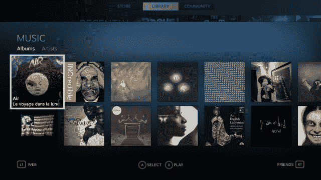
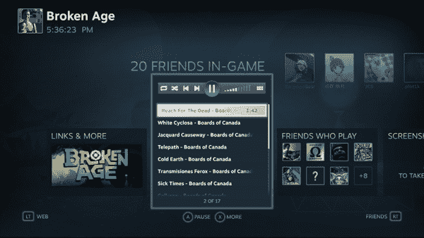
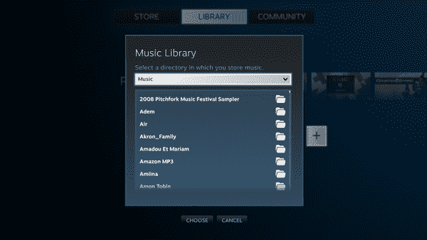

# Valve 为 Steam TechCrunch 添加了游戏内音乐控制和播放功能

> 原文：<https://web.archive.org/web/https://techcrunch.com/2014/02/03/valve-adds-in-game-music-controls-playback-to-steam/>

# Valve 为 Steam 添加了游戏内音乐控制和播放功能

如果连自己喜欢的曲子都吹不爆，玩自己喜欢的游戏还有什么乐趣？

今天，Valve 为其羽翼未丰的 SteamOS 和大画面界面宣布了一个非常棒的新功能:游戏内音乐控制。

(想知道什么是“蒸汽”和“大图”？SteamOS 是一个基于 Linux 的操作系统，Valve 正在为一系列专用的、客厅友好的个人电脑开发，他们称之为“Steam Machines”。大图模式本质上是 SteamOS 减去操作系统，是为那些想要新界面但已经在 Windows/Mac 或其他电脑上安装了 Steam 的人准备的)

就目前的情况来看，在游戏中切换你的音乐(就像《堡垒 2》一样)有点痛苦。你有你的独立音乐播放器在一个窗口中播放，你的游戏在它前面全屏运行。你可以用 alt-tab 从一个切换到另一个——但这需要很长时间，而且往往会让大多数全屏游戏崩溃几秒钟。如果你每次切换游戏时显示器都堵塞，那么在游戏间隙尝试改变你的音乐队列并不容易。

当你在房间另一边的电视上运行大画面模式时，这个问题会变得更糟。大多数桌面音乐播放器的字体和按钮都很小，不能在一两英尺之外控制。

有了新的蒸汽音乐功能，您的音乐可以直接进入大画面/蒸汽操作系统界面。您告诉 Steam 您的音乐库在哪里，它会建立一个闪亮的新目录供您阅读，包括相册艺术和艺术家的照片。一旦你参与了游戏。音乐控制只需一个按键，就可以集成到同一个蒸汽叠加中，让您可以在不离开游戏的情况下跟踪您的朋友和成就。

蒸汽音乐目前处于早期测试阶段，Valve 向那些已经选择加入的人分阶段推出该功能。为了选择加入并希望能尽早加入，加入这里的蒸汽音乐团体。

新的音乐控制功能目前似乎只针对大画面/蒸汽操作系统，而 Valve 承诺“桌面功能很快就会出现”——所以如果你使用的是好的时尚蒸汽界面(我想大多数键盘/鼠标游戏玩家都是这样)，你可能会比大画面用户等待游戏控制的时间要长一点。

