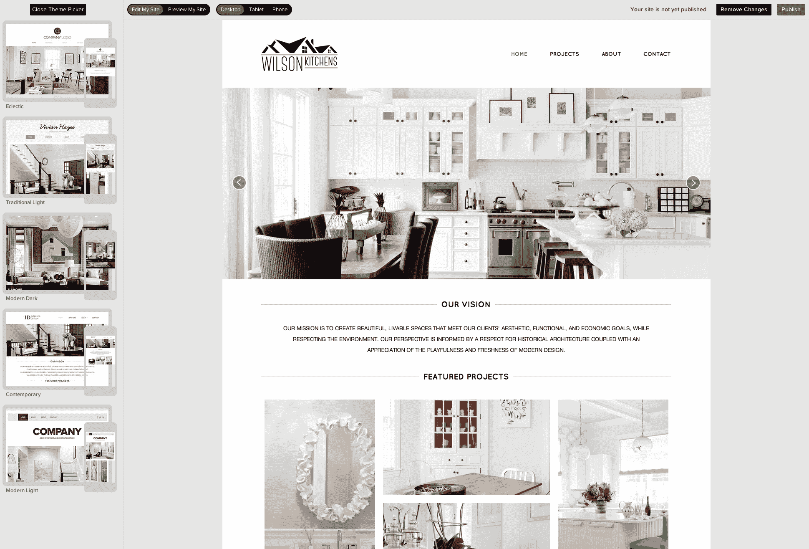
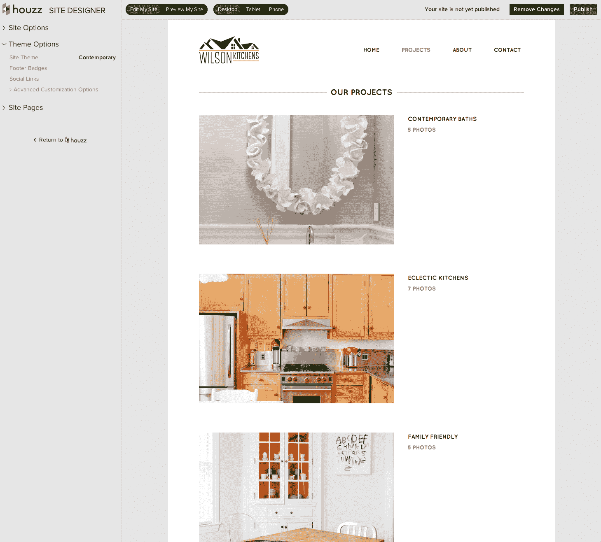

# Houzz 推出网站设计器，为家庭专业人士提供免费网站

> 原文：<https://web.archive.org/web/https://techcrunch.com/2014/02/05/houzz-launches-site-designer-offers-free-websites-for-home-professionals/>

广受欢迎的家居改造和设计服务公司 Houzz 今天推出了一项新服务，允许室内设计师、建筑师、承包商等家居专业人士为他们的业务建立免费网站。这些网站连接到他们的 Houzz 个人资料，这使他们可以轻松地从现有的个人资料中获取他们的图片、评论和其他信息。

Houzz 的联合创始人阿龙·科恩告诉我，自从这项服务推出以来，专业人士一直在抱怨他们很难保持自己网站的更新。虽然他们不断更新他们的 Houzz 个人资料，但他们的网站经常会出现过时的信息和设计，与他们经常在 Houzz 上使用的高质量图像不太匹配。

目前，Houzz 上有超过 300，000 名家居专业人士。科恩告诉我:“我们一直想给 T2 的房主和专业人士最好的体验。为了让专业人士更好地在网上展示，当然也为了让更多的专业人士使用这项服务，Houzz 的一个小团队开始研究使用现成的工具，如 WordPress。但据参与该项目的工程师之一沈戬称，将 Houzz 连接到 WordPress 或另一个现有工具，然后构建主题和插件以使一切顺利运行，这似乎太具挑战性和不灵活了。

相反，该团队使用了一些现成的工具，如 Bootstrap，但它创建了自己的丰富的 web 应用程序，允许专业人员在可视化编辑器中基于有限数量的响应主题构建他们的网站。开发人员还在主题中使用了有限数量的谷歌网络字体，以将复杂性保持在最低水平(当然也是为了避免有人以漫画字体作为主要字体来构建网站)。这项服务将被命名为 Site Designer，与 Houzz 的其他服务共享相当多的基础设施。

该团队首先从一个非常复杂的工具开始，但随后将一切都削减到最低限度。因为早期测试中的用户不相信他们是在 WYSIWYG 编辑器中编辑他们的网站，所以团队在应用程序中添加了一个预览按钮。

这些网站可以设置为每当专业人士改变他们的 Houzz 个人资料时自动更新，但他们也可以从 Houzz 获得评论。毕竟，常规网站上的普通推荐对消费者来说往往没有什么影响力，因为它们总是非常积极，而且很难核实。

专业人士将能够在自己的域名或 Houzz.com 子域上托管这些网站。实际上没有 Houzz 品牌。科恩强调，设计工具和主题是为了避开专业人士。

网站设计师现在是一个测试版产品，专业人士可以[在这里注册](https://web.archive.org/web/20230403113047/http://www.houzz.com/sitedesigner)。

