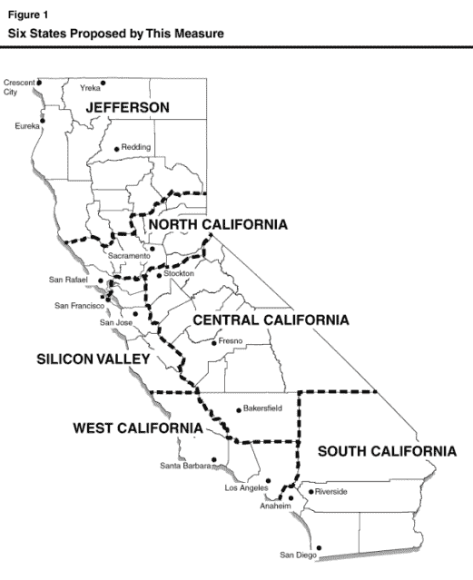
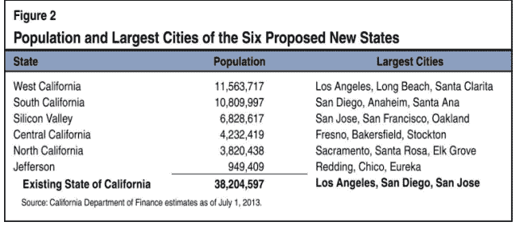
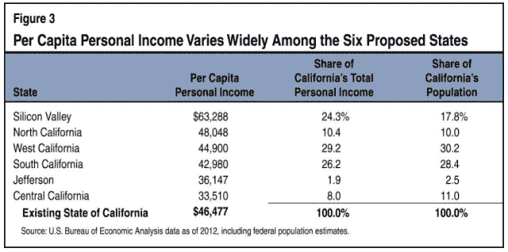
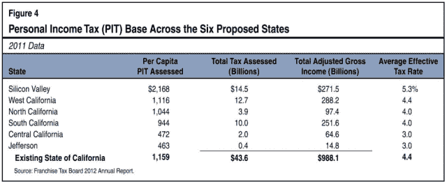
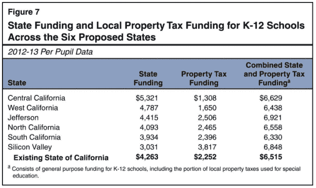
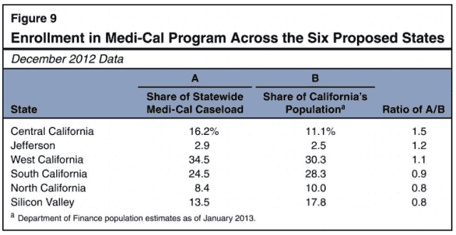
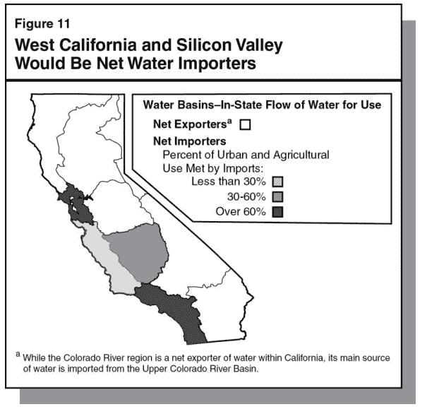

# 如果硅谷成为一个州，加州会发生什么

> 原文：<https://web.archive.org/web/https://techcrunch.com/2014/02/05/what-happens-to-california-if-silicon-valley-became-a-state-in-7-graphs/>

至少有一位富有的科技投资者想要鼓励加州潜在的分离主义倾向，并将加州分割成六个不同的州，包括一个硅谷州。根据加州法律，无论提议的投票提案是不可能的还是奇怪的，国务卿和立法分析师办公室都会向选民发布一份关于法案潜在经济影响的报告[ [PDF](https://web.archive.org/web/20221208174127/http://www.lao.ca.gov/ballot/2013/130771.pdf) 。通常，投票命题分析是相当枯燥的，但让硅谷成为它自己的州？这个要有趣得多。

以下是加州认为，如果选民支持蒂姆·德雷珀将加州分为六个州的提议，可能会发生的情况。

**加州想要什么以及新的人口**

硅谷由旧金山的圣何塞和它东边的奥克兰组成，大约有 600 万居民。“西加利福尼亚”，其首都将是洛杉矶，将是最大的州，有 11，000，000 居民。

切片和切块将由 12 名委员指导，每个州两名。国会将不得不在 2019 年之前批准它。如果国会目前的生产力是一个指标，我们需要在下周给他们文件，然后威胁在未来 5 年内每个月关闭加州，以获得任何前进的动力。

**大部分富人都会搬家**

硅谷将成为全美国最富有的州，平均年收入 63，288 英镑，足以支付一套公寓的首付。

加州将失去 28%的所得税基数(145 亿美元)，但硅谷将是一个非常适合居住的地方。

**该州的其他地方需要更多的学校资金**

硅谷每个学生所需的政府补助几乎是加州中部的一半(3031 美元对 5321 美元)，部分原因是高额的财产税。其他州要么需要增加收入，要么制定一个饥饿游戏式的比赛来选择哪些学生可以得到午餐。

**医生！我们需要很多医生！**

该州中部有足够的医学院或法学院，这意味着需要引进它们来培养更多的居民。硅谷也包括了该州一半的医疗保险接受者。联邦政府需要分配更多的资源给贫困的居民。或者，硅谷可以教贫穷的居民编写代码，这样他们就可以支付高额的医疗费用。

**硅谷需要水，或者得到达萨尼**的赞助

加利福尼亚与水有着狂热的爱恋；频繁的干旱和复杂的管理系统总是暂时平衡每个地区的需求。硅谷可能有资金和人才，但它 60%的水需求依赖进口。因此，硅谷可以用一些医生和老师来换取自来水。或者像大多数科技公司一样，找一个企业赞助商。

**前方的路**

也有一些零散的线索。每个州都需要一个新的首都，支付一个过渡团队，并想出在哪里安置囚犯。我猜想州长拉里·佩奇将会实现他在[的毕生梦想，建立一个燃烧的人类类型的实验区](https://web.archive.org/web/20221208174127/http://www.businessinsider.com/google-ceo-larry-page-wants-a-place-for-experiments-2013-5)，把奥克兰变成一个谷歌人进行各种实验的药物狂欢地。如果他也向居民提供谷歌沙拉吧，我会住在那里。