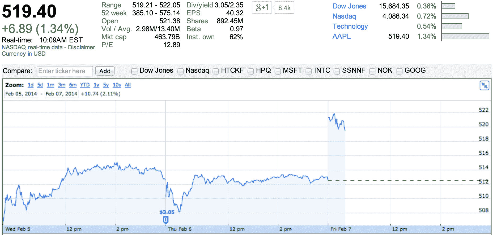

# 苹果在过去两周内回购了 140 亿美元的 AAPL 股票 TechCrunch

> 原文：<https://web.archive.org/web/https://techcrunch.com/2014/02/07/apple-has-repurchased-14-billion-of-aapl-shares-over-the-past-two-weeks/>

你可以在蒂姆·库克最近对《华尔街日报》的声明中感受到卡尔·伊坎的存在——苹果刚刚回购了相当于 140 亿美元的苹果[股票](https://web.archive.org/web/20221206184631/http://www.google.com/finance?cid=22144)，作为其大规模股票回购[计划](https://web.archive.org/web/20221206184631/https://beta.techcrunch.com/2013/04/23/apple-will-initiate-share-repurchases-to-increase-dividends-and-boost-apple-shares/)的一部分。以今天的市值计算，它仅占公司的 3%多一点。

提醒一下，维权投资者卡尔·伊坎(Carl Icahn)最近在 Twitter 上游说，称苹果在股票回购计划方面做得不够。

尽管 iPhones 销量创历史新高，超过 5000 万部，苹果[报告了 2014 年 Q1 的喜忧参半的结果。收入低于华尔街的预期，而利润高于预期。但是，尽管有 131 亿美元的利润，该公司仍然设法产生大量现金。](https://web.archive.org/web/20221206184631/https://beta.techcrunch.com/2014/01/27/apple-q1-2014/)

事实上，该公司手头的现金增加到 1588 亿美元。对苹果来说，它仍然是一笔巨大的战略资产，但股东们希望能拿回一部分。

几年前，苹果开始考虑派发股息。因为股票交易低于公司的预期，它开始回购股票。

当谈到股票回购计划时，这是对一家公司股票的巨大信任票。一方面，这意味着苹果认为它不应该以任何其他方式投资手头的现金。换句话说，蒂姆·库克认为苹果股票是苹果自有资金的最佳财务投资。另一方面，它减少了流通股的数量。现有投资者将拥有苹果更大的股份。

在过去的 12 个月里，该公司从目前 600 亿美元的回购计划中回购了相当于 400 亿美元的股票。就目前而言，还没有消息称会有另一个潜在的回购计划以同样的速度购买股票。

但是一个更大的问题仍然存在。今年 1 月，谷歌[以 32 亿美元收购了](https://web.archive.org/web/20221206184631/https://beta.techcrunch.com/2014/01/13/google-just-bought-connected-device-company-nest-for-3-2b-in-cash/) Nest。如果苹果用部分资金收购 Nest 会怎么样？

许多前苹果工程师为智能恒温器公司工作，包括 Nest 创始人兼首席执行官托尼·法德尔，他是 iPhone 开发团队的创始成员。让他的团队去为谷歌工作不是一个明智的决定:TechCrunch 已经了解到，Nest 将成为谷歌的核心硬件部门。

在过去的 15 个月里，苹果以每家不到 10 亿美元的价格收购了 21 家公司。蒂姆·库克关于股票回购计划的声明将安抚现在和未来的股东。但该公司的下一个重要步骤将是向所有人证明，在进行有意义的大型收购时，它可以扣动扳机。

