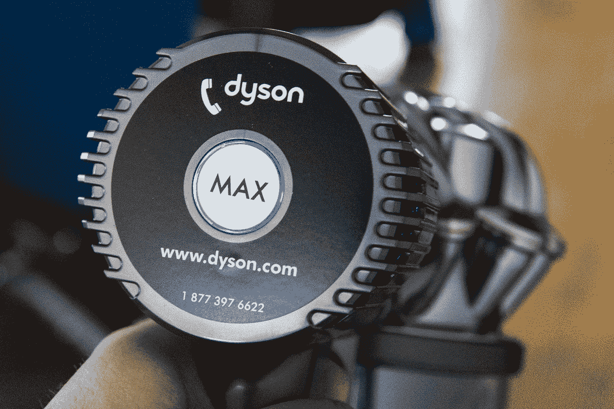

# 戴森 DC59 评论:帮助你完全抛弃有线吸尘器的便携式发电站 TechCrunch

> 原文：<https://web.archive.org/web/https://techcrunch.com/2014/02/07/dyson-dc59-review-a-portable-powerhouse-to-help-you-ditch-corded-vacuums-entirely/>

没有用过戴森的人通常认为他们的名声是炒作。毕竟，一个设计用来吸灰尘的设备怎么可能比其他任何一个设计用来完成同样任务的机器都强呢？没有操作系统，没有功能清单，没有要考虑的应用市场，等等。虽然真空吸尘器的功能很简单，但戴森在幕后的复杂性使其机器有些神奇，新的 DC59(或加拿大的 DC62，这解释了照片中的徽章)动物数码超薄真空吸尘器可能是最神奇的。

## 基础

*   26 分钟电池
*   6 分钟加速模式
*   配有 4 个真空头
*   4.6 磅
*   0.12 加仑桶容量
*   建议零售价:499.99 美元
*   [产品信息页面](https://web.archive.org/web/20221007060920/http://www.dyson.com/Vacuums/Cordless/DC59/DC59-Animal.aspx)

**优点**

*   三倍于其他手持吸尘器的吸力
*   比上一代产品多运行 6 分钟
*   在升压模式下，功率比 DC44 高 50%

**缺点**

*   升压模式对电池快速充电
*   基于触发器的操作会惹恼一些人

## 设计

[gallery ids="954628，954627，954624，954625，954626，954623，954629，954630，954631"]

不管它们作为清洁设备的效用如何，戴森的真空吸尘器系列都是优秀设计的象征。对于该公司的创始人兼首席执行官詹姆斯·戴森来说，“设计”这个词不仅包括外观，还包括产品的工程和技术方面。这是一种全面的产品创造方法，与苹果公司对设备制造的愿景相呼应。

戴森经常被比作苹果，当看 DC59 的 ID 时，这种比较是真实的。这款真空吸尘器继承了戴森手持系列的传统，但在手柄上增加了一个更尖锐的角度，改变了过滤器的位置，并修改了新戴森数字马达 V6 的旋风“皇冠”。其结果是更干净的外观，但也强调了这种新一代真空发动机的功率增加。

紫色管的设计是从 DC44 开始的趋势的延续，DC44 的特点是蓝色轴，对于人群中更稳重的真空购物者来说，这可能是一个奇怪的选择，但整体设计是戴森系列中最和谐的设计之一，DC59 无疑是我书中最好看的无绳真空吸尘器。

## 表演

我之前拥有一台戴森 DC35 作为我的主要吸尘器，我并不不习惯戴森无绳型号。这是一台坚固的机器，很好地服务于我的两居室公寓，但它的最大运行时间为 15 分钟，实际上比 DC59 更重，而且它缺乏对宠物友好的主地板真空头和室内装潢附件。

DC59 的功率大得多，你可以立即看出它是比任何前辈更有效的立式地板吸尘器替代品。戴森无绳电话的问题一直是，它的电力可能只够让你在用完之前对空间有限的地方进行一次标准清洁，但不足以真正彻底或完成额外的任务，如除尘(使用附带的除尘头)。

26 分钟是一个很大的进步，几乎是那一代人寿命的两倍。这足够支付我的新家，它有两层，包括地毯，硬木和瓷砖，还有一点果汁留下来打扫卫生。与以前的型号相比，重量减轻了，这也确实有助于确保你的手臂不会感到疲劳，即使你伸手去拉窗帘或清理角落里的蜘蛛网。

最后，扳机和手柄似乎也经过了重新设计，使操作更加容易。扳机似乎更灵敏，这意味着更难在使用中意外关闭真空，倾斜的手柄设计更容易戴在手腕和手上。

在使用中，戴森的 DC59 的续航时间和广告宣传的一样长，相差几分钟，但与之前的型号相比，它感觉长得奢侈。它处理了我能扔给它的一切，包括用附带的缝隙工具清理我的难以清理的毛刺研磨机。充电时间大约为三个半小时，如果你刚刚完成清洁并想完成它，这并不理想，但至少它不是你必须离开一夜的东西。

## 结果

如果你吸尘，你会喜欢 DC59。请注意，我并没有说如果你喜欢吸尘，你就会喜欢 DC59:它实际上非常擅长它所做的事情，它使一项艰巨的任务变得令人愉快，这是戴森优于其竞争对手的真正关键。DC59 改进了无绳电话的各个方面，提供了更大的功率、更长的运行时间和更好的人体工程学设计。这很贵，但是如果你有足够的现金，当你遇到这种真空的时候，你永远不会觉得自己花了太多钱。