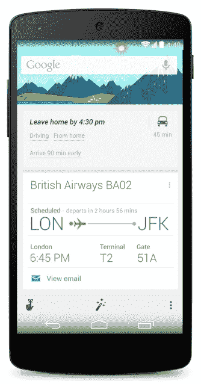

# 谷歌安卓搜索应用增加了新的语音命令，“该走了”，和奥运会谷歌 Now 卡

> 原文：<https://web.archive.org/web/http://techcrunch.com/2014/02/07/google-search-app-on-android-adds-new-voice-commands-time-to-leave-and-olympics-google-now-cards/?utm_source=dlvr.it&utm_medium=feed>

# 谷歌安卓搜索应用增加了新的语音命令，“该走了”，和奥运谷歌 Now 卡

谷歌今天推出了 Android 应用程序的[谷歌搜索更新，同时也为 Google Now 引入了一些新功能。](https://web.archive.org/web/20230306150025/https://play.google.com/store/apps/details?id=com.google.android.googlequicksearchbox)

Google Now 已经告诉你去上班，这样你就可以准时到达，现在它将为你去机场、参加活动和预订晚餐做同样的事情。基本上，任何 Google Now 卡过去都只能提醒你什么时候需要去某个地方(航班、带有位置和时间的日历事件、餐馆预订、电影和音乐会门票)，现在也可以告诉你什么时候应该离开以准时到达那里。您将能够指定您是乘坐公共交通工具还是开车，以及您希望多早到达(当您开车去机场时，这非常方便)。

除此之外，谷歌的语音识别功能现在可以让你打电话和发短信。只需说“给约翰打电话”或“给我哥哥发短信”，应用程序就会为你调出合适的联系人。如果你的联系人中有几个约翰，它会检查你想给谁打电话，如果你有多个号码，它也会问你这个问题。

正如谷歌之前所说，它希望成为你的私人助理。就像它的其他一些语音功能一样，这些新功能允许你在不接触键盘的情况下与你的设备进行相对复杂的交互。

此次发布的其他新功能包括索契奥运会的新 Google Now 卡，可以轻松访问奖牌榜、新闻和即将举行的活动。

该团队还增加了用户可以用来在 Google Now 中设置语音提醒的语言数量。该应用程序现在支持法语、德语、日语或韩语，所以如果你想这么做(而且你在德国)，你现在可以说“Erinnere mich daran um 12 Uhr Rolf anzurufen”，谷歌确实会提醒你中午有电话。