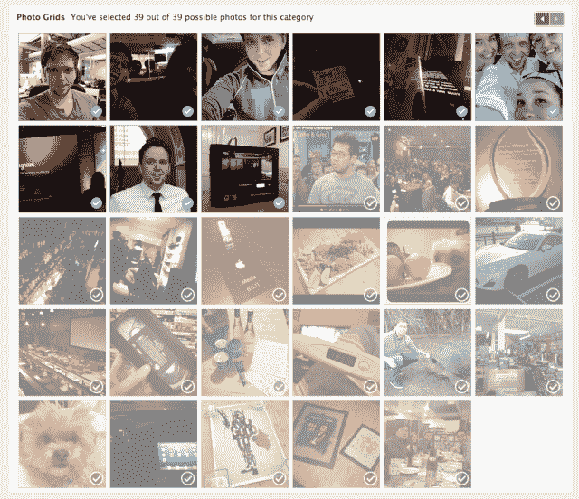

# 脸书现在允许你编辑你的“回望”电影

> 原文：<https://web.archive.org/web/https://techcrunch.com/2014/02/07/how-to-edit-facebook-look-back-video/>

# 脸书现在允许你编辑你的“回望”电影

本周早些时候，我们[得知](https://web.archive.org/web/20230404151745/https://techcrunch.com/2014/02/05/dont-like-your-facebook-look-back-youll-be-able-to-edit-it-soon/)脸书将很快让你编辑公司为庆祝脸书十周年而制作的自动生成的“回顾”视频。

果然:他们刚刚推出了编辑器。

几乎在发布后不久，许多用户就开始抱怨脸书自动选择的照片。有些人有太多前任的照片。有些人有悲伤的照片，他们宁愿不记得是一个里程碑。我的一个朋友的 Look Backs 突出了一块石头的图片，没有解释或评论。

快速浏览一下[脸书回看](https://web.archive.org/web/20230404151745/https://www.facebook.com/lookback/)页面，现在可以看到一个闪亮的新编辑按钮。

编辑器可能不像一些人希望的那样功能丰富*；你不能选择任何脸书的照片来替换那些你不喜欢的——你只能从更广泛的预选照片/状态更新中选择。*

**如何编辑你的回眸:**

*   进入[脸书回顾](https://web.archive.org/web/20230404151745/https://www.facebook.com/lookback/)页面
*   点击编辑按钮
*   从预先填充的选项中挑选您的新照片/帖子
*   点击页面顶部的“更新”按钮
*   等待几分钟，让脸书生成您的新视频。

尚不清楚编辑功能是否已经向所有用户推出，或者是否会随着时间的推移而推出。然而，我们现在已经检查了十几个账户，每个都有新的按钮。

非常感谢 Draconius Grey、Michael K .、Akshat M .和许多其他人今天早上向我们提供了这方面的信息！ ]

