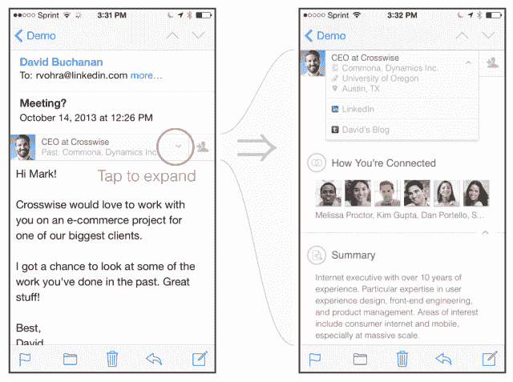

# LinkedIn 取消了聪明但不明智的“介绍”功能和幻灯片产品 TechCrunch

> 原文：<https://web.archive.org/web/https://techcrunch.com/2014/02/07/linkedin-axing-clever-but-ill-advised-intro-feature-and-slidecast-product/>

# LinkedIn 取消了聪明但不明智的“介绍”功能和幻灯片产品

LinkedIn 正在取消其拦截发送到 iOS 设备的电子邮件以向其注入网站信息的功能。该声明是今天通过电子邮件向客户发布的，其中公司详细说明了如果用户启用了该功能，则删除该功能的步骤。

一封发给 LinkedIn 用户 Nicholas Shulman 的电子邮件写道:“我们努力提供让我们的会员开心的产品体验，并为他们的职业生活增加价值。”。“这有时意味着关闭某些产品或功能，专注于为我们的会员提供最相关的服务。”

LinkedIn 也[发布了一篇关于关闭该功能的博文](https://web.archive.org/web/20221206190547/http://blog.linkedin.com/2014/02/07/doing-fewer-things-better/)。

LinkedIn 的一位发言人告诉 TechCrunch 说:“我们正在对几个大项目进行大规模的长期投资，为了让它们成功，我们需要专注于更少的事情。”“考虑到这一点，我们已经审视了我们的产品，并决定关闭 Intro、Slidecast 以及我们 iPad 和 iPhone 应用程序的旧版本。”

Slidecast 是一个音频演示工具，将于 4 月 30 日关闭。自 2 月 18 日起，LinkedIn 还关闭了支持 6.0 以上版本的 iOS 应用程序。

LinkedIn 表示，它将于 3 月 7 日取消 iPhone Intro，并提供了一份“卸载”Intro 的说明列表。该通知还指出，在卸载 Intro 之前，你将无法从已启用的电子邮件帐户发送或接收电子邮件，这凸显了该功能的入侵性质，即[在推出时导致我们对其抛出红旗](https://web.archive.org/web/20221206190547/https://beta.techcrunch.com/2013/10/24/do-not-want/)。

本质上，Intro 通过 LinkedIn 运行的中间代理服务器传递你的所有邮件。该服务器打开邮件，注入 LinkedIn 个人资料信息，然后发送给您。当然，所有这些都是选择加入，但我们指出，添加一个修改电子邮件内容的中间服务器是一个非常糟糕的主意。

在你的电子邮件中有一个 LinkedIn 个人资料的链接带来的好处实在太少，不足以证明通过代理服务器传递每封电子邮件所带来的额外安全风险。

尽管我们明确表示，我们认为 LinkedIn 的初衷是好的——为他们的用户提供更好的体验——但他们没有考虑到客户阶段。

Intro 是一个聪明的工程黑客，产生了一个漂亮的结果，但它不应该被发布给公众。现在它被砍掉了。

以下是从舒尔曼的电子邮件中删除 Intro 的说明:

> *   在 iPhone 主屏幕上，轻按 iPhone 设置应用程序。
> *   点击常规部分。如果没有转到 iPhone 设置的主页，请轻按左上方的导航箭头，直到返回设置主页。
> *   向下滚动并点击配置文件部分。
> *   点击所有以 Intro 开头的个人资料进行删除。重要的是将它们全部移除。
> *   若要验证您以前的邮件帐户是否已打开，请返回到 iPhone 设置，轻按“邮件、通讯录和日历”，然后轻按您的邮件帐户。确保邮件开关切换到绿色表示“开”。

图片来源:[希拉·斯卡伯勒](https://web.archive.org/web/20221206190547/http://www.flickr.com/photos/22028494@N03/6290003115/in/photolist-azPUMz-dPGVKt-9dadgM-dLAhuJ-82EA9o-adWYuV-arq76A-dUdMsr-9fLRVv-82EzHN-dmZ3fL-82BrC2-cXgNKw-82BrTB-fYq8pZ-82Btur-82EC25-82ECfC-82EBJA-82Buin-82EDnu-82ECPj-82Bu9Z-82BtGv-82EBeU-82BsBP-bUTUKK-e86S2q-bEx9H4-9EbiQZ-9Y9nGA-dQVWGF-bxTYJa-dn9iAK-dUhMCd-dpcrWp-9oTspL-dpcsGg-dnezGS-dn9HBC-9v76Un-dUn4SP-dna9Lg-ahEZH8-bLfKFt-ayeKjo-ayc3ur-ayeJmy-ayc3R8-ayeKmq-ayc3Y6)