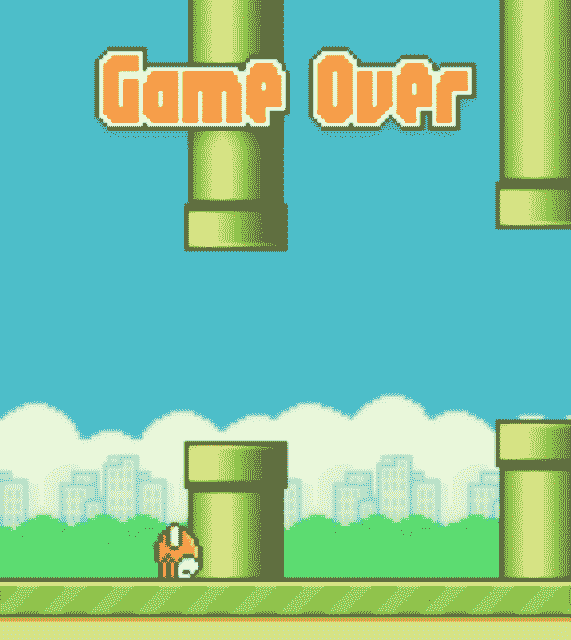

# 一个 Flappy Bird 迷的自白 TechCrunch

> 原文：<https://web.archive.org/web/https://techcrunch.com/2014/02/08/the-only-way-to-win-is-not-to-play/?source=gravity>

只是一个小游戏。只需要一秒钟。我，我需要打破我的最高分。那只笨鸟。该死的。好的，这次我会做得更好。该死的。好吧，广告分散了我的注意力。该死的！我做得很好。不不。

我不知道为什么我想玩 [Flappy](https://web.archive.org/web/20221005182914/https://itunes.apple.com/us/app/flappy-bird/id642099621?mt=8) [Bird](https://web.archive.org/web/20221005182914/https://play.google.com/store/apps/details?id=com.dotgears.flappybird&hl=en) 。为什么在日常生活的间隙，每当有困难或者我有时间等待的时候，这是我脑海中闪现的第一件事。但我只是需要听到那些硬币累积起来的甜美声音，就像小时候玩马里奥一样。只要我待在管道之间，其他的都不重要。

我是说，我以前也玩过其他的。然而，在经历了这么多平滑的难度曲线之后，Flappy Bird 还是有那么一点诱人之处。这让我很丢脸，但我喜欢。是手游的施虐者。

美妙之处在于没有承诺。我不必等着看我是否成功。如果我失败了，没有投资损失。这种强化如此直接，我渴望持续的判断。没有几个月像在工作中那样担心绩效考核。没有必要考虑我是否像其他游戏那样拯救了足够多的生命来击败 boss。

每一根经过的管子都会冲走之前所有的罪恶。

每次我重新开始，都没有包袱要背，没有永久的记录让我感到沉重。只是分数，和超越分数的欲望。打败我的朋友。战胜自己。征服让世界其他地方沮丧的事情。

但是为了什么呢？我要飞向哪里？我会不会有一天漂过管道之海，到达那个遥远的云中城市？我的[预定](https://web.archive.org/web/20221005182914/http://www.kohse.com/wp-content/uploads/2012/03/ESB3D_Bespin_APsm.jpg)天堂？

不，没有祝贺。没有秘密结局。结束时没有可爱的胜利动画可看。管道是无限的。没有谜题。没有叙述。没意义。它旨在以娱乐的名义吸引我们的注意力。对某些人来说，它带来了解脱。但是没有满足感。新的高分引发对新高分的渴望。我们得到的只是另一个多巴胺的冲击。

也许这就是为什么 Flappy Bird 的创作者 [Dong Nguyen 发推文](https://web.archive.org/web/20221005182914/https://beta.techcrunch.com/2014/02/08/flappy-bird-going-down/)“我要拿下‘Flappy Bird’。我再也受不了了。”【更新 2/9/2014:董已将 Flappy Bird 从应用商店下架。]赢得胜利的唯一方法就是不去比赛，他知道我们不能自己退出。

