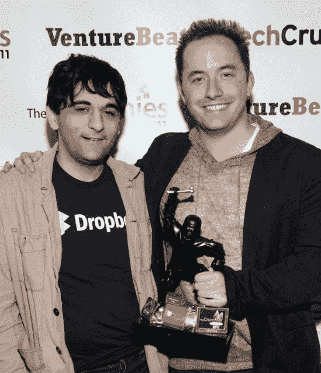

# Dropbox 的云存储之王德鲁·休斯顿和阿拉什·菲尔多西赢得年度创始人奖

> 原文：<https://web.archive.org/web/https://techcrunch.com/2014/02/10/dropboxs-cloud-storage-kings-drew-houston-and-arash-ferdowsi-win-founder-of-the-year-crunchie/>

# Dropbox 的云存储之王德鲁·休斯顿和阿拉什·菲尔多西赢得了年度创始人奖

当硅谷的摇滚明星放弃谷歌和脸书的轻松工作加入你的创业公司时，你知道你在做正确的事情。今年的年度创始人克朗彻获得了 Dropbox 的人才磁铁，首席执行官德鲁·休斯顿和首席技术官阿拉什·菲尔多西。

从麻省理工学院的宿舍到拒绝巨额收购要约和他们刚刚租下的第二个旧金山办公室，Drew 和 Arash 已经将云存储服务打造成了世界上最热门的项目之一。你可以从我去年对德鲁采访中感受到他坦率的风格。

仅在 2013 年，Dropbox 的员工就从 200 人增长到了 500 多人。它收购了受欢迎的电子邮件应用 Mailbox plus 团队，这些团队来自[较小的](https://web.archive.org/web/20221208235259/https://beta.techcrunch.com/2013/07/20/dropbox-acquires-mobile-coupon-startup-endorse-a-month-after-shutdown/)初创公司，如[代言](https://web.archive.org/web/20221208235259/https://beta.techcrunch.com/2013/07/20/dropbox-acquires-mobile-coupon-startup-endorse-a-month-after-shutdown/)、 [Snapjoy](https://web.archive.org/web/20221208235259/https://beta.techcrunch.com/2012/12/19/dropbox-acquires-snapjoy-and-puts-photos-into-its-focus/) 和[出售](https://web.archive.org/web/20221208235259/https://beta.techcrunch.com/2013/11/04/dropbox-snatches-up-sold-the-service-that-simplifies-selling-online-to-help-it-build-a-new-mystery-ecommerce-product/)。Dropbox 举办了第一次[开发者大会](https://web.archive.org/web/20221208235259/https://blog.dropbox.com/2014/01/happy-new-year-from-dropbox/)并且[对其面向商业的](https://web.archive.org/web/20221208235259/https://beta.techcrunch.com/2013/11/13/dropbox-hits-200-million-users-and-announces-new-products-for-businesses/)产品进行了彻底改革，以期待企业销售的推动。为了资助这些和新的存储创新，Dropbox 据说已经筹集了 2 . 5 亿美元的巨额资金，投资者试图在该公司身上下更多的赌注。

不过，德鲁和阿拉什赢得这个奖项的真正原因是他们创造的公司文化。员工喜欢他们的 CEO 设定明确的目标，但给人们以自由，让他们以自己的方式实现目标。与此同时，Arash 注重细节，将员工推向卓越的高标准。我听说过 CTO 在凌晨 3 点发生故障时发送电子邮件的故事……就像上个月导致小停电的原因一样。

据说两人都非常平易近人，给这个新兴巨头一种更亲密的公司的感觉。这对于构建一个庞大但模糊的世界至关重要，在这个世界中，我们的数据总是触手可及。

Drew 和 Arash 在年度创始人类别中面临着来自其他决赛选手的激烈竞争，如 Box 的存储大王 Aaron LevieTumblr 的戴维·卡普把公司卖给了雅虎；web 性能现象 CloudFlare 的 Matthew Prince 米歇尔·扎特琳和李·霍洛韦；还有电商火首发蒂娜·瓦尔沙夫斯卡娅。

但是 Dropbox 的创始人做了一些真正令人印象深刻的事情。他们一起将云存储这样听起来枯燥的东西变成了一个鼓舞人心的工作场所。那是因为他们看不到他们产品的真正含义。Dropbox 不是为了保存人们的文件，而是为了保护他们珍贵的记忆。

 
*【图片:[红杉](https://web.archive.org/web/20221208235259/http://www.sequoiacap.com/)*