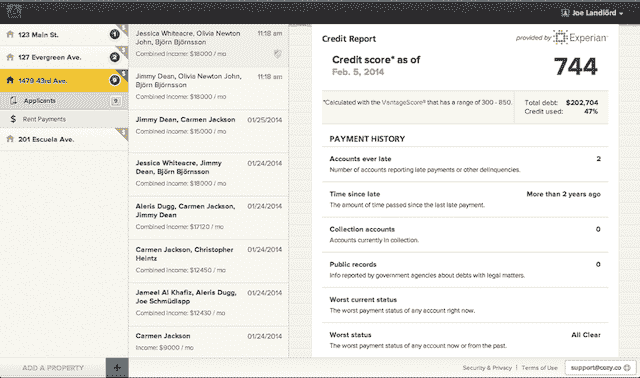

# Cozy 推出新功能，让租户更好地控制自己的信用报告 TechCrunch

> 原文：<https://web.archive.org/web/https://techcrunch.com/2014/02/11/cozy-credit-reporting/>

# Cozy 推出新功能，让租户更好地控制自己的信用报告

今天，Cozy 推出了信用检查的新功能，解决了租赁过程中的另一个问题。

这家初创公司[去年筹集了由 General Catalyst](https://web.archive.org/web/20221209123713/http://venturebeat.com/2013/10/15/cozy-gets-5m-to-make-it-easier-to-pay-rent-online/) 牵头的 A 轮融资，已经允许房东执行筛选租户和收取租金等任务。现在，当房东找到他们感兴趣的申请人时，他们实际上可以从 Cozy 网站上请求信用报告。然后，申请人可以选择是否批准这个请求(如果他们想要这个公寓，大概他们会同意)。

联合创始人兼首席执行官 Gino Zahnd 表示，这在几个关键方面改变了流程。首先，这意味着申请人不必向他们申请的每套公寓的房东提供他们的社会安全号码。显然，这对申请人来说是一个安全问题，但 Zahnd 认为房东也不一定喜欢处理一堆敏感的个人信息。

“在这个过程中，我们完全改变了控制信息的人，”他说。

其次，Zahnd 说这消除了申请费的需要。事实上，他声称他的目标是“让世界摆脱申请费”，他形容这是“一个荒谬的想法”。

第三，在初次报告之后，每一次后续的信用请求都是一次“软查询”，只是更新你的信息，而不是“硬查询”。重要的[区别](https://web.archive.org/web/20221209123713/https://www.creditkarma.com/article/hard_inquiries_and_soft_inquiries)？硬查询会影响你的信用评分，而软查询则不会。

为了提供这些信息，Cozy 使用 Experian Connect API。Zahnd 表示，信用报告公司 Experian 现在愿意通过 API 向其他公司提供这些数据，这一事实表明了该行业正在发生变化:“消费者希望控制他们的私人信息。……益百利非常清楚这一点。”

他补充说，今天推出的信用报告“在很大程度上是第一个版本”，计划中的新功能将“在如何工作和谁启动这一过程方面给租房者更大的权力。”