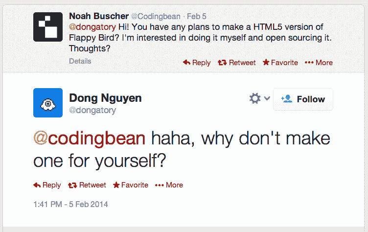

# Flappy Bird 热潮继续——现在以 HTML5 网页游戏 TechCrunch 的形式出现

> 原文：<https://web.archive.org/web/https://techcrunch.com/2014/02/11/the-flappybird-craze-continues-now-appearing-as-html5-web-games/>

# Flappy Bird 热潮继续——现在以 HTML5 网页游戏的形式出现

随着游戏突然从 iTunes 中退出，Flappy Bird 的克隆数量达到了历史最高水平。苹果应用商店和 Google Play——甚至 Pebble 应用商店——现在都充斥着这款游戏的复制品。仍然安装有原版游戏的手机显然在易贝上市，售价为 99999 美元。

现在有 81 个 Flappy 克隆开发者(你好，“Flappy Penguin”，“Ironpants”，“笨拙的鸟”，“Flappy Bee”等等)，而且这个名单还在增长。

这款应用的成功似乎让 Flappy Bird 的创作者 Dong Nguyen 陷入了抑郁，他现在渴望回到过去的[“简单生活”](https://web.archive.org/web/20221206181411/https://twitter.com/dongatory/status/432095426854912000)。

周日，他从 App Store 和 Google Play 下架了这款简单却令人上瘾的游戏。

然而，现在有一种方法可以玩游戏，甚至不必下载到手机上。

[免费的 Flappy Bird](https://web.archive.org/web/20221206181411/http://freeflappybird.org/) 可以直接在手机浏览器或桌面上玩。它出现在一个列出其他简单游戏的网站上。

与许多克隆游戏不同的是，这款游戏看起来与原版一模一样，正如 Nguyen 上周在 twitter 上的回复所说，就在 Flappy 热潮爆发之前，任何人都可以制作他的游戏的 HTML 版本:

毫无疑问，其他网络版本将会跟进，但就目前而言，Flappy Bird 热潮远未减缓。