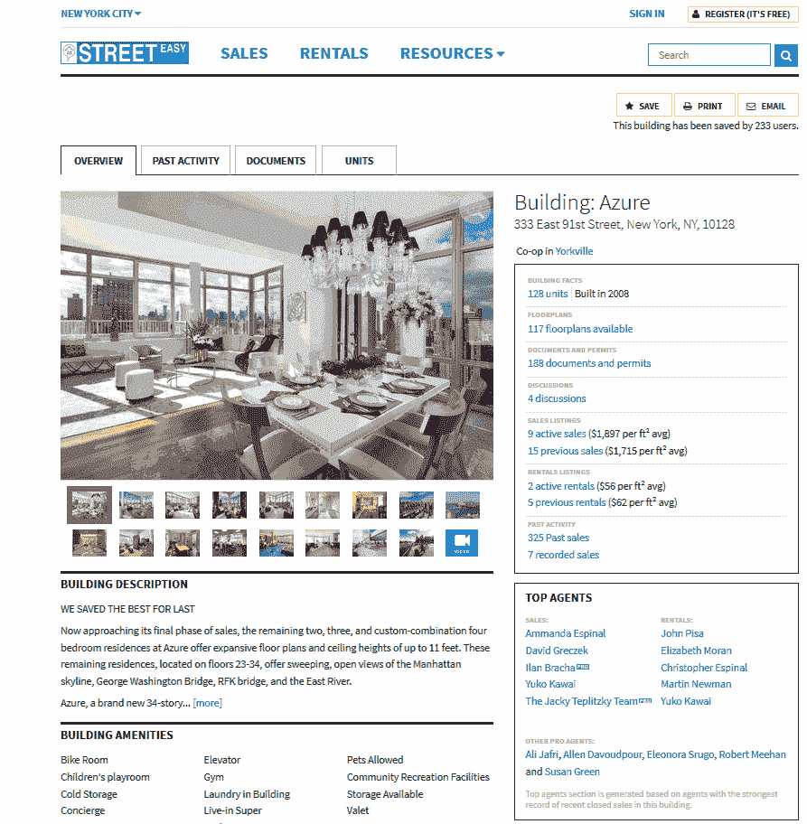
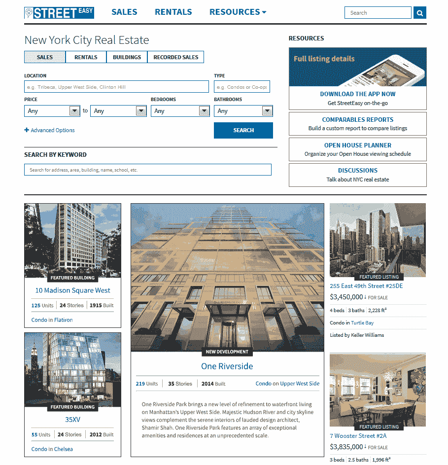

# Zillow 报告创下 2013 年第四季度收入记录，重新推出以纽约为重点的免费服务 street easy TechCrunch

> 原文：<https://web.archive.org/web/https://techcrunch.com/2014/02/12/zillow-reports-record-q4-2013-earnings-relaunches-nyc-focused-streeteasy-as-free-service/>

[Zillow](https://web.archive.org/web/20221226100234/http://zillow.com/) 今天[公布了](https://web.archive.org/web/20221226100234/http://investors.zillow.com/releasedetail.cfm?ReleaseID=825393)其 2013 年第四季度财报。该公司的收入为 5830 万美元(同比增长 70%)，GAAP 每股收益为 0.07 美元，非 GAAP 每股收益为 0.20 美元。净收入为 270 万美元。

在去年同期，Zillow 报告盈利 3430 万美元，净收入 50 万美元。2013 年全年，该公司的收入达到创纪录的 1.975 亿美元，同比增长 69%。

分析师在财报发布前的共识是，该公司将报告收入约为 5618 万美元，每股收益为 0.07 美元，比去年同期下降 12%。

在前几个季度，该公司报告了其网站的创纪录流量，以及其移动应用程序的大幅增长。然而，尽管收入创下纪录，但推动这一流量的广告支出增加意味着该公司上一季度净亏损约 120 万美元。对于整个 2013 财年，Zillow 今天报告亏损 1250 万美元，该公司再次指出，这“主要是由于之前宣布的广告投资。”不过，这与预期基本一致，因为 Zillow 早就决定放弃短期利润，以扩大用户基础。

这一次，Zillow 的流量再一次增长到新的记录水平——这当然也是由缓慢复苏的房地产市场推动的。总的来说，季度流量同比增长 57 %,达到 5440 万个月平均流量。

该公司表示，2013 年 1 月，它的独立用户达到了 7000 万，创下了新的纪录。在收益达到预期后的一次采访中，首席执行官斯潘塞·拉斯科夫强调，移动设备现在也是该公司收入增长的一大驱动力。至于 Zillow 最近对租赁的重视，Rascoff 指出，目前这仍然是公司收入的一个相对较小的驱动因素，但他预计这将快速增长。

“对于 Zillow 来说，这是一个突破性的一年，在这一年中，我们多次创造了创纪录的收入、流量和移动使用量，因为我们作为类别领导者的市场份额显著增长。我们在 2014 年有了一个令人难以置信的强劲开端，1 月份又创下了近 7000 万独立用户的流量记录，”Rascoff 在今天的公告中说。他还强调，该网站现在比任何竞争对手都大得多，并将继续投资，迅速扩大其受众。

除了今天报告其收益，Zillow 还宣布重新推出以纽约市为中心的房地产网站，该网站于 2013 年 8 月以 5000 万美元收购。这项服务正在进行彻底的重新设计，但也许更重要的是，它正在从目前的免费增值模式转向完全免费的服务。以前，StreetEasy 用户必须每月支付 10 美元才能使用高级搜索功能和信息，如记录的销售信息、房产记录和新房产的实时电子邮件提醒。

现在，该服务提供所有的工具，而不像以前那样需要付费。这也非常符合 Zillow 本身的运营方式，因此这一举动并不令人感到意外。Rascoff 还指出，Zillow 认为自己是一家媒体公司，因此它的内容吸引的眼球越多，它的底线就越好。

鉴于 StreetEasy 在纽约市场的受欢迎程度，该公司显然也决定保持品牌本身的发展，类似于它对 Postlets 所做的事情。

