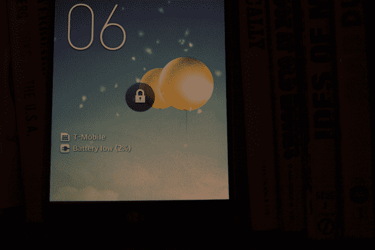

# LG G Flex | TechCrunch 一周

> 原文：<https://web.archive.org/web/http://techcrunch.com/2014/02/14/a-week-with-the-lg-g-flex/>

关于 [LG G Flex](https://web.archive.org/web/20230326182844/http://www.engadget.com/2013/12/06/lg-g-flex-review/) 的大部分评论已经上升，但由于这款手机正在美国慢慢渗透，我想我会给它一整周的使用时间，看看到底有什么大惊小怪的。如果你看了我们的《生死抉择》,你会知道我对这款手机很感兴趣，但认为它很新奇，对大多数用户来说可能太贵了。然而，作为对未来事物的一个窥视，它是相当迷人的。本周强化了这一观点。

如果你还记得的话，这款手机是一款 6 英寸的平板手机，配有 1，280 x 720 像素的弯曲有机发光二极管屏幕。它运行 2.26GHz 的四核 Snapdragon 800，内置 Android 4.2.2。它有一个高清后置摄像头，没有外部存储。

这与手机性能无关。它在大多数情况下都能很好地工作，并提供了惊人的电池寿命——我看到了三天的适度使用，直到我耗尽电池。虽然你的结果可能会有所不同——例如，我没有把它作为我的主要电子邮件设备——但 Flex 的 3,500mAh 和低功耗处理器配合得很好。虽然视频观看会对手机造成一点影响，但我仍然会推荐这款手机，单就电池性能而言。

然而，真正的噱头是曲面屏幕。首先，这款手机只有 6 英寸，大得可笑。虽然我理解使用 Galaxy Note 这样的设备的动力，但我从来没有真正想把它作为日常随身携带的东西。再加上曲面屏，问题就大了。

首先，要明白这个屏幕仍然是非常实验性的，它离理想状态还很远。总之就是屏幕吵。这张照片中可见的噪音并非偶然。

这种噪音始终存在，并使白色 UI 元素看起来像灰色的纸。如果你需要一个清晰易读的屏幕，那就放弃这款手机吧。塑料有机发光二极管当然是可以弯曲的，但是价格是多少呢？

这款手机还有一个自我修复的塑料背面，随着时间的推移，它会自动消除划痕。这种聚合物熔化非常缓慢，减少了划痕的可见性。虽然它不会从严重的划痕中恢复过来——我用开瓶器打开了一个——但除了背面最深的划痕外，所有划痕最终都会“融化”掉。该功能显然是针对那些可能不会或不能将该设备放在箱子中的用户，并且让人想起科学博览会项目，而不是运输产品功能。

如果你去掉手机的轻微弯曲，你就有了另一款 LG 旗舰。然而，我很高兴地注意到，处理器和电池远远弥补了设计的愚蠢(或者有人会说，独特)。在适当的情况下，我完全可以想象自己想要一部像 Flex 这样的手机，哪怕只是为了媒体消费的潜力。这款手机必须像小平板电脑而不是大手机一样对待。很难把这个馅饼盘大小的设备举到头上，如果你打算打电话，我肯定会推荐蓝牙耳机。

我也很高兴这部手机上没有臃肿的软件，我需要的所有应用程序运行流畅，没有问题。性能足够好——比 Galaxy Note 3 慢一点——但我敢打赌用户不会注意到这款设备和 Note 之间的太大差异。

你应该为这部手机支付额外费用吗？T-Mobile 的这款手机在 24 个月内每月 28 美元，总共 672 美元，在 AT&T 上大约 300 美元。鉴于零售价超过 600 美元，我们谈论的是一个非常昂贵的提议，但性能并不高。

我很高兴看到这项技术、LG 和塑料有机发光二极管的下一步发展。这是一项令人着迷的技术。也挺吸引眼球的。然而，这是首批具有真实可见曲线的设备之一，尽管听起来令人兴奋，但我不确定这是普通用户在性能或尺寸方面的追求。

也就是说，我很高兴 LG 尝试了这一点。携带如此奇怪和有趣的东西是一种独特的待遇，在这种情况下，外形因素为二流手机制造商的无聊平板电脑增添了价值。

http://www.lg.com/us/mobile-phones/gflex

[gallery ids="957672，957673，957674，957675，957676，957677"]