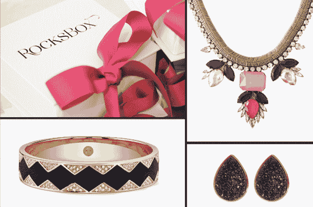
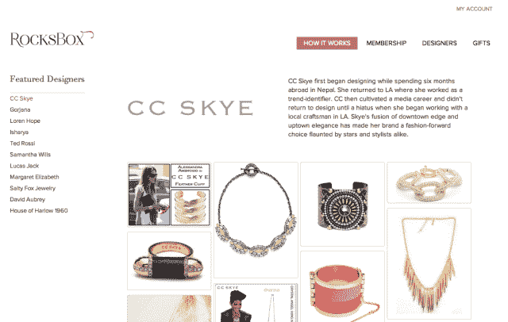

# RocksBox 获得 150 万美元的情人节种子资金

> 原文：<https://web.archive.org/web/https://techcrunch.com/2014/02/14/rocksbox-gets-a-1-2m-seed-round-for-valentines-day/>

[Meaghan Rose](https://web.archive.org/web/20221007194032/http://www.crunchbase.com/person/meaghan-rose) 非常想让[rocksborx](https://web.archive.org/web/20221007194032/https://www.rocksbox.com/)成为一个东西，所以她单枪匹马地为这个想法建立了一个 WordPress 网站，并为其储备了自己的珠宝。她从自己的衣柜里拿出几盒样品，让想参加的朋友可以尝试不同的外观。

自该公司在 2012 年感恩节发布测试版以来，罗斯和洛克斯堡已经走过了很长一段路。这家最初自创的定制首饰盒初创公司后来搬出了罗斯自己的首饰盒，搬进了旧金山一间光线充足的办公室。它刚刚结束了来自 [Matrix Partners](https://web.archive.org/web/20221007194032/http://www.crunchbase.com/financial-organization/matrix-partners) 、 [Ellen Levy](https://web.archive.org/web/20221007194032/http://www.crunchbase.com/person/ellen-levy) 和 [Sonja Perkins](https://web.archive.org/web/20221007194032/http://www.crunchbase.com/person/sonja-perkins) 的 150 万美元种子资金。

珠宝行业是一个垂直行业，随着行业向在线扩展，各公司正在尝试几种方法。有像 [BaubleBar](https://web.archive.org/web/20221007194032/http://www.crunchbase.com/company/baublebar) 这样的直截了当的电子商务，也有像 [Chloe + Isabel](https://web.archive.org/web/20221007194032/http://www.crunchbase.com/company/chloe-isabel) 这样的初创公司，他们试图通过离线方式利用社交媒体。

与[Le Totte](https://web.archive.org/web/20221007194032/http://www.crunchbase.com/company/le-tote-2)等公司一样，RocksBox 允许您每月以 15 至 19 美元的价格签约成为会员，这将为您提供一盒独特的珠宝，您可以根据需要随时购买，为期 12 个月、6 个月或不限时间。罗斯从设计师那里批发购买这些作品。

有了 RocksBox，您可以购买盒子里的三四件衣服中的任何一件，或者一直穿着直到厌倦，然后简单地把它们退回。该服务从您的反馈和购买数据中学习，并为每个后续盒子发送更独特的定制体验。

Rose 希望 RocksBox 赋予她的客户更多权利。“珠宝是一个有趣的类别，但它充满了恐惧和恐吓。”她说，她之所以选择 RocksBox 模式，是因为她认为珠宝是真正的消费者，而不是首席执行官或顾问(罗斯在沃顿商学院毕业后曾在麦肯锡短暂工作过):

> 作为一名消费者，我知道几件事:第一，以旧方式购买珠宝是可怕的(势不可挡，令人生畏，很难找到独特的东西——没有人有时间做这些)。第二，我们喜欢变化(你第一次穿某件衣服是最令人兴奋的时候，通常从那时开始)。第三，有几件*T2 的作品让你爱不释手(但当你看着货架上的一堆珠宝时，你不可能知道哪些会达到“真爱”的状态)。*

虽然她不愿透露实际数字，但 Rose 断言 RocksBox 在 12 月份的现金流是正的，并表示她的客户群逐月增长了 30-40%，是去年的 20 倍以上。她最近还推出了自己的设计师系列，希望有一天能推出更高端的盒子，并将 RocksBox 品牌扩展到珠宝之外，加入腰带环等其他配饰。

投资者[乔希·汉娜](https://web.archive.org/web/20221007194032/http://www.crunchbase.com/person/josh-hannah)将该公司比作[蓝色尼罗河](https://web.archive.org/web/20221007194032/http://www.crunchbase.com/company/blue-nile)。“几个与我关系密切的人进行了认购，并且不停地对 RocksBox 赞不绝口，这确实促使我进行了投资。我很少看到人们对这样一个年轻的产品有如此高的热情，”他说。

汉娜还投资了[Gilt group](https://web.archive.org/web/20221007194032/http://www.crunchbase.com/search?query=Gilt+Groupe)、 [JustFab](https://web.archive.org/web/20221007194032/http://www.crunchbase.com/company/justfabulous) 和 [Polyvore](https://web.archive.org/web/20221007194032/http://www.crunchbase.com/company/polyvore) ，她是对的；在我被男朋友赠送了订阅之后，我转身邀请了另外六个朋友。

“我认为珠宝没有更快地转移到网上的部分原因是需要试穿一些东西，触摸和感受产品，”汉娜解释说。“蓝色尼罗河通过销售给男性来解决这个问题，所以无论如何，这种产品永远不会提前试用，”他说。RocksBox 以他们自己的方式解决了这个问题:你的订阅允许你不断尝试和轮换你穿的衣服，但如果你找到了一个保管人，就很容易购买——这是一个完美的试用模式，订阅和购买都有利可图。"

这里有一个有趣的交叉点，在订阅模式和使用规模来解决一个长期存在的难题之间。某些细分市场更适合提供带有购买选择权的订阅服务，而时尚无疑是其中较大的一个。

对于商品，触摸和亲身体验商品的欲望几乎消失了——人们现在在亚马逊上订阅卫生纸。但对于珠宝等非商品，将浏览者转化为买家的关键可能是最古老的:让他们走进商店。只是，用 RocksBox 的方法，那家店就是你的客厅。

有时有问题的订阅商业模式是否会找到它与珠宝的独特契合，还有待观察。RocksBox 的资助意味着我们有第一次机会找到答案。

