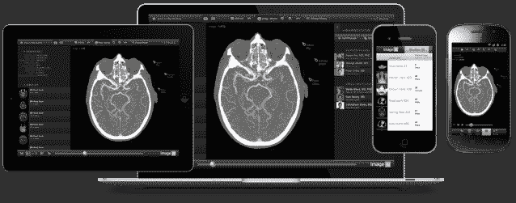

# TrueVault 推出，为初创公司和健康应用带来轻松的 HIPAA 合规性| TechCrunch

> 原文：<https://web.archive.org/web/https://techcrunch.com/2014/02/14/truevault-launches-to-bring-easy-hipaa-compliance-to-startups-and-health-apps/>

这是最好的时代，也是最糟糕的时代:为了在 2008 年开始的“大衰退”和金融危机的失控中重振美国经济，国会匆忙制定并分发了史无前例、备受争议的 7870 亿美元经济刺激计划。其中，[刺激法案](https://web.archive.org/web/20230314161850/http://en.wikipedia.org/wiki/American_Recovery_and_Reinvestment_Act_of_2009)成为另一项里程碑式立法的载体，[高科技法案](https://web.archive.org/web/20230314161850/http://en.wikipedia.org/wiki/HITECH_Act)，该法案试图为全面的医疗改革奠定基础。

HITECH 法案不仅旨在鼓励臃肿的医疗保健行业降低成本，采用医疗保健信息技术和电子健康记录，它还对 HIPAA 的隐私和安全条款进行了重大修改。今年 1 月，这些[变化最终确定](https://web.archive.org/web/20230314161850/http://www.hipaasurvivalguide.com/hipaa-omnibus-rule.php)，它们对所有数字医疗公司、技术提供商和应用程序开发者都有重要意义。

规则的改变(以及规则本身)是复杂的，它们需要初创公司和工程师投入大量工作来保持合规性。在医疗保健行业，对提高效率、降低成本的技术(以及更多工程师)的需求最为迫切，这是一个问题。在很多情况下，创业公司和开发者没有花时间去适应 HIPAA，而是削减了他们应用程序的特性和功能。这降低了产品的整体价值主张，并剥夺了反馈回路中的重要部分。

幸运的是， [TrueVault](https://web.archive.org/web/20230314161850/https://www.truevault.com/) 支持你。TrueVault 是 Y Combinator 最新一批创业公司中的一员，它的使命是减轻创业公司在 HIPAA 合规性方面耗时、停滞不前的过程，以便他们可以专注于真正重要的事情:修复医疗保健体验。

在过去的两年里，移动健康应用出现了爆炸式增长。然而，问题是其中许多都是垃圾。其中一些只是克隆，但其中许多缺乏人们希望从移动健康应用中获得的功能。普通消费者希望访问健康信息，而不是无文本的数据，但 HIPAA 的新变化要求提供健康信息的应用和技术符合要求。

TrueVault 希望通过提供安全的 API 来存储健康数据并简化 HIPAA 合规性的复杂性，从而解决这一问题。这个想法是通过确保初创公司可以避免担心设置和维护 HIPAA 兼容的应用程序堆栈，从而节省数百个开发时间。相反，TrueVault 处理 HIPAA 要求的所有物理和技术保护，同时像大多数 API 服务一样工作，联合创始人 Trey Swann 说。

TrueVault 面向初创公司、网络和移动应用以及可穿戴设备，使他们能够通过 RESTful APIs 存储和搜索任何文件格式的受保护健康信息(PHI)。它将签署一份“商业伙伴协议，并根据全面的隐私和数据泄露保险政策保护客户”，就像 HIPAA 习惯于让每个人做的那样。

当然，你可能会说:“但是，Rip，有很多符合 HIPAA 的主机提供商。那些呢？”说得好，我的朋友。说得好。AWS、FireHost 和 RackSpace 等大家熟悉的名字都提供符合 HIPAA 标准的发布，并将签署 BAA。因此，您可以将您的应用程序和健康数据转移到其中一个大公司。

许多创业公司现在都面临着这个“构建还是购买”的决定。这就是为什么联合创始人 Trey Swann 看到了 TrueVault 的巨大机遇。他说，TrueVault 对符合 HIPAA 标准的托管服务提供商的价值主张是，他们仍然需要公司花几个月的时间在那种环境下构建符合 HIPAA 标准的应用程序堆栈，这需要一系列技术规范。

另一个好处是成本。如果一家公司希望与 AWS 签署 BAA，它需要使用专用实例，每个实例小时比标准费用多 10%。此外，如果他们希望符合 HIPAA 和 AWS 标准，他们的仪表起价为 1，500 美元/月(仪表起价为 2 美元/实例小时，超过一个月约为 1，500 美元/实例小时)。$1,500).另一方面，FireHost 的起价是 1115 美元/月，每添加一个 HIPAA 就绪的实例就要额外支付 250 美元。

相反，TrueVault 以相当有竞争力的价格提供服务:每个 API 调用 0.001 美元。是的，那是 100 美元的 10 万个电话。Swann 说无限量的文件和 JSON 存储已经包含在这个价格中了。对于提供所有存储数据的自动加密、用于搜索加密数据的 API、审计跟踪、主动监控、哈希、正常运行时间和 SLA 的服务来说，这并不坏。

然而，关键在于搜索。为了符合 HIPAA，应用程序必须加密他们的数据库，这意味着你的应用程序无法搜索他们的数据，因此功能受到影响。TrueVault 的服务保护您的数据，并允许您查询受保护的数据。公司可以获得无限的文件和 JSON 存储，并搜索任何 JSON 文档和二进制字段，或者让他们的应用程序直接调用 TrueVault 的搜索 API，以快速为他们的应用程序添加搜索界面。

如今，TrueVault 的平台上存储了大约 500 万份文档，每周都有数百万次 API 调用。这家初创公司已经签约了近 200 家公司，包括 image32、LifeVest Health、Weave 和 Rocky Mountain Health Plans，并且正在快速增长。

更多信息，请点击查看家中的 [TrueVault。](https://web.archive.org/web/20230314161850/https://www.truevault.com/)