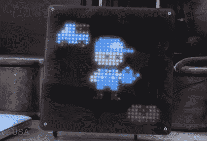
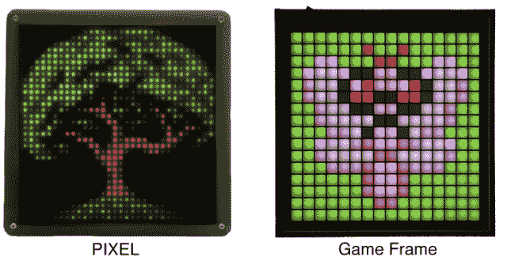

# PIXEL 将老式视频游戏艺术带入家中

> 原文：<https://web.archive.org/web/http://techcrunch.com/2014/02/17/pixel-brings-brings-old-school-video-game-art-to-life-in-your-home/>

把你的旧 Lite-Brite 调到 11 档。添加蓝牙，加入动画支持，让人们通过智能手机画出他们的设计。你得到了什么？类似 PIXEL 的东西。

(恰如其名)PIXEL 是一款专为展示像素艺术而打造的显示器。如果你愿意，可以称之为像素艺术相框。

想要一个声波在你的斗篷上敲击他的脚的动画循环？当然可以。从你浴室的管道里冒出来的一串没完没了的 Marios？好吧！想要吃豆人围着屏幕哇卡哇卡直到时间的尽头吗？见鬼，为什么不呢。

当你想改变照片时，你只需打开智能手机上的应用程序，然后离开。想做一些更复杂的事情吗——比如动画？在您最喜欢的编辑应用程序中制作您的设计，然后通过 USB 或蓝牙将其传输到 PIXEL。如果你在画一幅静物，你可以给它发送一个 PNG 如果你在做动画，你可以给它发一个 GIF。

到目前为止，PIXEL 已经在 Kickstarter 上筹集了 2 万美元[，他们最初设定的目标只有这个数字的一半。这实际上是该产品的第二个版本*——早在 2013 年初，该团队就为一个稍微不那么漂亮的版本筹集了 5 万美元。*](https://web.archive.org/web/20230320043953/https://www.kickstarter.com/projects/996412530/pixel-led-art)

如果你能挤进去，抓住剩下的几个早期交易中的一个，一个完全组装的 PIXEL 将花费你 260 美元。这些都没了之后，剩下的要 300 美元。或者，你可以选择 220 美元的 DIY 套件版本来节省一些钱——但这是一种自带烙铁的东西，所以要确保你知道自己在做什么。

如果你几周前告诉我，我很快就会想要一个像素艺术相框，我会回答说“像素艺术相框到底是什么？”

两个星期后，我试图找出我想要哪一个像素艺术相框。

就在上周，达雷尔[指出了游戏框架](https://web.archive.org/web/20230320043953/https://techcrunch.com/2014/02/07/game-frame-puts-pixel-art-on-display-in-the-coolest-possible-way/)，一个惊人相似的概念已经在 Kickstarter 上筹集了 6 万美元，其活动还剩下近 3 周。

PIXEL 和 Game Frame 在许多方面都很相似，但各有所长。游戏框架来自备受崇拜的 pixel 艺术家 [eBoy](https://web.archive.org/web/20230320043953/http://en.wikipedia.org/wiki/EBoy) 的作品，而 PIXEL 来自 10 位不同艺术家的作品。PIXEL 的分辨率更高(1024 像素对 Game Frame 的 256 像素)，但 Game Frame 使用了一些聪明的光学巫术，使每个单独的 LED 变成一个巨大的，均匀发光的方形像素。每一个都有自己完全不同的视觉风格。

两个我都要。或者两者都有。是的，我两个都要。

(如果你错过了上面的链接，你可以[在这里](https://web.archive.org/web/20230320043953/https://www.kickstarter.com/projects/996412530/pixel-led-art)找到 PIXEL 的 kickstarter 活动)