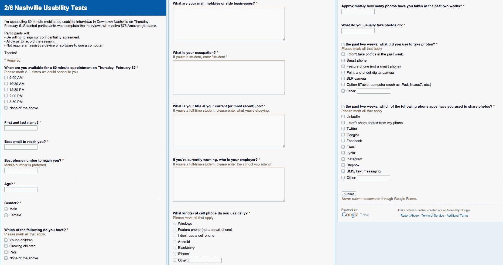
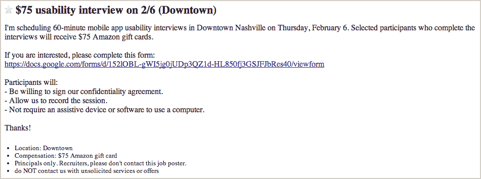
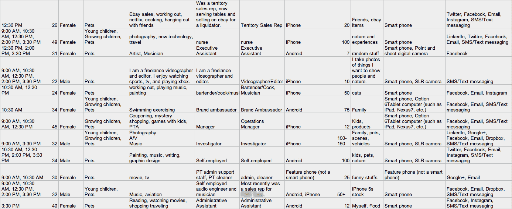
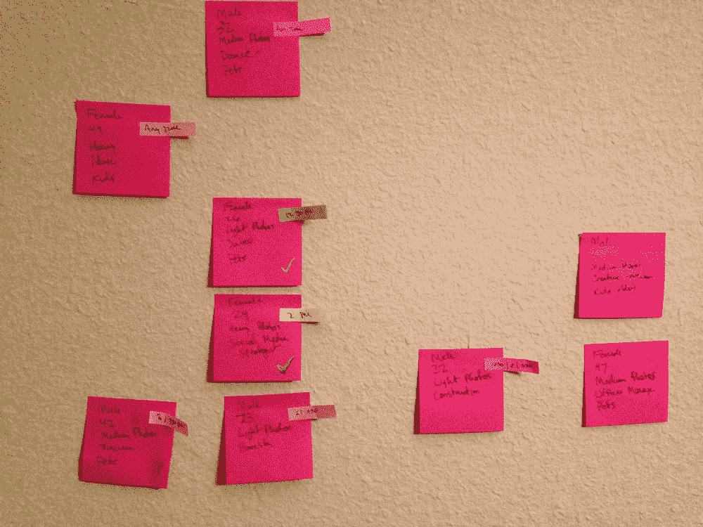
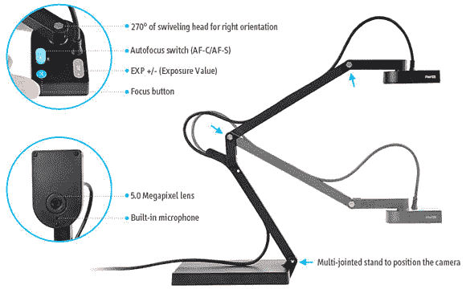

# 如何运行实时用户测试，第 1 部分:设置 TechCrunch

> 原文：<https://web.archive.org/web/https://techcrunch.com/2014/02/18/how-to-run-live-user-testing-part-1-setup/>

布兰登·穆里根撰稿人

More posts by this contributor

**编者按** : *[Brenden Mulligan](https://web.archive.org/web/20221007001826/https://twitter.com/mulligan) 是 [Cluster](https://web.archive.org/web/20221007001826/http://cluster.co/) 的联合创始人和设计师，之前曾创建过 Onesheet、MorningPics、ArtistData 等网站。在 Twitter 上找到他 [@mulligan](https://web.archive.org/web/20221007001826/https://twitter.com/mulligan) 。*

在[集群](https://web.archive.org/web/20221007001826/https://cluster.co/)，我们是迭代和实验的忠实粉丝。自 2013 年 2 月公开发布以来，我们已经在 iOS 和 Android 上快速迭代了该产品。在苹果应用商店上线的前八周，我们发布了 10 个更新。在安卓系统上，有一周我们在五天内推出了五个版本，同时进行了大量的 A/B 测试。

虽然快速迭代是美妙的，但有时我们也会放慢速度，对更大的变更做出更深思熟虑的决定。当这种情况发生时，我们倾向于快速制作原型，然后在不同的小组面前进行测试。这些测试中的大多数都是相当非正式的，但偶尔(不可否认的是不够频繁)我们会进行全面的用户测试，招募潜在用户来浏览应用程序并给我们反馈。

我们正在进行一个大的更新，所以我们最近为不同的原型运行了多个会话。当与其他企业家谈论它时，他们向我们询问细节。这是我们不断发展的剧本。

因为这相当长，这将是三个部分的第一部分:

1.  设置
2.  运行测试
3.  任务报告

*在开始之前，我想对* ***非常感谢*** *到* [*迈克尔·马戈利斯*](https://web.archive.org/web/20221007001826/http://www.gv.com/team/michael-margolis) *和* [*Google Ventures 的设计团队*](https://web.archive.org/web/20221007001826/http://www.gv.com/design/) *，是他们教会了我们大多数这些技术。*

## 第 1 部分:设置

用户测试非常有价值，需要大量的工作来设置。在一周的时间里，一个人要花费大量的时间来设置测试并运行好它们。所以要花时间正确地做这件事。

设置过程分为以下几个部分:

1.  决定要测试的特定事物
2.  决定何时何地进行用户研究
3.  决定研究什么类型的用户
4.  用 Craigslist 招募用户
5.  修剪候选人名单
6.  优先考虑和安排
7.  获得合适的设备

### 决定要测试的特定事物

最近，我们有幸与来自谷歌风投的才华横溢的[设计团队进行了一次](https://web.archive.org/web/20221007001826/http://www.gv.com/library/design)[冲刺](https://web.archive.org/web/20221007001826/https://beta.techcrunch.com/2013/10/23/inside-a-google-ventures-design-sprint/)(整篇文章即将发表)。在五天的时间里，我们确定了集群的核心机会，集思广益，构建了几个简单的原型，并与潜在用户一起测试了原型。这一过程的结果是清楚地知道哪些新概念可行，哪些不可行。

有了成功想法的列表，团队就可以基于我们当前的应用程序快速构建一个单一的功能原型。这个工作原型完成后，是时候向用户展示它了，看看从设计冲刺中收集的所有见解是否在我们实际应用的上下文中有效。

### **决定何时何地进行用户研究**

我计划在纳什维尔呆一周，这给了我们一个在湾区之外进行测试的好机会。这非常有价值，因为湾区往往充满了精通技术的早期采用者。纳什维尔有其公平的份额，但技术不是社区的核心，所以我们觉得这将给我们一个机会，以满足更多的“真正的”用户。

选择一个安静、私密、中立的地方也很重要。尽管使用公司的会议室很诱人，但我还是建议不要把用户带到公司办公室。使用朋友的办公室或共同工作空间。我们得到的所有建议是地点越中立越好。

隐私和安静是很重要的，因为你将记录会议，所以你不想在咖啡厅里做，那里有很多干扰和背景噪音。

当我在纳什维尔的时候，我从[企业家中心](https://web.archive.org/web/20221007001826/http://www.ec.co/)租了一个会议室。结果很完美。

纳什维尔企业家中心

决定研究什么类型的用户

这是整个过程中非常重要的一部分。在招募用户之前，你需要决定你要会见什么类型的人。我们在 Google sprint 期间已经这样做了，因为我们的应用涉及分享照片，所以我们问了这些类型的问题:

*   他们应该使用什么类型的手机？
*   他们应该在多大程度上参与社交媒体？
*   他们应该使用(和不使用)哪些应用程序？
*   他们应该每周拍几张照片？
*   他们多大了？
*   他们目前如何分享照片？

带着这些问题，我们创建了一个 [Google Forms](https://web.archive.org/web/20221007001826/http://www.google.com/google-d-s/createforms.html) 调查，它将帮助我们清楚地确定潜在测试者是否符合我们的目标概况。如果你没有测试正确的用户类型，就不值得进行用户测试，所以花点时间，把这一步做好。

我们在纳什维尔研究中使用的实际筛选工具(点击放大)

由于用户将不得不亲自去某个地方，获得他们的可用性也是有用的。我们是这样做的，首先问“你在 2 月 6 日星期四以下哪个时间有空来纳什维尔市中心？”时隙有五种选择。

### 用 Craigslist 招募用户

大约在我们计划进行用户测试的一周前，我们在 Craigslist 的 jobs/etc . part 上发布了一个工作机会。在这篇相对较短的帖子中，我们给出的信息非常少，除了我们正在寻找参与可用性研究的人，他们需要签署 NDA 并被拍摄，我们愿意支付他们的时间(在这种情况下，一张 75 美元的亚马逊礼品卡用于 60 分钟的会议)。

Craigslist 的帖子驱使人们去看电影

帖子没有让用户回复邮件。相反，有一个链接指向我们上面构建的 Google 表单。这让我们非常容易整合和组织每个人的回答。

### 修剪候选人名单

通常，我们会在几天内收到 60-200 份申请。我们试着把它减少到五个。这要经过几轮编辑。

在这项研究中，第一次大幅度削减发生在设备类型上。由于我们构建原型的时间很少，我们只能对安装了 iOS 7 的 iPhone 用户进行测试，理想情况下是 iPhone 5 型号，因为我们没有时间对所有屏幕尺寸进行优化。虽然这使用户有点倾斜，但我们能够通过查看其他信息来重新平衡它。

纳什维尔筛选员的回答示例，删除了所有个人信息(点击放大)

然后我们排除了那些不用手机拍照的人。虽然最终与这些用户交谈可能会很有趣，但我们一直在寻找那些会立即使用我们应用的人。如果他们不拍照，他们就不太可能是我们想要的那类用户。

### 优先考虑和安排

对于剩下的候选人，我们查看了他们的年龄、职业和一些其他数据点，并整理出了我们最有兴趣与之交谈的人的优先列表。在这一点上，它变成了一个调度练习，为每个时间段安排我们的最佳人选，如果那个人不能来，就选择一个后备人选。

每个候选人都收到电子邮件，说他们被选中了一个时间段，他们需要在一定的时间内回信确认，否则他们的时间段将被放弃。后备名单是通过电子邮件发送的，说他们在后备名单上，并让我们知道如果他们被选中，他们是否不再能做到这一点，否则他们会在一定时间内听到是否需要他们。

排班时移动候选人

作为警告，人们是非常古怪的。前五名候选人中，只有三人得到确认，其中一人取消了。这不是一个问题，因为我们能够用我们的备份来填充插槽，但这是一个你可能会想到的更大的痛苦。为了以防万一，拥有多个备份甚至是明智的。

### 获得合适的设备和软件

我们正在测试一款移动应用，因此记录用户实际使用该应用的情况非常重要。虽然你可以通过插入应用程序并在电脑上观看截屏来做到这一点，但实际看到他们触摸他们的手机要好得多。我们[为此购买了一台 100 美元的相机](https://web.archive.org/web/20221007001826/http://www.amazon.com/Ziggi-HD-High-Definition-Document-Camera-CDVU-04IP/dp/B008DBF5Z8/ref=sr_1_1?ie=UTF8&qid=1392406332&sr=8-1&keywords=ipevo+presenter)，它非常值得投资。

IPEVO Ziggi-HD 高清 USB 文档摄像机

你需要的另外一件事就是把会议的音频和视频记录到你的电脑上。为此，我推荐一款优秀的 app 叫做 [Screenflow](https://web.archive.org/web/20221007001826/https://itunes.apple.com/us/app/screenflow-4/id573279886?mt=12) 。

### 现在是测试的时候了

你已经有了目标、用户和设备。现在是时候展示和运行测试了！下一篇文章将会介绍如何搭建房间，以及如何对真实用户进行测试。

*请随时通过 Twitter 上的 [@mulligan](https://web.archive.org/web/20221007001826/http://twitter.com/mulligan) 联系我，同时询问任何其他问题。*