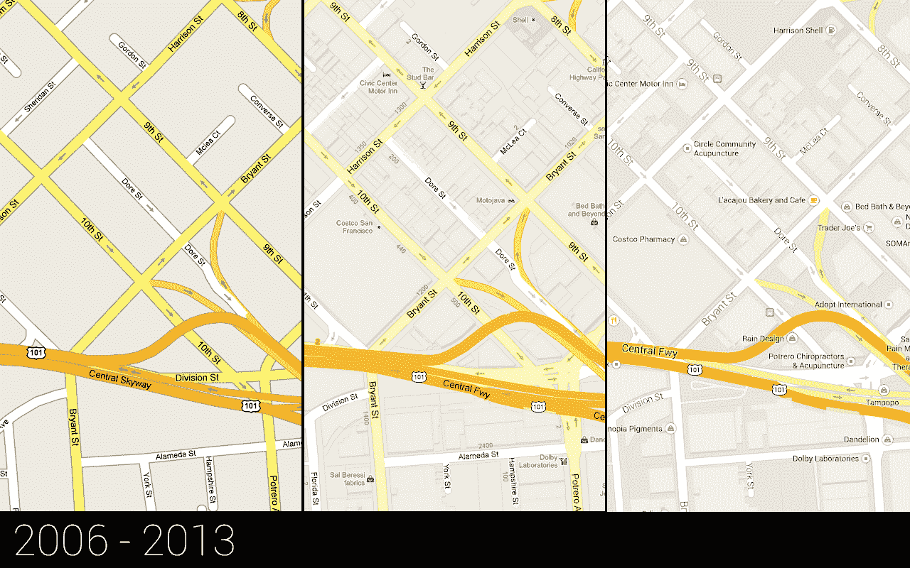

# 谷歌开始让新的谷歌地图成为所有人的默认地图

> 原文：<https://web.archive.org/web/https://techcrunch.com/2014/02/19/google-starts-making-the-new-google-maps-the-default-for-everybody/>

经过不到一年的预览，谷歌今天[宣布](https://web.archive.org/web/20221226040809/http://google-latlong.blogspot.com/2014/02/thank-you-and-welcome-to-new-google-maps.html)它现在向所有用户推出[新谷歌地图](https://web.archive.org/web/20221226040809/http://maps.google.com/maps/about/explore/)作为默认选项。

自从谷歌在去年的 I/O 开发者大会上宣布新版地图以来，用户可以在两个版本之间切换。不过，该公司告诉我，大多数用户仍在使用旧版本。从今天开始，谷歌将慢慢地让每个人都转向新的谷歌地图。这一推出将需要几周时间，不喜欢新版本的用户可以暂时切换回旧版本，尽管在某个时候，谷歌可能会关闭旧地图。

谷歌去年宣布的新版本相对来说比较基础，所以直到现在，谷歌一直把它作为一个选项，并没有把所有用户转移到新的体验。它仍然缺少[号](https://web.archive.org/web/20221226040809/https://techcrunch.com/2013/11/06/new-google-maps-for-desktop-brings-back-pegman-adds-waze-data-and-3d-earth-tours/)的[重要](https://web.archive.org/web/20221226040809/https://www.google.com/url?sa=t&rct=j&q=&esrc=s&source=web&cd=1&cad=rja&ved=0CCcQFjAA&url=http%3A%2F%2Fbeta.techcrunch.com%2F2013%2F11%2F27%2Fembeds-return-to-new-google-maps-will-soon-include-ads%2F&ei=qfcDU6GbCcaFogSp3YLgCg&usg=AFQjCNETp953N5Y-8l0JJEaHNKbEoGf_ig&sig2=_HmiVPAf69mylqWJ734dkQ&bvm=bv.61535280,d.cGU)功能，但谷歌也想在 2013 年 I/O 上推出它，看看它仍然需要调整服务的哪些地方，以及用户会如何反应。

现在，谷歌认为新版谷歌地图在功能上与原版不相上下，并开始向全球所有用户推广。

[https://web.archive.org/web/20221226040809if_/https://www.youtube.com/embed/N6DrfYHVcXs?feature=oembed](https://web.archive.org/web/20221226040809if_/https://www.youtube.com/embed/N6DrfYHVcXs?feature=oembed)

视频

谷歌地图的首席设计师 Jonah Jones 告诉我，在过去的几个月里，该团队专注于提高速度，减少混乱，并恢复了一些功能，如 [pegman](https://web.archive.org/web/20221226040809/https://techcrunch.com/2013/11/06/new-google-maps-for-desktop-brings-back-pegman-adds-waze-data-and-3d-earth-tours/) 和路由到多个目的地，以及谷歌新的 3D [地球之旅](https://web.archive.org/web/20221226040809/http://goo.gl/3MKsmm)，以及整合来自最近收购的[的交通事故数据](https://web.archive.org/web/20221226040809/https://techcrunch.com/2013/06/11/its-official-google-buys-waze-giving-a-social-data-boost-to-its-location-and-mapping-business/)[【Waze】。](https://web.archive.org/web/20221226040809/http://waze.com/)

新用户会立即注意到两个版本之间的差异。新的谷歌地图取消了旧的侧边栏，将地图放在最前面和中间，在左上角有一个白色的小输入框。

就功能而言，新版和旧版地图最大的不同在于，新版地图对每个用户来说都是完全个性化的。例如，它会标记你已经评级的地方，并从你当前的位置到你在地图上选择的地方画出微妙的轮廓。例如，当你选择一家餐馆时，它还会自动在地图上高亮显示相关地点。

据琼斯称，重新设计背后的主要想法是尽可能使体验身临其境，并通过只给用户提供他们需要的信息来消除混乱。

在谷歌地图的历史上，这意味着削弱道路的重要性，例如，该公司在地图上增加了更多的地标和其他信息。在早期版本中，所有文本也是粗体的。现在，该公司使用更复杂的字体来显示对用户最重要的信息。这也意味着静音的一些颜色和调整地图中使用的一些图标。

琼斯告诉我，新版谷歌地图的大部分早期反馈都非常积极。然而，让他感到惊讶的是，尽管谷歌在新版本中内置了其他获取街景图像的方式，但用户还是非常想念 pegman。他还指出，用户喜欢缩小到太空中(然后显示地球顶部的实时云层)。

新用户很快学会的一件事是，当你切换到 3D 谷歌地球模式时，屏幕底部会出现图像转盘。因为谷歌希望让体验尽可能全屏，同时仍然消除混乱，所以它将图像和全景照片移到了旋转木马中。它现在还使用这个空间来突出街景图像。

琼斯还告诉我，他从来不热衷于地图如何使用卫星图像。“我们总是有这样一种隐含的想法，即我们必须在卫星地图上显示与其他地图相同的信息，”他告诉我。"那可能是个错误。"现在，有了个性化地图，该团队还能够改变它在卫星视图中显示信息的方式，并相应地进行调整。

这种个性化，还有 3D 模式和其他功能，现在都是可能的，因为谷歌摆脱了早期谷歌地图基于磁贴的系统。那些早期版本基本上每次下载一个 PNG，没有太大的灵活性。新版本是基于矢量的，允许实时变化，并减少了所需的带宽量。像 WebGL 这样的新网络技术现在也使类似谷歌地球的 3D 模式成为可能，并确保即使像谷歌地图这样复杂的应用程序也能流畅地工作。在后端，该团队也付出了相当多的努力，使个性化尽可能无缝。

为了更深入地了解新版谷歌地图的所有新功能，请看一下我们从去年开始的[深度探索。](https://web.archive.org/web/20221226040809/https://techcrunch.com/2013/05/15/deep-dive-with-the-new-google-maps-for-desktop-with-google-earth-integration-its-more-than-just-a-utility/)

