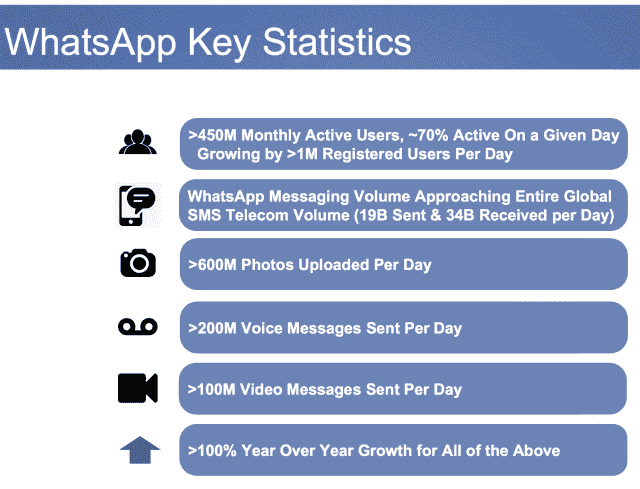

# 扎克说广告不是信息赚钱的方式，WhatsApp 将优先考虑增长而不是订阅

> 原文：<https://web.archive.org/web/https://techcrunch.com/2014/02/19/whatsapp-will-monetize-later/>

脸书不会像对待 Instagram 那样，在新收购的 WhatsApp 上投入广告力量。但 WhatsApp 也不会专注于推出目前在一些国家收取的每年 1 美元的订阅费。相反，凭借脸书带来的金融安全，它将致力于经济增长。

在脸书宣布以令人瞠目结舌的 190 亿美元收购 WhatsApp 后，货币化成为[今天分析师电话会议](https://web.archive.org/web/20230331205209/http://investor.fb.com/eventdetail.cfm?EventID=141327)的大话题。那就是 40 亿美元的现金和 120 亿美元的股票，它还保留了 30 亿美元的限制性股票以留住创业公司的员工。但脸书首席执行官马克·扎克伯格、首席财务官大卫·埃伯斯曼和 WhatsApp 首席执行官简·库姆都表示，这不会是未来几年的优先事项。当积极赚钱的时候，不会通过广告。

“我们未来几年的明确战略是专注于发展和连接世界上的每个人，”扎克伯格说。目前，WhatsApp 在国际上拥有 4.5 亿月用户，但这是一个分散的市场，有许多竞争对手。脸书的首席执行官解释说，现在超越他们是至关重要的。“一旦我们成为拥有 10 亿、20 亿、30 亿用户的服务，我们有很多明确的方式可以赚钱。”

扎克伯格直言不讳地表示“我个人不认为广告是信息货币化的正确方式。”除了 WhatsApp，这可能意味着脸书也不打算利用广告来赚钱。这是有道理的，因为信息的高度个人化和私密性会导致广告像疼痛的拇指一样突出。

电话中的评论重申了库姆过去提出的一个观点。在 2012 年的一篇博客文章中，他认为，“广告不仅仅是对美学的破坏，对你智力的侮辱和对你思路的打断”——这也意味着公司必须挖掘用户数据。(当在电话中被问及 WhatsApp 用户的年龄时，埃博斯曼说不上来，因为该应用不要求提供这些数据。)

Koum 今天在他关于收购的的[帖子中做出了类似的承诺，写道:“你仍然可以指望绝对没有广告打断你的交流。”](https://web.archive.org/web/20230331205209/http://blog.whatsapp.com/index.php/2014/02/facebook/)

最终，扎克伯格希望 WhatsApp 团队将这款应用变成“一项真正伟大的业务”，而不仅仅是一款伟大的产品，他将当前的订阅模式描述为“一个充满希望的开端”。

不过，在电话会议中，分析师反复询问 WhatsApp 现有订阅业务的更多细节。[脸书的股价在盘后交易中一度下跌 5%](https://web.archive.org/web/20230331205209/https://techcrunch.com/2014/02/19/facebook-falls-5-in-after-hours-trading-after-announcing-16b-cash-and-stock-to-buy-chat-app-whatsapp/) ，尽管现在仅下跌 2.64%，可能是因为投资者不明白为什么脸书会在一个赚不了多少钱的东西上花这么多钱。但库姆暗示，该应用程序可能会有“50 亿用户潜在给我们钱，”所以，“我们今天并不真正关心货币化。'

埃博斯曼补充说，“一些国家的一些用户”已经付费订阅，但他说扩大这些订阅“不是优先事项”从另一个角度来看，一位分析师询问了付费用户和免费用户之间的差异，埃博斯曼重申这“不是重中之重”，并表示，“随着他们选择在一个又一个国家推出这项服务，我相信我们会了解更多。”

“我们相信，从长远来看，WhatsApp 将为股东带来回报，”埃博斯曼说。

目前，这两家公司愿意推迟从 WhatsApp 赚钱，以确保它成为全球主导的移动通讯工具。给它贴上一美元的价格标签可能会将用户导向免费下载的竞争对手，如微信、Kik、KakaoTalk 和 Line。

这也许是 WhatsApp 被收购的最大优势。脸书从其主要应用和网站的广告中赚了很多钱。这笔钱可以让 WhatsApp 摆脱广告对产品的污染，或者通过订阅费来减缓增长。相反，它可以全速接近 10 亿用户。

