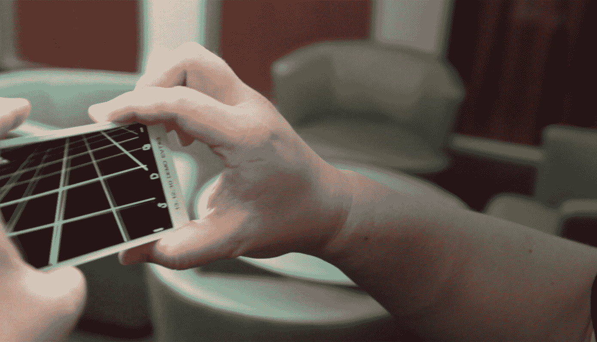
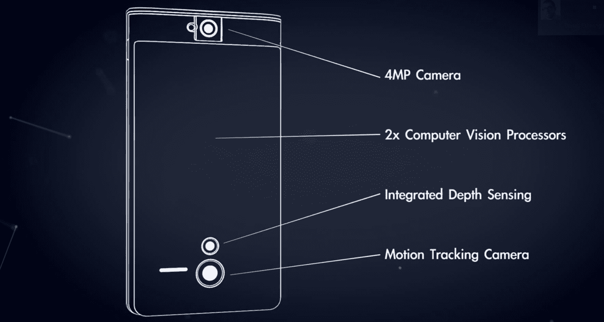

# 谷歌推出 Project Tango 智能手机，试验计算机视觉和 3D 传感器

> 原文：<https://web.archive.org/web/https://techcrunch.com/2014/02/20/google-launches-project-tango/>

谷歌今天[宣布了](https://web.archive.org/web/20230404054340/https://plus.google.com/115422404677762786098/posts) [项目 Tango](https://web.archive.org/web/20230404054340/http://www.google.com/atap/projecttango/) ，这是一款基于 Android 的原型 5 英寸手机和开发者套件，带有来自其高级技术和项目(ATAP)硬件 skunkworks 集团的[高级 3D 传感器](https://web.archive.org/web/20230404054340/https://techcrunch.com/2014/02/20/inside-the-revolutionary-3d-vision-chip-at-the-heart-of-googles-project-tango-phone)。

使用它的传感器，手机不仅可以跟踪运动，还可以通过 3D 扫描建立房间的视觉地图。该公司相信，这些传感器与先进的计算机视觉技术的结合将为室内导航和沉浸式游戏以及其他许多事情开辟新的途径。

从今天开始，谷歌将允许开发者注册使用这些手机，但第一轮将限于由 200 名开发者组成的手动审查小组。开发者必须向谷歌提供一个清晰的想法，他们希望用这款设备构建什么，该公司预计在 2014 年 3 月 14 日之前分配所有设备。它将把这些设备分配给希望开发“室内导航/地图、使用物理空间的单人/多人游戏以及处理传感器数据的新算法”的应用程序的开发者

开发者将能够在 Unity 游戏引擎的帮助下用 Java、C/C++编写应用程序。该公司指出，这款手机的应用编程接口仍在开发中。

ATAP 技术项目负责人[李炯楷](https://web.archive.org/web/20230404054340/http://en.wikipedia.org/wiki/Johnny_Lee_(computer_scientist))表示:“Project Tango 致力于通过先进的传感器融合和计算机视觉，让移动设备像人类一样理解空间和运动，实现新的和增强的用户体验——包括 3D 扫描、室内导航和沉浸式游戏。”。

Project Tango 背后的想法是看看开发者会为这项技术设想出什么样的应用。谷歌希望，它可以基于手机内置的 3D 传感和视觉技术，解锁新型智能视觉应用。通过让应用程序对空间有一种近乎人类的理解，开发人员将能够创建以前根本不可能的应用程序。

这些手机配备了指南针和陀螺仪，就像任何其他手机一样，但除此之外，它们还配备了类似 Kinect 的视觉传感器，可以扫描手机周围的房间。

值得注意的是，这里的想法不是创建类似于 T2 的基于手势的界面。这是关于当开发者知道手机在太空中的确切位置时，他们如何创建应用程序。

在声明中，谷歌问道:“如果你在购买家具之前，只需拿着手机四处走动，就能捕捉到你家的尺寸，会怎么样？如果到一个新位置的方向不在街道地址处停止会怎样？如果你再也不会发现自己迷失在一座新建筑里，那该怎么办？”

## 探戈的传感器

谷歌正在为 Project Tango 使用 Movidius 的 Myriad 1 视觉处理器平台。很长一段时间以来，将这种传感器嵌入手机不仅非常昂贵，而且因为它往往需要大量计算，还会迅速耗尽手机电池。然而，最新一代的视觉处理器使用的能量明显更少，这可能是谷歌能够继续这个项目的原因。你可以在我们的文章中阅读更多关于传感器的信息。

该项目由[李](https://web.archive.org/web/20230404054340/http://en.wikipedia.org/wiki/Johnny_Lee_(computer_scientist))领导，他在 2011 年初去谷歌之前曾负责微软的 Kinect 技术。今天的声明也标志着谷歌 ATAP 集团的首次公开硬件发布，这是摩托罗拉公司决定[保留](https://web.archive.org/web/20230404054340/https://plus.google.com/115422404677762786098/posts/1vvkZB1Sr66)的少数部门之一，尽管它正在出售公司的其余部分。

除了 Tango，该集团还参与了 Ara 项目，这是一个模块化的手机概念，也受到了相当多的关注。谷歌认为 ATAP 是其在谷歌[x]之外的“[moon shot](https://web.archive.org/web/20230404054340/https://techcrunch.com/2013/10/29/google-motorola-spotlight-stories/)科技集团”，就我们所知，它的使命是测试先进的移动技术。该小组由前 DARPA 主任 Regina Dugan 领导，她于 2012 年加入谷歌。