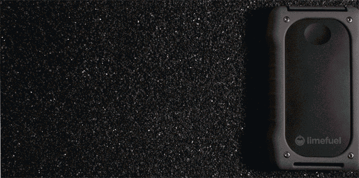

# 如果您需要更多电量，这种备用电池甚至可以在您的手机无法使用时继续使用 TechCrunch

> 原文：<https://web.archive.org/web/https://techcrunch.com/2014/02/21/if-you-need-more-power-this-backup-battery-can-survive-even-when-your-phone-cant/>

我喜欢备用电池——我带了很多，它们最终都会被使用，尤其是在我旅行的时候。但有时我担心:万一世界末日，我的便携式备用电源会怎么样？如果世界被永无止境的暴风雪所掩埋，或者一次流星撞击挡住了阳光，把一切都埋在三英尺厚的灰烬层中，我的果汁储备还能运转吗？

有了 [Limefuel IP66 加固型外置电池](https://web.archive.org/web/20230130234411/https://www.kickstarter.com/projects/limefuel/external-usb-battery-pack-limefuel-ip66-rugged-150?ref=discovery)，答案是肯定的。这款设备目前正在 Kickstarter 上众筹(在短短几天内已经突破了 3 万美元的目标)，根据你选择的配置，最多可提供 15，000 mAh 的储备电量。其他备用充电器也能提供这么多备用能量(包括亚马逊上的一些低成本选项)，但没有一个能在如此坚固的情况下提供这种能量。

L150XR 防水、防污、防挤压或防震(你会注意到，不仅仅是“抗冲击”)，并通过 IP66 认证。对于那些不熟悉加固设备评级系统的人来说，IP66 意味着包装完全密封防尘，除了浸没之外，还可以承受来自任何方向的“强大水射流”，持续长达三分钟。当然，你必须把所有的口盖都合上，以确保那种程度的保护，但这仍然令人印象深刻。

L150XR 的其他功能包括大容量，可以为你的智能手机充电 10 次左右，以及两个同时工作的充电端口，和 2A 输入，可以更快地为备用电池充电(尽管仍然需要 9 到 15 个小时才能充满)。它甚至有直通充电(意味着你可以同时给它和一个附加设备充电)，这是人们在我最近评测的摩尔菲发电站 XL 中错过的[。](https://web.archive.org/web/20230130234411/https://techcrunch.com/2013/12/29/mophie-powerstation-xl-review/)

总部位于博尔德的 Limefuel 成立于 2012 年 11 月，已经为移动设备制造充电设备，因此它很有可能在 2014 年 5 月发货。较低容量的 10，400 毫安时版本的预购起价为 50 美元，但 15，000 毫安时的大版本起价为 70 美元(但仍比许多高端竞争对手便宜)。

你可能不需要 L150XR 提供的强烈的环境阻力，但另一方面，也没有理由不拥有它。如果你真的这么做了，要知道，到最后，当你的手机早已不在了，你认识的所有人都死于空气中的高浓度颗粒物时，你的银行里还有电。