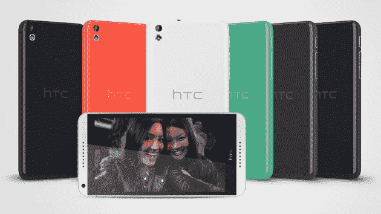

# HTC 在 2014 年 MWC 上拍摄“足够好”,戏弄 3 月 25 日大揭秘 TechCrunch

> 原文：<https://web.archive.org/web/https://techcrunch.com/2014/02/24/dont-forget-about-htc/>

# 3 月 25 日，HTC 在 MWC 2014 上为“足够好”而努力

眨眼之间，你就会错过 HTC 移动世界大会的公告。这家苦苦挣扎的手机制造商发布了两款完全可以接受、非常无聊的中档手机和一款折叠@home-ish 智能手机应用。该项目名为“给予的力量”，旨在众包闲置的智能手机 CPU 周期，以帮助治疗疾病。因为为什么不。

但这并不是 HTC 的全部锦囊妙计。HTC 首席执行官 Peter Chou 开玩笑说，更多的即将到来。在公司的新闻发布会上，周反复提醒与会者，3 月 25 日将有一个活动[。别忘了，好吗。坚持到 3 月 25 日。这时候好东西来了(阅读:下一代 HTC One)。](https://web.archive.org/web/20221006212823/https://beta.techcrunch.com/2014/02/18/htcs-next-generation-successor-to-the-htc-one-gets-its-debut-march-25/)

HTC 透露了 [HTC Desire 816](https://web.archive.org/web/20221006212823/http://www.engadget.com/2014/02/24/htc-desire-816/) (如上图)和 [Desire 610](https://web.archive.org/web/20221006212823/http://www.engadget.com/2014/02/24/htc-desire-610/) 。两者都大量借鉴了 HTC One 和 HTC First 的风格，包括前置扬声器、彩色外壳和柔软的边缘。816 配备了 5.5 英寸的显示屏，而 610 采用了 4.7 英寸的屏幕。

有趣的是，816 是专为中国市场设计的，HTC 称该设备旨在“重新点燃中端市场”

两款手机都不太可能打破销售记录。事实上，与其他新手机相比，它们并不起眼。但如果价格合适，这些中档手机可以帮助 HTC 在新兴和发展中市场挽回一些失去的市场份额。

这些手机的定价尚未公布。

另外，别忘了 3 月 25 日。

【T2