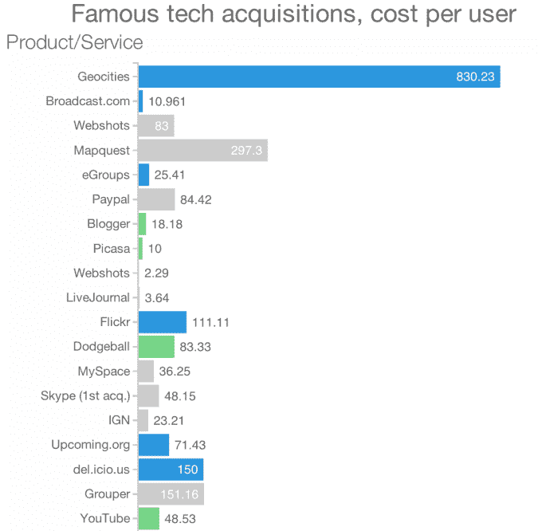

# 可视化 15 年来苹果、谷歌、雅虎、亚马逊和脸书的收购 TechCrunch

> 原文：<https://web.archive.org/web/https://techcrunch.com/2014/02/25/the-age-of-acquisitions/?ncid=twittersocialshare>

# 可视化 15 年来苹果、谷歌、雅虎、亚马逊和脸书的收购

你变老了，你慢下来了，你死了。也就是说，除非你能注入一些新鲜血液。在目睹了上一代科技巨头的衰落或停滞后，今天的巨头们正依靠收购来保持年轻和相关性。查看下面的互动信息图，比较过去 15 年苹果、亚马逊、谷歌、雅虎和脸书的收购规模、频率和重点。

商业保险提供商 [Simply Business](https://web.archive.org/web/20221225220029/http://www.simplybusiness.co.uk/) 制作了这张信息图，只能在 TechCrunch 上看到。每一个点的大小都代表了该公司被披露后的价格。滚动查看相关链接，了解更多交易信息。右上角的加号和减号按钮让您可以放大特定的时间段。选择顶部的类别以筛选特定类型的采购。频率切换揭示了公司大举买入的阶段。你可以点击任何一家科技巨头的标志，查看它们全面收购的完整清单(不包括小规模收购)。抱歉，我们的手机读者，但在网上浏览这个要容易得多。

由[simple Business](https://web.archive.org/web/20221225220029/http://www.simplybusiness.co.uk/)信息图表总结的趋势包括:

*   在玛丽莎·梅耶尔被任命为首席执行官后开始疯狂收购之前，雅虎在 2011 年和 2012 年经历了收购干旱。
*   尽管苹果拥有巨额现金储备，但它一直保持着较低的收购价格，因为它更喜欢购买技术而不是市场份额。
*   脸书在上市后加快了以人才为重点的收购，以应对人才流失。
*   虽然史蒂夫·乔布斯认为收购是“创新的失败”，但蒂姆·库克一直积极收购公司，为苹果带来新的知识产权。
*   *   在 2008 年到 2009 年的“安息吧:美好时光”时代，并购出现了衰退。
    *   过去几年，随着搜索、媒体和广告收购的减少，社交、移动和硬件收购开始受到青睐

巨头们最大的收购(披露价格)是:

*   苹果——Anobit(3.9 亿美元)，AuthenTec(3.56 亿美元)
*   亚马逊——捷步达康(9 亿美元)，Kiva Systems(7.75 亿美元)
*   谷歌——摩托罗拉移动(125 亿美元)，Nest(32 亿美元)，double click(31 亿美元)，YouTube(16.5 亿美元)
*   雅虎-Broadcast.com(50 亿美元)，Overture(18.3 亿美元)，Tumblr(11 亿美元)
*   脸书——WhatsApp(190 亿美元)，insta gram(10 亿美元，以 7.15 亿美元收盘)

[太平洋标准时间下午 5:25 更新:为了将 WhatsApp 收购和其他收购的价格放在上下文中，[这里有一个图表](https://web.archive.org/web/20221225220029/https://public.brightside.io/v1/chart/ece4947eb29375535376ca212578cf78)比较了过去 15 年中大多数主要消费者空间收购的每用户收购成本。[点击](https://web.archive.org/web/20221225220029/https://public.brightside.io/v1/chart/ece4947eb29375535376ca212578cf78)查看包含每笔交易细节的原始互动图表。]

更多关于收购游戏的信息，请阅读:

随着科技巨头争夺人才，不买就死

[欢迎来到独角兽俱乐部:向十亿美元创业公司学习](https://web.archive.org/web/20221225220029/https://techcrunch.com/2013/11/02/welcome-to-the-unicorn-club/)

[当创始人和投资者在收购要约上发生分歧时](https://web.archive.org/web/20221225220029/https://techcrunch.com/2014/02/22/when-founders-and-investors-split-over-an-acquisition-offer/)

[如何留住你的团队，让你的创业收购成功](https://web.archive.org/web/20221225220029/https://techcrunch.com/2014/02/08/kristian-segerstrale-how-to-keep-your-team-and-make-your-startup-acquisition-succeed/)