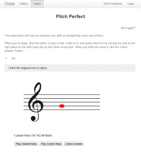

# 认识一下 Oppia，谷歌的新开源项目，它允许任何人创建一个交互式的学习体验

> 原文：<https://web.archive.org/web/https://techcrunch.com/2014/02/26/meet-oppia-googles-new-open-source-project-that-lets-anyone-create-an-interactive-learning-experience/>

谷歌已经成为教育界越来越积极的参与者，特别是在探索技术在重新想象我们学习方式方面可以发挥的作用方面。随着[用于教育的 Google Play】、](https://web.archive.org/web/20230320212306/https://techcrunch.com/2013/05/15/with-google-play-for-education-google-looks-to-challenge-apples-dominance-in-the-classroom/)[用于课堂的 Android 和 Play 驱动的三星平板电脑](https://web.archive.org/web/20230320212306/http://www.samsung.com/us/news/newsRead.do?news_group=productnews%3Dbusinessproduct%3D&news_seq=22447)及其用于 MOOCs 和在线课件的作品，该公司正在扩大其在传统学术空间课堂内外的存在。

谷歌的教育实验今天继续进行，首先推出了第一个 [MOOC 风格的课程，现在向公众开放](https://web.archive.org/web/20230320212306/https://techcrunch.com/2014/02/26/google-announces-an-online-data-interpretation-class-for-the-general-public/)，讲述如何解释和理解在线数据。谷歌的开源博客悄悄宣布的第二个实验是推出 [Oppia](https://web.archive.org/web/20230320212306/https://www.oppia.org/) ，这个项目旨在“让任何人都能轻松创建在线互动活动”，其他人可以从中学习。

谷歌在其公告中解释说，Oppia 背后的动机源于这样一个事实，即尽管越来越多的教育内容现在通过视频和短信交付，但其中大部分仍然是静态和异步的。或者，换句话说，数字化讲座或演示是不够的；当谈到这些工具为互动、对话和反馈创造机会的方式时，仍然有很大的改进空间。

谷歌新的开源项目本质上旨在通过提供一个框架，让任何人都可以快速创建这些类型的交互式学习体验，并将它们添加到他们的网站上，从而消除这个过程中的头痛或神秘。但是，除此之外，Oppia 对教师也有潜在的有趣影响，而且不一定会减少他们对有一天被机器人或全息人工智能版本取代的担忧。

换句话说，Oppia 致力于通过扮演向学习者提问的导师或教师的角色来提高学习过程的互动性。然后，根据学习者如何回答这些问题，教师决定如何进行，问哪些问题，如何给予反馈等等。在描述 Oppia 时，谷歌表示，人们可以将其视为一个“智能反馈系统”，这是一种尝试，旨在开始自动化我们如何“授人以鱼”——用它的例子来说。

该系统收集学习者与指导探索的人互动的方式以及他们提供的内容的数据，并与作者分享，以便他们轻松解决课程中的问题。例如，作者可能会登录 Oppia 来查找学习者对某个问题提供的答案，但系统没有正确或充分地做出响应。

然后，“老师”可以为这个问题“创建一条新的学习路径”，基于他们在现实生活中与这个人实际互动时如何回答这个问题的反馈。Oppia 随后会向任何回答问题的未来学习者提供反馈。该项目还允许教师接受数字、文本和多项选择格式的课程回答，并提供可点击的地图和代码评估器等。

在技术方面，谷歌表示，它基于 Oppia 的可扩展框架，允许开发者添加自己的输入，并扩展 Oppia 理解的潜在格式和响应类型的范围。该公司解释说，探索，正如谷歌所说的用户可以通过其系统建立的课程，可以在 Oppia 服务器上创建，可以嵌入到任何网页中，嵌入可以“引用特定版本的”探索，以便未来的变化不会扰乱原则版本。

此外，用户还可以通过版本控制协作创建和编辑探索，该系统允许参数与学习者相关联，旨在使教师能够创建更深入的交互体验。哦，Oppia 还有一个内置的移动设备响应用户界面，[正如 The Next Web 指出的](https://web.archive.org/web/20230320212306/http://thenextweb.com/google/2014/02/27/google-debuts-online-education-tool-oppia-help-anyone-create-interactive-activities-teaching-others/#!xLFO8)。

正如谷歌的许多此类项目一样，目前还不清楚谷歌打算在 Oppia 上投入多少关注和支持。该项目的主页上明显写着 Oppia 不是谷歌的正式产品，这似乎暗示谷歌不打算为该项目投入大量人力或资源。相反，该公司可能希望开发人员将承担 Oppia 的所有权，社区将接管维护工作。

尽管如此，它仍然是一个很好的工具，看看 Oppia 在未来几个月会变成什么样子应该很有趣。当然，虽然它旨在成为一个学习工具，但 Oppia 可能会应用于广泛的用例中，为产品、公司、教师等提供一种扩展的、可扩展的常见问题或反馈系统。

更多关于 [Oppia 在家这里](https://web.archive.org/web/20230320212306/https://www.oppia.org/)和谷歌的 YouTube 解释者如下: