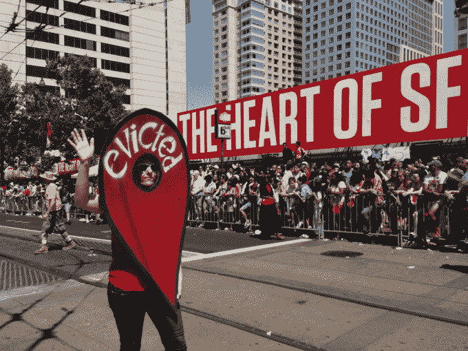
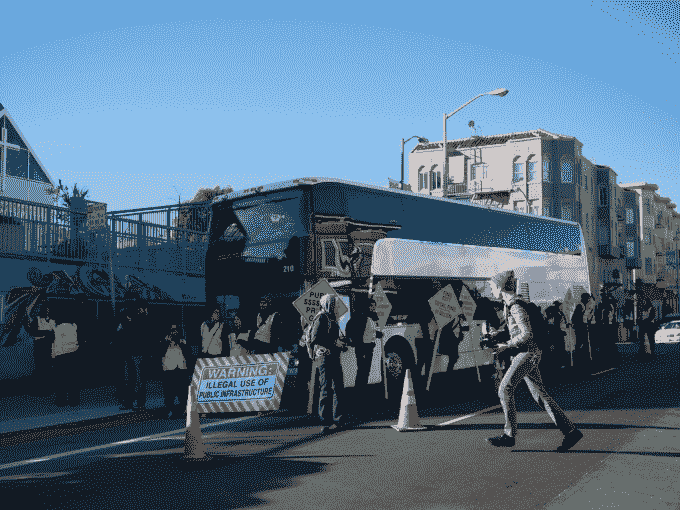

# 谷歌树立榜样，试图抵消旧金山中产阶级化的危险

> 原文：<https://web.archive.org/web/https://techcrunch.com/2014/02/28/hyperlocal-philanthropy/>

虽然旧金山的中产阶级问题不仅仅是由科技繁荣引起的，但科技行业应该致力于帮助那些受到它给这座城市带来的资金和人口流入影响的社区。谷歌昨天的捐赠是关注邻居的一个很好的例子。

谷歌已经拨款 680 万美元资助为期两年的低收入青年免费市政项目，该项目为旧金山的孩子们提供免费乘车证，帮助他们上学、放学后上课和工作。

直说吧。旧金山和湾区的很多人都对科技产业感到愤怒。随着更多高薪技术工人的涌入，他们已经看到当地商品和服务的租金和价格上涨。像谷歌、苹果和脸书这样的南湾科技巨头为旧金山员工提供的舒适的通勤班车已经成为这种焦虑的避雷针。[抗议](https://web.archive.org/web/20221226014010/http://blogs.kqed.org/newsfix/2013/12/20/eviction-protesters-oakland-san-francisco-target-silicon-valley-buses)挡住了他们，打碎了他们的窗户。

但在我看来，技术并没有导致这个问题，而是加剧了这个问题。这并不意味着它不负责修复它。

租金上涨源于糟糕的城市规划和陷入困境的官僚机构。尽管科技行业显然在增长，但该市并没有为不同收入阶层建造更多的公寓。在过去的十年里，T4 平均每年建造 1500 套新住房，而 75000 名新居民涌入这座城市。当有开发更多住宅的运动时，邻里协会经常会阻止它们的建设，理由是更高的建筑会破坏天际线和城市特色。他们没有说的是，通过限制住房的可用性，他们自己的财产价值将会增加。

旧金山因未能增加城市范围内的居住面积而搬起石头砸了自己的脚(或内脏，取决于你对问题的看法有多严重)。海湾地区的其他小城市拒绝允许在科技巨头的校园附近建造更密集的住房，这使得问题更加复杂。与此同时，区域交通系统不可靠，速度慢，而且停车不方便。都是把人往 SF 推。

最终，是城市政府和组织造成了住房供应的缺乏。真正缓解中产阶级化问题的唯一方法是更好的公共政策。

但是科技行业满足了需求，这使得这些问题变成了一场房地产危机。

科技公司在海湾落户，以利用斯坦福和伯克利周围的风险资本和人才。但消费技术的发展和快速变化的景观导致年轻劳动力愿意放弃安静的南湾郊区更短的通勤距离和更大的生活空间，转而选择旧金山的文化、社区和夜生活。

在争夺顶尖人才的激烈竞争中，科技巨头们开始提供班车来招募想在城市生活的人。这进一步增加了旧金山对住房的需求，让这个城市充满了有能力支付更多费用的人。低供给和高需求导致基本必需品的租金和成本飙升，特别是在靠近南湾的社区，如米申、索玛和诺伊山谷。

虽然那些有技术工资的人可以忍受高价格，但城市里的其他人却不能。长期居民、服务人员和艺术家感受到了中产阶级化的压力。令人担忧的是，随着他们被驱逐，这座城市可能会变成一个文化单一的城市。事情变得更糟，贪婪的房东利用埃利斯法案驱逐受租金控制的居民，这样他们就可以为新租户抬高价格。某些技术工人严重不容忍和阶级歧视的[事件被广泛报道，再加上所有这些问题，造成了对整个行业的普遍愤怒。](https://web.archive.org/web/20221226014010/http://www.techmeme.com/130817/p8#a130817p8)[事情不一定是这样的。](https://web.archive.org/web/20221226014010/https://techcrunch.com/2014/01/24/it-doesnt-have-to-be-this-way/)

许多科技巨头及其高管都是严肃的慈善家。但通常情况下，他们关注的是数据驱动的捐赠，他们的钱可以产生最大的影响。这可能意味着抗击疟疾或者在海外提供教育和就业机会。这些都是大问题，但在很大程度上，科技并没有造成这些问题。与此同时，谷歌、苹果、脸书和各种规模的初创公司正直接影响着员工邻居的生活水平。当然，他们给当地企业带来了工作和收入，但是他们也让当地的东西变得更加昂贵。

这就是为什么我认为科技公司及其团队应该重新关注我所说的超本地捐赠，或者让员工和办公室附近的人受益的慈善事业——他们正在影响的人。这就是为什么我认为谷歌对低收入青年免费市政债券的支持是其他公司应该效仿的举措。它符合 Square 和 ZenDesk 等公司所承担的[社区服务项目](https://web.archive.org/web/20221226014010/https://techcrunch.com/2014/01/24/it-doesnt-have-to-be-this-way/)，以及 [HandUp](https://web.archive.org/web/20221226014010/https://handup.us/) 和 [MissionBit](https://web.archive.org/web/20221226014010/http://www.missionbit.com/) 等非营利组织。

通过支付这些孩子上学和工作的免费公共汽车票，谷歌正在帮助他们继续接受教育，养活自己，并获得明天就业所需的技能。如果学生可以乘坐公交车穿过城镇参加课后计划或实习，他们更有可能发现自己的职业激情，成为所在领域的专家，并找到一份可以让他们自由生活在他们想去的地方的工作。

这也是谷歌补偿该市允许其私人班车使用公共汽车站的一种方式。不幸的是，法律禁止该市向私人公司收取高额费用来获得这一特权，这笔收入可以用来资助其他抵消中产阶级化的举措。相反，这个城市只能向他们收取足够的费用来资助一个项目……向他们收取使用公交车站的费用。这座城市无法从这些费用中产生盈余，所以有了公车捐赠，谷歌就直接给了其他需要资金的项目。

谷歌在一份声明中说:“旧金山居民对我们不支付更多费用使用城市公交站感到沮丧是理所当然的。因此，我们将继续在这些费用上与市政府合作，同时在未来两年内为低收入学生提供市政债券。"

谷歌的捐赠会修复中产阶级化吗？不。事实上，它真的只是解决了一个症状，而不是解决根本问题。但这是朝着正确方向迈出的一步，也是其他科技公司可以效仿的榜样。同时，很高兴看到市长办公室承诺建造更多的住房。

不管什么行业，所有旧金山人的目标不应该是指责谁造成了问题，而是合作寻找解决方案。大公司可以进行大规模的跨国捐赠，组织服务项目。员工个人也可以捐款，为有价值的事业做志愿者，支持独立的当地企业，并努力对他们的同事表现出同情心。当没有人垂头丧气的时候，这个城市会有趣得多。

格雷格·费伦斯坦和金·麦·卡特勒补充报道。图片致谢:[罗伯特·麦考尔](https://web.archive.org/web/20221226014010/http://www.mccallstudios.com/)，[克里斯·马汀](https://web.archive.org/web/20221226014010/http://www.flickr.com/photos/cjmartin/11295788563/in/photolist-eZc4RU-95r1nz-idaSpe-idaRz8-95u47h-eYZSb6-izMhm7-gNBMF7-eXkm77-eX8W3Z-eX8Wti-eXkmrJ-8hX7RJ-eMt8v3-eP6HUe-h8sMpE-h8swaH-9QSLke-h8sN2b-9o1FrD-93xP8m-93uH5x-93xP7m-gvBCsk-dCM6Br-adSCYq-cmPtQA-aegnTz-9tbGtd-hyTdBB-93xP6E-93xP5Q-93xP6b-93xP5h-93uH4R-bWtmAK/)，[史蒂夫·罗兹](https://web.archive.org/web/20221226014010/http://www.flickr.com/photos/44124466908@N01/9179837474/in/photolist-eZc4RU-95r1nz-idaSpe-idaRz8-95u47h-eYZSb6-izMhm7-gNBMF7-eXkm77-eX8W3Z-eX8Wti-eXkmrJ-8hX7RJ-eMt8v3-eP6HUe-h8sMpE-h8swaH-9QSLke-h8sN2b-9o1FrD-93xP8m-93uH5x-93xP7m-gvBCsk-dCM6Br-adSCYq-cmPtQA-aegnTz-9tbGtd-hyTdBB-93xP6E-93xP5Q-93xP6b-93xP5h-93uH4R-bWtmAK)，