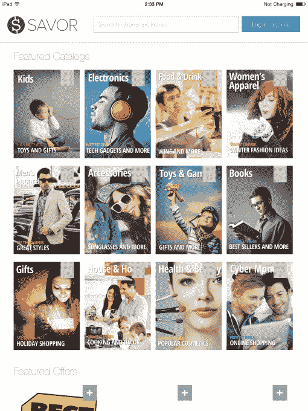

# Savor 为 iPad TechCrunch 推出了一个个性化的交易查找器和“类似 Flipboard”的优惠券目录

> 原文：<https://web.archive.org/web/https://techcrunch.com/2014/02/28/savor-introduces-a-personalized-deal-finder-flipboard-like-coupon-catalog-for-ipad/>

一家名为 [Savor](https://web.archive.org/web/20221006043208/http://savor.co/) 的公司正试图重新想象，如果像 RetailMeNot 或 Coupons.com 这样的优惠券聚合网站和服务在今天被发明出来，它们将如何运作。Savor 表示，它正致力于建立一种服务，根据每位消费者的兴趣个性化提供优惠券，而不是向用户抛出一堆优惠。

个性化优惠也是知名交易发现公司，如 Groupon，一直在努力的事情，但 Savor 目前只专注于电子商务零售商优惠券，计划未来通过与卡相关的优惠扩展到线下实体零售。

但是，这项如今在网络和 iPad 上都可以使用的服务之所以如此有趣，是因为它是如何确定什么与特定用户相关的。联合创始人 Rich DeNardis 解释说，访问 Savor 的消费者仍然可以像使用更传统的优惠券网站一样使用该服务，即通过搜索优惠或浏览类别。

然而，Savor 将提示用户使用脸书注册，这使得该服务可以挖掘他们在社交网络上的“喜欢”和兴趣，因此 Savor 可以提供最相关的交易。

在您与脸书联系后，Savor 会选择您可能感兴趣的商店和类别，并让您通过点击您感兴趣的商店名称和类别(例如，“女装”、“鞋”、“玩具”、“电脑配件”等)来进一步定制这些建议。)

这样做之后，您还可以配置 Savor 来发送关于书签优惠和/或每日或每周电子邮件摘要的提醒。

这家公司由德纳第斯和德鲁·塞门塔(Drew Sementa)共同创立，是在德纳第斯不再是所谓的“华尔街家伙”之后成立的，他之前曾在投资银行和私募股权公司工作。他说，在那段时间里，他遇到了许多联盟营销、忠诚度平台和支付公司，并意识到这是一个巨大但非常破碎的市场。

DeNardis 解释说:“当我查看现有的网站时，许多网站都是在 10 到 15 年前建立的，它们确实没有发展到能跟上当今人们与网络互动的方式。他说，其中许多尚未更新，无法提供跨设备的无缝体验，也无法与社交网站整合。

该公司去年 11 月首次推出测试版网站，并在用户测试和反馈后，于几周前重新推出了该网站。Savor 现在也有一个 iPad 应用程序，DeNardis 将其比作 Flipboard，它提供了一个更直观的展示，优惠券被组织成交易的“目录”。用户可以浏览这些部分，一路上保存他们最喜欢的交易。

Savor 目前正在开发一款安卓平板电脑应用，接下来是智能手机版本。它还在与银行合作伙伴合作即将到来的线下扩展，这将涉及上述[卡关联优惠](https://web.archive.org/web/20221006043208/http://cardley.com/about/)。

这家总部位于芝加哥的公司有 6 个全职团队，已经筹集了一轮“朋友和家人”资金，计划在本季度结束前寻求大约 100 万美元的种子资金。

品味 [iPad 应用程序在这里](https://web.archive.org/web/20221006043208/https://itunes.apple.com/us/app/savor-savings.-simplified./id788835060?mt=8)。